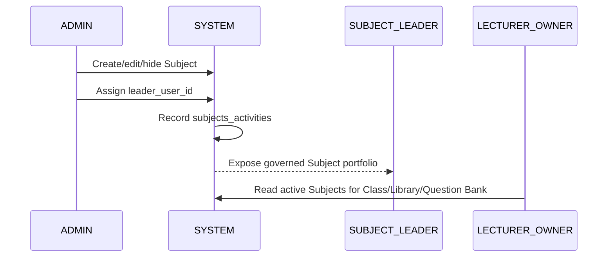
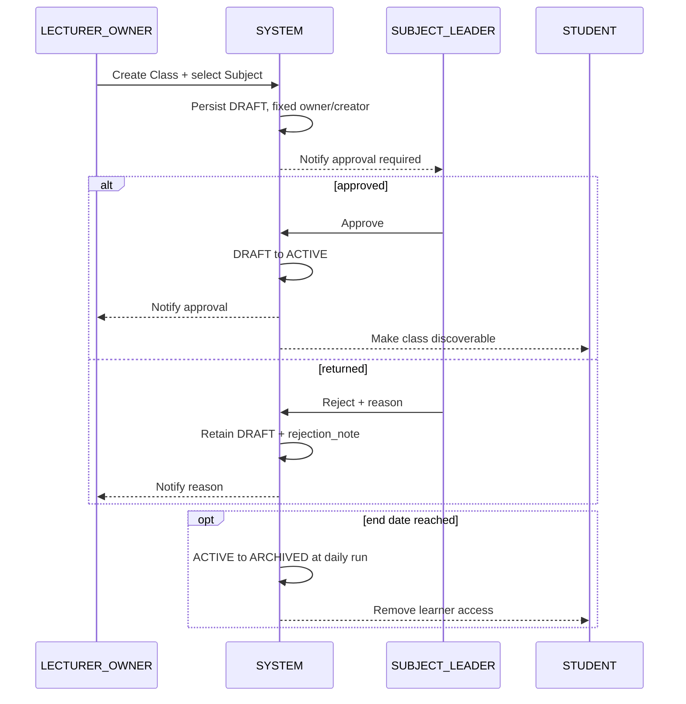
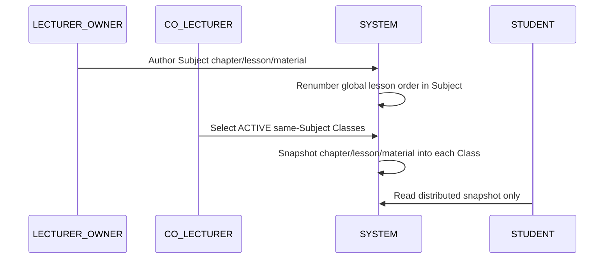

# KoreanStudyHub — Current-State Feature & Use-Case Catalog

**Baseline:** `origin/main` fetched 2026-08-04 (`7daa03d0`).  
**Purpose:** This document supersedes the *business direction* of the earlier catalog. It is a medium-granularity catalog for later committee-style specifications, not a claim that every target rule is already fully implemented.

## 1. Scope and modelling rules

- Workflow lanes: `ADMIN`, `SUBJECT_LEADER`, `LECTURER_OWNER`, `CO_LECTURER`, `STUDENT`, `SYSTEM`. Notifications are supporting behaviour, not a separate lane.
- A **Subject** is the flat catalog item held in `subjects`. Legacy Java/package/route names containing `Department` are technical debt, not proof of a department hierarchy workflow.
- `users.subject_id` is a default landing/filter value, not a Lecturer authorization boundary. A leader may own many subjects.
- `/practice` remains a separate bounded context: its AI and storage configuration are not merged into class/test-bank workflows.
- A use case groups CRUD only when it has the same aggregate, actor, authorization rule and lifecycle. Approval, import confirmation, distribution, submission, evaluation and audit are separate where their rules differ.

## 2. Explicitly retired workflows

| Retired workflow/data idea | Replacement / treatment |
|---|---|
| Department hierarchy, Course and Course Category | Flat Subject catalog; one leader may govern multiple subjects. |
| Question Bank categories | Question Bank item is scoped by Subject and Library lesson. |
| Class invitation code/link | Active-class discovery and join request. |
| Leader assignment transfers ownership | `class_co_lecturers`; owner and creator never change. |
| Lecturer authors lessons directly in a class | Library authoring then subject-matched snapshot distribution. |
| Student class comments as a principal workflow | Removed; Board is currently a read-only placeholder. |
| Schedule, study group and class-role workflows | Not part of the current primary product flow. |
| Class states outside DRAFT / ACTIVE / ARCHIVED | Retired target state model. Rejection is a DRAFT annotation (`rejection_note`), not a state. |
| Practice Question/Test Bank | Separate `/practice` boundary. |
| Korea Discovery News feed, crawl and editorial workflow | Removed in V112. Korean dictionary lookup and saving a term to Flashcards remain a shared, Admin-configured capability. |

## 3. Revised feature catalog

| ID | Feature | Core outcome |
|---|---|---|
| FE-01 | Authentication, profile and account security | Account access, profile, password and session lifecycle. |
| FE-02 | Subject catalog and subject-leader governance | Admin maintains active subjects and assigns their leader. |
| FE-03 | Class lifecycle and leader approval | Owner creates a subject-bound draft; leader makes it active or returns a reason. |
| FE-04 | Class discovery, membership and roster | Students request entry to active classes; owner manages enrollment. |
| FE-05 | Co-lecturer assignment and class access | Leader assigns teaching collaborators without changing ownership. |
| FE-06 | Subject Library authoring and distribution | Author subject chapters/lessons/materials, then snapshot them into classes. |
| FE-07 | Subject Question Bank contribution and review | Lecturer contributes lesson-linked questions; leader reviews state changes. |
| FE-08 | Test Bank authoring, random generation and distribution | Build a published test and clone it to eligible active classes. |
| FE-09 | Student class learning and assessment | Consume distributed lessons, tests and assignments in an active enrollment. |
| FE-10 | Flashcards and smart review | Own, share and study flashcard decks. |
| FE-11 | Notifications, member directory and direct messaging | Notify users and enable authorized 1:1 conversations. |
| FE-12 | Dashboards, activity and operational tracking | Role-specific teaching, subject and platform visibility. |
| FE-13 | Identity, RBAC and platform administration | Users, permissions, settings, storage and operational audit. |
| FE-14 | AI-assisted authoring and evaluation | Non-Practice provider/prompt operations and AI drafting. |
| FE-15 | Shared Korean dictionary and Flashcard capture | Admin-configured KRDICT lookup and saving selected terms into a personal Flashcard deck. |
| FE-16 | Independent Practice learner experience | Four-skill practice catalog, attempt and result experience. |
| FE-17 | Practice authoring, publishing and media operations | Controlled content production and protected practice assets. |

## 4. Medium use-case catalog (92 use cases)

### FE-01 — Authentication, profile and account security

| ID | Use case | Primary actor(s) |
|---|---|---|
| UC-001 | Sign in with password or Google OAuth | All users |
| UC-002 | Recover a forgotten password | All users |
| UC-003 | Change password and revoke other sessions | Authenticated user |
| UC-004 | View or update profile and avatar | Authenticated user |
| UC-005 | End the current session | Authenticated user |

### FE-02 — Subject catalog and subject-leader governance

| ID | Use case | Primary actor(s) |
|---|---|---|
| UC-006 | Manage Subject catalog entries (create, edit, activate, hide) | ADMIN |
| UC-007 | Assign or replace the Subject Leader for a Subject | ADMIN |
| UC-008 | View own governed Subject portfolio | SUBJECT_LEADER |
| UC-009 | View activity history for a Subject | ADMIN, SUBJECT_LEADER |

### FE-03 — Class lifecycle and leader approval

| ID | Use case | Primary actor(s) |
|---|---|---|
| UC-010 | Create or update a subject-bound Class draft | LECTURER_OWNER |
| UC-011 | View owned class details, lifecycle and rejection note | LECTURER_OWNER |
| UC-012 | Soft-delete an eligible Class | LECTURER_OWNER |
| UC-013 | Review a pending Class in a governed Subject | SUBJECT_LEADER |
| UC-014 | Approve a Class and activate it | SUBJECT_LEADER |
| UC-015 | Return a Class to its owner with a rejection reason | SUBJECT_LEADER |
| UC-016 | Automatically archive an active Class after its optional end date | SYSTEM |

> Current-state gap: resubmission is an edit of the DRAFT, not an independent action; an edit after rejection does not yet re-notify the leader.

### FE-04 — Class discovery, membership and roster

| ID | Use case | Primary actor(s) |
|---|---|---|
| UC-017 | Browse and search ACTIVE Classes by name or Subject | STUDENT |
| UC-018 | Request to join an ACTIVE Class | STUDENT |
| UC-019 | Re-request membership after rejection or removal | STUDENT |
| UC-020 | Leave an eligible ACTIVE Class | STUDENT |
| UC-021 | Review pending membership requests | LECTURER_OWNER |
| UC-022 | Approve or reject a membership request | LECTURER_OWNER |
| UC-023 | View active class members and enrollment status | LECTURER_OWNER, CO_LECTURER, STUDENT |
| UC-024 | Import and confirm a class roster from Excel | LECTURER_OWNER |

### FE-05 — Co-lecturer assignment and class access

| ID | Use case | Primary actor(s) |
|---|---|---|
| UC-025 | Search eligible teaching collaborators in a governed Subject | SUBJECT_LEADER |
| UC-026 | Replace the complete co-lecturer assignment set for a Class | SUBJECT_LEADER |
| UC-027 | Access managed teaching content as a Co-lecturer | CO_LECTURER |
| UC-028 | View owner and co-lecturers in the student member directory | STUDENT |

### FE-06 — Subject Library authoring and distribution

| ID | Use case | Primary actor(s) |
|---|---|---|
| UC-029 | Browse a Subject Library hierarchy | LECTURER_OWNER, CO_LECTURER, SUBJECT_LEADER |
| UC-030 | Manage Library chapters and global lesson ordering | LECTURER_OWNER, SUBJECT_LEADER |
| UC-031 | Author or revise a Library lesson's rich content | LECTURER_OWNER, SUBJECT_LEADER |
| UC-032 | Manage a Library lesson's PDF, video and downloadable materials | LECTURER_OWNER, SUBJECT_LEADER |
| UC-033 | Preview a Library lesson before distribution | LECTURER_OWNER, CO_LECTURER, SUBJECT_LEADER |
| UC-034 | Select same-Subject recipient Classes for distribution | LECTURER_OWNER, CO_LECTURER, SUBJECT_LEADER |
| UC-035 | Distribute a Library snapshot into one or more ACTIVE Classes | LECTURER_OWNER, CO_LECTURER, SUBJECT_LEADER |
| UC-036 | Consume a distributed lesson snapshot | STUDENT |

> Current-state deviation: individual-lesson distribution remains alongside whole-Subject distribution; the recipient filter currently excludes only ARCHIVED classes, so DRAFT must be corrected to ACTIVE-only before it is presented as a completed target rule.

### FE-07 — Subject Question Bank contribution and review

| ID | Use case | Primary actor(s) |
|---|---|---|
| UC-037 | Browse/filter Question Bank items by Subject and Library lesson | LECTURER_OWNER, CO_LECTURER, SUBJECT_LEADER, ADMIN |
| UC-038 | Create or edit an eligible Question Bank draft | LECTURER_OWNER, CO_LECTURER |
| UC-039 | Submit a draft Question for leader review or resubmit a rejected Question | LECTURER_OWNER, CO_LECTURER |
| UC-040 | Preview, validate and confirm an Excel Question import | LECTURER_OWNER, CO_LECTURER |
| UC-041 | Review Question Bank items in governed Subjects | SUBJECT_LEADER |
| UC-042 | Approve or reject a Question with a review note | SUBJECT_LEADER |
| UC-043 | Bulk-review Questions with partial-success reporting | SUBJECT_LEADER |
| UC-044 | Archive or restore a Question while preserving its previous workflow state | SUBJECT_LEADER, ADMIN |

### FE-08 — Test Bank authoring, random generation and distribution

| ID | Use case | Primary actor(s) |
|---|---|---|
| UC-045 | Create or revise an independent Test Bank test | LECTURER_OWNER, CO_LECTURER |
| UC-046 | Create or revise a class-local Test | LECTURER_OWNER, CO_LECTURER |
| UC-047 | Add, edit or remove test questions/options/media | LECTURER_OWNER, CO_LECTURER |
| UC-048 | Publish or archive an eligible Test | LECTURER_OWNER, CO_LECTURER, SUBJECT_LEADER |
| UC-049 | Generate a random test from APPROVED Question Bank items | LECTURER_OWNER, CO_LECTURER, SUBJECT_LEADER |
| UC-050 | Choose Subject, chapter or lesson scope for random generation | LECTURER_OWNER, CO_LECTURER, SUBJECT_LEADER |
| UC-051 | Select eligible ACTIVE target Classes for a published Test | LECTURER_OWNER, CO_LECTURER, SUBJECT_LEADER |
| UC-052 | Atomically distribute a test as independent class snapshots | LECTURER_OWNER, CO_LECTURER, SUBJECT_LEADER |
| UC-053 | Inspect class test publication and learner-attempt monitoring | LECTURER_OWNER, CO_LECTURER |

> Target guards: no Practice test, DRAFT test, source class, cross-Subject class or duplicate class-test name may pass distribution. Random generation caps the requested count at 50; current short-pool behaviour creates fewer questions rather than reporting a shortage.

### FE-09 — Student class learning and assessment

| ID | Use case | Primary actor(s) |
|---|---|---|
| UC-054 | Track completion of distributed lessons | STUDENT |
| UC-055 | View published class Tests | STUDENT |
| UC-056 | Start, save and submit a timed Test attempt | STUDENT |
| UC-057 | View Test result, answer review and explanations | STUDENT |
| UC-058 | View class Assignments and submission conditions | STUDENT |
| UC-059 | Submit or resubmit an Assignment | STUDENT |
| UC-060 | Review/grade submissions and release feedback | LECTURER_OWNER, CO_LECTURER |
| UC-061 | View released Assignment result and feedback | STUDENT |

### FE-10 — Flashcards and smart review

| ID | Use case | Primary actor(s) |
|---|---|---|
| UC-062 | Manage an owned flashcard deck and its cards | Authenticated user |
| UC-063 | Import or generate flashcard drafts | Authenticated user |
| UC-064 | Share/unshare an accessible deck | Deck owner |
| UC-065 | Study an accessible deck with smart review | Authenticated learner |

### FE-11 — Notifications, member directory and direct messaging

| ID | Use case | Primary actor(s) |
|---|---|---|
| UC-066 | View notifications and unread state | All users |
| UC-067 | Receive an event notification/email through the durable outbox | SYSTEM |
| UC-068 | Select a permitted class member as a direct-message recipient | STUDENT, LECTURER_OWNER, CO_LECTURER |
| UC-069 | Start, read, reply to and mark a direct conversation read | All users |

> Leaving a class removes a person from that class directory but preserves historic conversations. There is no separate in-class messaging module and no fully implemented announcement workflow.

### FE-12 — Dashboards, activity and operational tracking

| ID | Use case | Primary actor(s) |
|---|---|---|
| UC-070 | View owner/co-lecturer teaching dashboard | LECTURER_OWNER, CO_LECTURER |
| UC-071 | View Subject portfolio, approval and activity summary | SUBJECT_LEADER |
| UC-072 | View class learning, test and assignment progress | LECTURER_OWNER, CO_LECTURER |
| UC-073 | View entity activity history within authorized scope | ADMIN, SUBJECT_LEADER, LECTURER_OWNER |

### FE-13 — Identity, RBAC and platform administration

| ID | Use case | Primary actor(s) |
|---|---|---|
| UC-074 | Manage user account lifecycle and roles | ADMIN |
| UC-075 | Configure role permissions and user overrides | ADMIN |
| UC-076 | Review security-relevant account activity | ADMIN |
| UC-077 | Manage global settings, OAuth and SMTP configuration | ADMIN |
| UC-078 | Manage non-Practice object-storage configuration | ADMIN |
| UC-079 | View platform administration dashboard and audits | ADMIN |

### FE-14 — AI-assisted authoring and evaluation

| ID | Use case | Primary actor(s) |
|---|---|---|
| UC-080 | Manage general AI providers, prompts and enablement | ADMIN |
| UC-081 | Inspect general AI provider request logs | ADMIN |
| UC-082 | Generate, edit and confirm AI question drafts | LECTURER_OWNER, CO_LECTURER |

### FE-15 — Shared Korean dictionary and Flashcard capture

| ID | Use case | Primary actor(s) |
|---|---|---|
| UC-083 | Configure the shared Korean Basic Dictionary connection | ADMIN |
| UC-084 | Look up a Korean word or phrase through the common dictionary helper | Authenticated learner |
| UC-085 | Select an owned deck and save a dictionary term as a Flashcard | Authenticated learner |

### FE-16 — Independent Practice learner experience

| ID | Use case | Primary actor(s) |
|---|---|---|
| UC-086 | Browse and filter independent Practice sets | STUDENT |
| UC-087 | Start, resume, submit and review a Practice attempt | STUDENT |
| UC-088 | Receive Practice writing/speaking or reading/listening evaluation | SYSTEM, STUDENT |

### FE-17 — Practice authoring, publishing and media operations

| ID | Use case | Primary actor(s) |
|---|---|---|
| UC-089 | Create, edit and version owner Practice drafts | LECTURER_OWNER |
| UC-090 | Import, review and apply Practice authoring candidates | Authorized Practice author |
| UC-091 | Publish/retire Practice sets and protected assets | Authorized Practice publisher |
| UC-092 | Manage Practice speaking media and AI capability bindings | Authorized Practice operator |

## 5. Required six workflow diagrams

### D-01 Subject governance


### D-02 Class lifecycle


### D-03 Join and membership
```mermaid
sequenceDiagram
    participant U as STUDENT
    participant S as SYSTEM
    participant O as LECTURER_OWNER
    U->>S: Search ACTIVE Classes
    U->>S: Request join
    S->>S: Create/reopen PENDING enrollment; check capacity
    S-->>O: Notify request
    alt approved
        O->>S: Approve enrollment
        S->>S: Enrollment ACTIVE
        S-->>U: Notify enrollment
    else rejected
        O->>S: Reject enrollment
        S->>S: Enrollment REJECTED
        S-->>U: Notify decision
    end
```

### D-04 Library distribution


### D-05 Question approval
```mermaid
sequenceDiagram
    participant T as LECTURER_OWNER
    participant S as SYSTEM
    participant L as SUBJECT_LEADER
    T->>S: Draft/import Question + Subject + Library lesson
    T->>S: Submit for REVIEW
    L->>S: Review governed-Subject Question(s)
    alt approve
        L->>S: APPROVED
    else reject
        L->>S: REJECTED + note
        T->>S: Edit and resubmit REVIEW
    else archive
        L->>S: ARCHIVED; remember previous state
        L->>S: Unarchive restores previous state
    end
```

### D-06 Test creation and distribution
```mermaid
sequenceDiagram
    participant T as LECTURER_OWNER
    participant C as CO_LECTURER
    participant S as SYSTEM
    participant U as STUDENT
    T->>S: Create independent/class Test or randomize APPROVED questions
    S->>S: Snapshot questions/options; publish Test
    C->>S: Select ACTIVE same-Subject target Classes
    S->>S: Atomically clone Test into each target Class
    U->>S: View/take published test with ACTIVE enrollment
```

## 6. Traceability and documentation rule

For the later 80–100 detailed use-case specifications, each `UC-001…UC-092` shall have: primary/secondary actors, preconditions, success/failure postconditions, normal flow, alternatives, shared business-rule IDs and shared message IDs. The six diagrams above stay workflow-level; they must not be duplicated once per CRUD operation.

The historical balanced catalog and its full formal-specification draft should be marked **superseded for non-Practice workflow direction**, not deleted, until the new individual specifications have been generated and reviewed.
