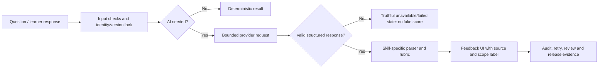

# Practice AI – Integration, review and testing guide

**Audience:** product owner, content/SME reviewer, QA, and engineering.

**Current release scope:** `EXPERIMENTAL_DEMO` for direct-audio Speaking.
It demonstrates a complete concept—audio in, AI feedback out—without claiming
standardized assessment, certification, or a production learner score.

## 1. Plain-language summary

Practice has four skills: Reading, Listening, Writing and Speaking. AI can
help explain, give feedback, or structure observations, but it must never turn
missing information into a made-up score.

For a learner, the simple rule is:

> A visible result must say what the system actually knows. A missing AI result
> is “not available”, not zero points or a failed learner.

Speaking has two distinct modes:

| Mode | What it is for | What can be shown |
| --- | --- | --- |
| Transcript-based feedback | Language/content feedback from the transcript | Text-focused feedback; no claim about pronunciation or fluency |
| Experimental Direct Audio | Portfolio/demo feedback where the provider directly receives audio | `Experimental AI feedback` with a non-standardized-assessment disclaimer |
| Production direct-audio assessment | Future high-confidence learner assessment | Not enabled until the production validation package is complete |

Every experimental score must carry this message:

> **Experimental AI feedback.** Kết quả chỉ nhằm minh họa tính năng AI và
> luyện tập, không phải đánh giá chuẩn hóa hoặc chứng nhận năng lực.

It must not issue certificates, decide pass/fail, rank learners, calculate an
official exam score, or be used for another high-stakes decision.

## 2. One flow for all four skills

The system keeps a **version lock**: a result is tied to the exact set, test,
section, group, question, prompt/rubric and AI configuration that created it.
That prevents later edits from silently changing the meaning of an old result.

## 3. What AI does for each skill

### Reading

- **Input:** published reading question, answer and approved explanation
  context.
- **Primary result:** deterministic answer correctness and points.
- **AI role:** optional explanation or learning hint, never a replacement for
  the answer key.
- **Quality checks:** source/question identity, answer-key match, structured
  response schema, and wording that separates explanation from official score.
- **Failure behaviour:** retain deterministic score; show explanation as
  unavailable or retryable rather than inventing one.

### Listening

- **Input:** published listening item, approved audio/transcript boundaries,
  answer key and any licensed visual asset.
- **Primary result:** deterministic answer correctness and points.
- **AI role:** optional explanation and study feedback.
- **Quality checks:** audio/source identity, question-to-audio binding,
  transcript/reference coverage, timing where required, and response schema.
- **Failure behaviour:** no fabricated transcript, explanation or audio claim.
  The official question score remains independent of optional AI feedback.

### Writing

- **Input:** learner text, prompt, immutable rubric and task/profile identity.
- **Primary result:** rubric-based feedback; task-level evidence stays separate
  from a whole-attempt summary.
- **AI role:** structured rubric feedback, suggestions and diagnostics.
- **Quality checks:** prompt/rubric version, expected JSON schema, bounded
  retries, completeness checks and no null/failed value converted to zero.
- **Failure behaviour:** `PENDING`, `FAILED` or `UNAVAILABLE` is displayed
  plainly. A retry may be offered only when the saved task is still coherent.

### Speaking

- **Input:** learner recording and/or transcript, question context and the
  selected evaluator mode.
- **Transcript mode:** evaluates language visible in transcript only. It must
  not infer pronunciation, fluency, rhythm, intonation or acoustic quality.
- **Experimental direct-audio mode:** an approved demo provider receives audio
  and returns structured feedback. The UI labels it experimental and does not
  use it for official points.
- **Production direct-audio mode:** remains disabled until the evidence package
  in section 6 is independently reviewed and accepted.
- **Failure behaviour:** provider failure, missing audio-consumption proof or
  malformed response yields no experimental score and no fake fallback.

## 4. Taxonomy: how the system names things

| Term | Meaning |
| --- | --- |
| **Capability** | What an evaluator is technically allowed to consume, for example transcript or direct audio |
| **Evidence mode** | What evidence was actually used for this result |
| **Rubric** | The declared criteria and scale used to organize feedback |
| **Artifact** | A saved, identifiable proof file: policy, test output, corpus report, review decision, etc. |
| **Readiness** | Whether a named release scope may be enabled |
| **Experimental** | Demonstration feedback with explicit limitations; not an assessment claim |
| **Production validation** | Independent evidence required before a learner-facing assessment claim |
| **Fail closed** | If a required check is missing, do not send, score or display a substitute result |

### Result states

| State | Learner-safe meaning |
| --- | --- |
| `READY` | Valid result exists for the declared scope |
| `PENDING` | Work is still running; it is not zero |
| `FAILED` | Processing failed; no score should be inferred |
| `UNAVAILABLE` | Required evidence or service is unavailable |
| `EXPERIMENTAL_DEMO_READY` | Demo provider response is valid; only experimental feedback may be shown |
| `PRODUCTION_VALIDATION_REQUIRED` | Production evidence is not complete; no production assessment claim |

## 5. Rubric and feedback rules

1. A rubric is versioned and bound to a task. Changing a rubric creates a new
   version; it does not reinterpret a prior attempt.
2. Deterministic answer keys own Reading/Listening correctness. AI explanation
   may help the learner but cannot overwrite a key.
3. Writing feedback must name its task/rubric context and preserve partial or
   unavailable evidence honestly.
4. Transcript-only Speaking may discuss vocabulary, grammar, relevance and
   organization, but not acoustic traits.
5. Experimental direct-audio feedback may include provider observations such as
   pronunciation or fluency only with the experimental label and disclaimer.
6. A response that fails schema validation is rejected, even if it looks
   plausible. Plausible-looking malformed data is still unsafe data.

## 6. Speaking artifact register and how to “get past” an artifact

Artifacts are not paperwork for its own sake. Each answers one concrete
question: “Can we trust this specific claim?”

| Artifact | Current demo treatment | Needed for future production |
| --- | --- | --- |
| `ALIGNER_CAPABILITY_CAPTURE` | Available engineering evidence | Independent specialist review of the exact captured component/configuration |
| `KOREAN_TIMESTAMP_SAMPLE_REPORT` | Available engineering evidence | Korean human-gold timestamp validation |
| `CORPUS_MANIFEST_REPORT` | Available engineering evidence | Real device/environment, proficiency, repeated-take and SME-labelled corpus |
| `ACOUSTIC_CALIBRATION_REPORT` | Available engineering evidence | Paired real-audio calibration and recorded reject/re-record thresholds |
| `FAIRNESS_REVIEW_REPORT` | Available engineering evidence | Human-score baseline and approved disparity evaluation |
| `REPEATABILITY_REPORT` | Available engineering evidence | Deterministic configuration and fresh independent five-run pass |
| `NON_TRAINING_POLICY` | Deferred for production | Provider policy evidence reviewed for the selected provider |
| `RETENTION_POLICY` | Deferred for production | Provider retention evidence reviewed for the selected provider |
| `REDACTED_CAPTURED_REQUEST` | Not required for demo readiness | Redacted request evidence for production audit |
| `REDACTED_CAPTURED_RESPONSE_RECEIPT` | Not required for demo readiness | Redacted receipt evidence for production audit |

### Artifact handling rules

- Never invent an artifact ID, reviewer identity, acceptance ID, policy value or
  test result.
- An engineering artifact can be `AVAILABLE_EXPERIMENTAL_EVIDENCE` without
  being production `ACCEPTED`.
- A production acceptance applies to one exact file digest, scope and version.
  It is not a blanket approval of future changes.
- A failed or incomplete artifact is useful evidence: keep it, record why it
  did not pass, fix the cause, then make a new capture rather than rewriting
  history.

### Current repeatability example

The Korean forced aligner showed a repeatability issue caused by MFCC dithering:
the five captured runs did not all keep the same word labels/boundaries. A
diagnostic configuration with dither disabled was stable, but it is **not**
automatically accepted. The correct next production step is to register the
new deterministic configuration and perform a fresh independent five-run
evaluation. This remains future production validation, not a demo blocker.

## 7. Direct-audio privacy and review paths

### Demo using preloaded/test audio

- No learner-consent workflow is needed for audio that is already approved for
  the demo.
- The provider must be configured and the runtime credential must be valid.
- A successful direct-audio request and valid structured response are required.

### Demo using a learner recording

- Show a short disclosure that audio will be sent to the selected AI provider
  for feedback.
- Require an affirmative user action before transfer.
- Keep audio only as long as the demo needs it; existing local delete handling
  remains available.
- Do not pretend this minimal demo disclosure is a production privacy program.

### Production later

Production adds formal provider policy/retention review, deletion handling,
least-privilege reviewer access, audit retention, Korean calibration, fairness,
repeatability, human UAT and a final release decision.

## 8. Testing checklist

### Automated contract tests

- Correct provider/model configuration can authorize an experimental request.
- Provider policy artifacts and SME/calibration decisions do not block the
  experimental scope.
- User-recorded audio without active consent does not transfer.
- Preloaded approved demo audio can use the separate demo path.
- Provider failure, no audio-consumption proof, or malformed response produces
  no score.
- Every experimental result includes the label and disclaimer.
- Production readiness remains red/deferred while its evidence is absent.

### Human QA before a demo presentation

1. Use a non-sensitive approved sample audio file.
2. Verify the UI says `Experimental AI feedback` before showing feedback.
3. Trigger one provider failure and confirm that no score appears.
4. Confirm the result is not included in certificates, ranking, pass/fail or
   official practice points.
5. If recording is enabled, verify disclosure and affirmative consent appear
   before transfer.

### Human QA before a production release

Do the full browser/device/provider/load/security/manual-UAT matrix, then have
the named owners make and record a GO/NO-GO decision. Experimental demo success
does not replace any of these checks.

## 9. Operational ownership

| Role | Owns |
| --- | --- |
| Product owner | Scope decision, permitted demo claims, production GO/NO-GO |
| Engineering | Version locks, provider boundary, schema validation, failure paths, auditability |
| Content/Korean SME | Content correctness, rubric interpretation, Korean linguistic review |
| Acoustic/calibration reviewer | Timestamp quality, acoustic calibration and repeatability review |
| Privacy/security owner | Provider policy, data handling and production risk acceptance |
| QA | Reproducible test matrix and evidence that UI behaviour matches declared scope |

## 10. Complete Practice feature inventory

This section is the practical map of the **current Practice product surface**.
It records the boundaries that have been deliberately implemented, retired or
kept fail-closed. It is not a claim that every future product idea is finished.

### 10.1 Content authoring, import and publication

| Area | What happens | Important safety rule |
| --- | --- | --- |
| Practice catalog | Sets, tests, sections, groups and questions form the published learning structure | A learner attempt is bound to the published structure that existed at submission time |
| Question authoring | Lecturers create/edit canonical Reading, Listening, Writing and Speaking items | Invalid type/group/version combinations are rejected before publication |
| Quick Excel/import | Supported workbook formats become draft candidates before publication | Old interactive workbook writers are retired; aliases and historical identities are never silently treated as new content |
| PDF/vision draft import | Selected text regions and bounded image crops can generate a lecturer-owned draft | Raw PDFs are not sent as provider-native files; input/byte/page limits and owner claim protect the operation |
| Review/publish | Draft content is validated, versioned and published into the learner catalog | Ungrouped or incoherent content cannot become a published learner question |
| TOPIK source bundles | Source/provenance, answer, transcript and media identities are checked before a candidate load | A local bundle is not automatically public content; licensed assets, rubrics and final audit remain explicit |

### 10.2 Attempt lifecycle and learner interaction

| Area | What happens | Important safety rule |
| --- | --- | --- |
| Start/resume | A learner opens an eligible published attempt and may resume a valid in-progress session | Ownership, class/catalog access and immutable version locks are rechecked; stale data is not reused as a new attempt |
| Save/autosave | Answers and Speaking prompt work are saved with typed state | An incomplete save is not reinterpreted as submitted or graded |
| Submit | Answers are sealed and the relevant deterministic or asynchronous evaluation is created | Double submit, stale version or wrong owner fails without creating duplicate score work |
| Discard/cancel | A valid unfinished attempt can be closed under lifecycle rules | Cancellation releases the guarded claim and does not leave a permanently busy record |
| Re-evaluate/retry | A permitted owner may request a bounded re-evaluation of an immutable attempt | A retry cannot swap question, rubric, provider/model or learner identity underneath the existing result |

### 10.3 Scoring and feedback by skill

| Skill | Deterministic authority | Optional AI authority | What never happens |
| --- | --- | --- |
| Reading | Answer key and immutable question version | Explanation only | AI cannot replace the key or invent an official answer |
| Listening | Answer key plus approved audio/question binding | Explanation only | Missing audio/transcript is not converted into a fake explanation or score |
| Writing | Task/profile/rubric and strict result contract | One unified provider evaluation for the whole Writing task | Multiple unrelated calls cannot create mutually inconsistent criterion results |
| Speaking transcript | Transcript-grounded language evidence | Language feedback | Transcript is never used to infer pronunciation, fluency or acoustic quality |
| Speaking direct audio demo | Valid direct-audio provider response in the experimental scope | Experimental pronunciation/fluency/holistic feedback | No certificate, ranking, official points or production assessment claim |

### 10.4 Writing: one unified provider call and cache/retry lifecycle

Writing deliberately packages the evaluation of one Writing task into **one
bounded provider call**. The call includes the prompt, learner answer, task
type, immutable rubric, optional authorized question image and the strict
response schema. This is important because one coherent response can keep the
summary, criteria, findings, upgraded answer and evidence spans on the same
provenance.

The lifecycle is:

1. Validate learner/task/version/input before any provider transport.
2. Build the exact request identity: endpoint, model, prompt version, rubric
   version, schema version, task type, answer, permitted image identity and
   retry/timeout policy.
3. Look up the user-scoped, versioned Writing cache.
4. On a valid cache hit, reuse the complete normalized envelope and make
   **zero** provider calls.
5. On a miss, the durable evaluation job makes one call with bounded timeout.
   It retries only configured transient HTTP failures; it does not retry a
   deterministic invalid request forever.
6. Parse and validate the entire strict response. Invalid/missing/contradictory
   required data becomes a typed unavailable/contract result, never a partial
   score pretending to be final.
7. Persist the normalized result and refresh only the matching cache identity.
8. A full/question audit re-evaluation deliberately bypasses normal cache read;
   a successful re-evaluation refreshes that exact cache entry without changing
   the identity of the underlying learner attempt.

The cache is **not** a global answer-sharing mechanism. Its identity includes
the learner-scoped input and all decision versions, so changing a prompt,
rubric, schema, model, question or answer cannot accidentally reuse an old
evaluation. TTL and retention are operational limits, not permission to expose
one learner's content to another.

### 10.5 AI requests, schemas, retry and failure truthfulness

| Boundary | Current rule |
| --- | --- |
| Provider selection | Practice owns capability-specific provider/model binding; there is no silent global Practice fallback |
| Prompt/schema | Prompts and closed JSON schemas are code/version controlled; schema validation occurs before presentation |
| Image/media input | Only explicitly authorized Practice material references may become provider image input; byte/type/size limits apply |
| Retry | Only named transient failures are retried with bounded backoff; no infinite retry loop |
| Queue/job | Durable task state distinguishes queued, processing, retry-wait, ready, failed and unavailable |
| Cache | A cache hit must match the complete contract identity and must cause zero provider calls |
| Provider disabled/missing credential | The operation fails before transport with a typed state; mocks are test helpers, not live fallback providers |
| Malformed output | Reject the output, retain truthful failure metadata and do not create a plausible-looking score |
| Cost/telemetry | Practice records bounded outcome/latency/audit metadata; it must not expose secrets, audio bytes or provider credentials |

### 10.6 Audio, media, privacy and retention

| Area | Current boundary |
| --- | --- |
| Speaking upload | Owner/attempt/question binding, MIME/digest/status checks and private storage path apply before playback or evaluation |
| Learner playback | Private authorized media only; no public/presigned URL is treated as authority |
| Reviewer playback | Named reviewer grant, consent check and range streaming; `Cache-Control: no-store, private` |
| Consent withdrawal | Future direct-audio transfer and reviewer access are blocked; local cleanup work is queued |
| Cleanup | KSH-controlled audio cleanup is durable and default-off until configured; it does not claim a provider deletion that was never confirmed |
| Demo recording | Short disclosure plus affirmative action before sending user-recorded audio; preloaded approved test audio follows its own source path |

### 10.7 Result, detail and progress presentation

| Surface | Current rule |
| --- | --- |
| Result overview | Correct/incorrect/unanswered/pending/failed/unavailable remain distinct; missing does not mean zero |
| Result detail | Shows source/evidence/capability context and links actions only when the underlying result permits them |
| Writing detail | Keeps task-level criterion/evidence context; a whole-attempt number cannot erase task coverage |
| Speaking detail | Keeps transcript-only and direct-audio authority separate; acoustic rows are unavailable when audio was not actually evaluated |
| Progress/history | Uses bounded, typed projections with explicit coverage/window context; Speaking production numeric aggregates are not fabricated |
| Responsive/accessibility UI | Semantic desktop/mobile layouts, focus, labels and state copy are regression-tested alongside business contracts |

### 10.8 Authorization and role boundaries

- Learners can only access their own eligible catalog, attempts, media and
  results.
- Lecturers own authoring/review operations in their permitted scope.
- Reviewer access is narrower than general lecturer access and is separately
  granted for sensitive direct-audio inspection.
- Administrator configuration does not silently override an attempt's immutable
  evaluation identity.
- Every denied route must remain denied even if a caller guesses an ID, sends a
  stale request or omits required authority.

### 10.9 Database, migration and operations boundaries

- Flyway migrations are ordered historical contracts. Applied migrations are
  retained/backward compatible; new changes are forward-only unless the owner
  has explicitly authorized an amendment.
- Disposable test databases are isolated from shared/production data.
- New technical fixtures do not prove retained-data disposition or production
  content readiness.
- Logs/audits record the minimum useful identity/status; secrets, learner audio
  bytes and private storage keys are not diagnostic data.
- Security/SBOM checks, dependency support decisions and browser/device/manual
  UAT are separate from code coverage and are recorded before production.

### 10.10 What is intentionally deferred or scope-limited

- Production certification or standardized Speaking assessment.
- Direct-audio production privacy/policy, Korean SME calibration, fairness and
  repeatability acceptance.
- Report-an-Error/Content Review feature phase (scheduled after initial Manual
  UAT/release decision).
- A real provider call until the owner configures a real provider/model and
  supplies runtime credentials through the approved secret channel.

## 11. Testing strategy and the meaning of unit/integration tests

### Does a unit test mean “test every function”?

**Mostly yes for meaningful behaviour, but not mechanically every line or
private helper.** A good JUnit + Mockito unit test treats a class as a decision
boundary and covers its observable partitions:

- valid/nominal cases;
- invalid, null, empty and malformed inputs;
- declared minimum/maximum and just-below/just-above boundaries;
- every meaningful state transition;
- authorization allow/deny paths;
- external failure/timeout/invalid-response paths;
- side effects: repository writes, queue claims, cache reads/writes, audit
  events and provider calls—or the important assertion that they did **not**
  happen.

Mockito is appropriate at external boundaries: repository, clock, provider,
queue, storage or authorization port. It should not replace the object being
tested with a mock, and a test should verify outcomes as well as only verifying
method calls.

### Integration tests

Integration tests prove components work together: Spring wiring, security,
controller/HTTP behaviour, JPA/Flyway schema, transaction/concurrency and a
disposable database. They do not call a real AI provider unless a separately
approved staging test explicitly supplies credentials and approved data.

### Coverage interpretation

JaCoCo measures executed instructions/branches/classes. It is valuable for
finding untested areas, but 100% coverage is not proof of correctness, and a
lower number is not automatically poor. The project now generates JaCoCo
reports through Maven; the authoritative percentage is only valid after a
complete green run using the required isolated `TEST_DB_URL` environment.

The current local full-suite attempt cannot establish any percentage because
Spring integration tests stopped at startup: `TEST_DB_URL` was not supplied.
That is a test-environment configuration blocker, not evidence of 100% or 0%
Practice coverage. Focused unit slices can still run and report their own
coverage, but must not be relabelled as full-Practice coverage.

**Observed focused baseline (2026-08-08):** the Direct Audio service and
manifest tests completed with JaCoCo reporting `75.22%` Practice instruction
coverage and `53.82%` branch coverage. This is deliberately labelled
**focused-slice coverage**, not full-Practice coverage. The full suite remains
pending an isolated MySQL `TEST_DB_URL`, username and password.

## 12. Where to look in the repository

- Direct-audio manifest:
  `docs/operations/practice-speaking-direct-audio-release-evidence-manifest.json`
- Demo/production schema:
  `docs/operations/practice-speaking-direct-audio-release-evidence-manifest.schema.json`
- Speaking evidence files:
  `docs/evidence/practice-speaking-direct-audio/`
- Direct-audio runtime boundary:
  `src/main/java/com/ksh/features/practice/ai/speaking/DirectAudioSpeakingEvaluationService.java`
- Pre-15 historical audit and future production work:
  `docs/PRACTICE_PRE_PHASE_15_RELEASE_CLOSURE_LIVE_REPORT.md`

This document is intentionally a guide, not proof that a provider, SME or
reviewer has approved anything. The manifest and exact captured evidence remain
the source of truth for a particular release decision.
