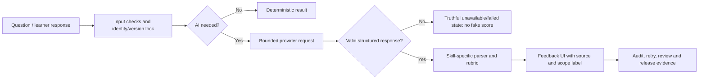

# Practice AI – Integration, review and testing guide

**Audience:** product owner, content/SME reviewer, QA, and engineering.

**Current release scope:** `EXPERIMENTAL_DEMO` for direct-audio Speaking.
It demonstrates a complete concept—audio in, AI feedback out—without claiming
standardized assessment, certification, or a production learner score.

## 1. Plain-language summary

Practice has four skills: Reading, Listening, Writing and Speaking. AI can
help explain, give feedback, or structure observations, but it must never turn
missing information into a made-up score.

For a learner, the simple rule is:

> A visible result must say what the system actually knows. A missing AI result
> is “not available”, not zero points or a failed learner.

Speaking has two distinct modes:

| Mode | What it is for | What can be shown |
| --- | --- | --- |
| Transcript-based feedback | Language/content feedback from the transcript | Text-focused feedback; no claim about pronunciation or fluency |
| Experimental Direct Audio | Portfolio/demo feedback where the provider directly receives audio | `Experimental AI feedback` with a non-standardized-assessment disclaimer |
| Production direct-audio assessment | Future high-confidence learner assessment | Not enabled until the production validation package is complete |

Every experimental score must carry this message:

> **Experimental AI feedback.** Kết quả chỉ nhằm minh họa tính năng AI và
> luyện tập, không phải đánh giá chuẩn hóa hoặc chứng nhận năng lực.

It must not issue certificates, decide pass/fail, rank learners, calculate an
official exam score, or be used for another high-stakes decision.

## 2. One flow for all four skills

The system keeps a **version lock**: a result is tied to the exact set, test,
section, group, question, prompt/rubric and AI configuration that created it.
That prevents later edits from silently changing the meaning of an old result.

## 3. What AI does for each skill

### Reading

- **Input:** published reading question, answer and approved explanation
  context.
- **Primary result:** deterministic answer correctness and points.
- **AI role:** optional explanation or learning hint, never a replacement for
  the answer key.
- **Quality checks:** source/question identity, answer-key match, structured
  response schema, and wording that separates explanation from official score.
- **Failure behaviour:** retain deterministic score; show explanation as
  unavailable or retryable rather than inventing one.

### Listening

- **Input:** published listening item, approved audio/transcript boundaries,
  answer key and any licensed visual asset.
- **Primary result:** deterministic answer correctness and points.
- **AI role:** optional explanation and study feedback.
- **Quality checks:** audio/source identity, question-to-audio binding,
  transcript/reference coverage, timing where required, and response schema.
- **Failure behaviour:** no fabricated transcript, explanation or audio claim.
  The official question score remains independent of optional AI feedback.

### Writing

- **Input:** learner text, prompt, immutable rubric and task/profile identity.
- **Primary result:** rubric-based feedback; task-level evidence stays separate
  from a whole-attempt summary.
- **AI role:** structured rubric feedback, suggestions and diagnostics.
- **Quality checks:** prompt/rubric version, expected JSON schema, bounded
  retries, completeness checks and no null/failed value converted to zero.
- **Failure behaviour:** `PENDING`, `FAILED` or `UNAVAILABLE` is displayed
  plainly. A retry may be offered only when the saved task is still coherent.

### Speaking

- **Input:** learner recording and/or transcript, question context and the
  selected evaluator mode.
- **Transcript mode:** evaluates language visible in transcript only. It must
  not infer pronunciation, fluency, rhythm, intonation or acoustic quality.
- **Experimental direct-audio mode:** an approved demo provider receives audio
  and returns structured feedback. The UI labels it experimental and does not
  use it for official points.
- **Production direct-audio mode:** remains disabled until the evidence package
  in section 6 is independently reviewed and accepted.
- **Failure behaviour:** provider failure, missing audio-consumption proof or
  malformed response yields no experimental score and no fake fallback.

## 4. Taxonomy: how the system names things

| Term | Meaning |
| --- | --- |
| **Capability** | What an evaluator is technically allowed to consume, for example transcript or direct audio |
| **Evidence mode** | What evidence was actually used for this result |
| **Rubric** | The declared criteria and scale used to organize feedback |
| **Artifact** | A saved, identifiable proof file: policy, test output, corpus report, review decision, etc. |
| **Readiness** | Whether a named release scope may be enabled |
| **Experimental** | Demonstration feedback with explicit limitations; not an assessment claim |
| **Production validation** | Independent evidence required before a learner-facing assessment claim |
| **Fail closed** | If a required check is missing, do not send, score or display a substitute result |

### Result states

| State | Learner-safe meaning |
| --- | --- |
| `READY` | Valid result exists for the declared scope |
| `PENDING` | Work is still running; it is not zero |
| `FAILED` | Processing failed; no score should be inferred |
| `UNAVAILABLE` | Required evidence or service is unavailable |
| `EXPERIMENTAL_DEMO_READY` | Demo provider response is valid; only experimental feedback may be shown |
| `PRODUCTION_VALIDATION_REQUIRED` | Production evidence is not complete; no production assessment claim |

## 5. Rubric and feedback rules

1. A rubric is versioned and bound to a task. Changing a rubric creates a new
   version; it does not reinterpret a prior attempt.
2. Deterministic answer keys own Reading/Listening correctness. AI explanation
   may help the learner but cannot overwrite a key.
3. Writing feedback must name its task/rubric context and preserve partial or
   unavailable evidence honestly.
4. Transcript-only Speaking may discuss vocabulary, grammar, relevance and
   organization, but not acoustic traits.
5. Experimental direct-audio feedback may include provider observations such as
   pronunciation or fluency only with the experimental label and disclaimer.
6. A response that fails schema validation is rejected, even if it looks
   plausible. Plausible-looking malformed data is still unsafe data.

## 6. Speaking artifact register and how to “get past” an artifact

Artifacts are not paperwork for its own sake. Each answers one concrete
question: “Can we trust this specific claim?”

| Artifact | Current demo treatment | Needed for future production |
| --- | --- | --- |
| `ALIGNER_CAPABILITY_CAPTURE` | Available engineering evidence | Independent specialist review of the exact captured component/configuration |
| `KOREAN_TIMESTAMP_SAMPLE_REPORT` | Available engineering evidence | Korean human-gold timestamp validation |
| `CORPUS_MANIFEST_REPORT` | Available engineering evidence | Real device/environment, proficiency, repeated-take and SME-labelled corpus |
| `ACOUSTIC_CALIBRATION_REPORT` | Available engineering evidence | Paired real-audio calibration and recorded reject/re-record thresholds |
| `FAIRNESS_REVIEW_REPORT` | Available engineering evidence | Human-score baseline and approved disparity evaluation |
| `REPEATABILITY_REPORT` | Available engineering evidence | Deterministic configuration and fresh independent five-run pass |
| `NON_TRAINING_POLICY` | Deferred for production | Provider policy evidence reviewed for the selected provider |
| `RETENTION_POLICY` | Deferred for production | Provider retention evidence reviewed for the selected provider |
| `REDACTED_CAPTURED_REQUEST` | Not required for demo readiness | Redacted request evidence for production audit |
| `REDACTED_CAPTURED_RESPONSE_RECEIPT` | Not required for demo readiness | Redacted receipt evidence for production audit |

### Artifact handling rules

- Never invent an artifact ID, reviewer identity, acceptance ID, policy value or
  test result.
- An engineering artifact can be `AVAILABLE_EXPERIMENTAL_EVIDENCE` without
  being production `ACCEPTED`.
- A production acceptance applies to one exact file digest, scope and version.
  It is not a blanket approval of future changes.
- A failed or incomplete artifact is useful evidence: keep it, record why it
  did not pass, fix the cause, then make a new capture rather than rewriting
  history.

### Current repeatability example

The Korean forced aligner showed a repeatability issue caused by MFCC dithering:
the five captured runs did not all keep the same word labels/boundaries. A
diagnostic configuration with dither disabled was stable, but it is **not**
automatically accepted. The correct next production step is to register the
new deterministic configuration and perform a fresh independent five-run
evaluation. This remains future production validation, not a demo blocker.

## 7. Direct-audio privacy and review paths

### Demo using preloaded/test audio

- No learner-consent workflow is needed for audio that is already approved for
  the demo.
- The provider must be configured and the runtime credential must be valid.
- A successful direct-audio request and valid structured response are required.

### Demo using a learner recording

- Show a short disclosure that audio will be sent to the selected AI provider
  for feedback.
- Require an affirmative user action before transfer.
- Keep audio only as long as the demo needs it; existing local delete handling
  remains available.
- Do not pretend this minimal demo disclosure is a production privacy program.

### Production later

Production adds formal provider policy/retention review, deletion handling,
least-privilege reviewer access, audit retention, Korean calibration, fairness,
repeatability, human UAT and a final release decision.

## 8. Testing checklist

### Automated contract tests

- Correct provider/model configuration can authorize an experimental request.
- Provider policy artifacts and SME/calibration decisions do not block the
  experimental scope.
- User-recorded audio without active consent does not transfer.
- Preloaded approved demo audio can use the separate demo path.
- Provider failure, no audio-consumption proof, or malformed response produces
  no score.
- Every experimental result includes the label and disclaimer.
- Production readiness remains red/deferred while its evidence is absent.

### Human QA before a demo presentation

1. Use a non-sensitive approved sample audio file.
2. Verify the UI says `Experimental AI feedback` before showing feedback.
3. Trigger one provider failure and confirm that no score appears.
4. Confirm the result is not included in certificates, ranking, pass/fail or
   official practice points.
5. If recording is enabled, verify disclosure and affirmative consent appear
   before transfer.

### Human QA before a production release

Do the full browser/device/provider/load/security/manual-UAT matrix, then have
the named owners make and record a GO/NO-GO decision. Experimental demo success
does not replace any of these checks.

## 9. Operational ownership

| Role | Owns |
| --- | --- |
| Product owner | Scope decision, permitted demo claims, production GO/NO-GO |
| Engineering | Version locks, provider boundary, schema validation, failure paths, auditability |
| Content/Korean SME | Content correctness, rubric interpretation, Korean linguistic review |
| Acoustic/calibration reviewer | Timestamp quality, acoustic calibration and repeatability review |
| Privacy/security owner | Provider policy, data handling and production risk acceptance |
| QA | Reproducible test matrix and evidence that UI behaviour matches declared scope |

## 10. Where to look in the repository

- Direct-audio manifest:
  `docs/operations/practice-speaking-direct-audio-release-evidence-manifest.json`
- Demo/production schema:
  `docs/operations/practice-speaking-direct-audio-release-evidence-manifest.schema.json`
- Speaking evidence files:
  `docs/evidence/practice-speaking-direct-audio/`
- Direct-audio runtime boundary:
  `src/main/java/com/ksh/features/practice/ai/speaking/DirectAudioSpeakingEvaluationService.java`
- Pre-15 historical audit and future production work:
  `docs/PRACTICE_PRE_PHASE_15_RELEASE_CLOSURE_LIVE_REPORT.md`

This document is intentionally a guide, not proof that a provider, SME or
reviewer has approved anything. The manifest and exact captured evidence remain
the source of truth for a particular release decision.
