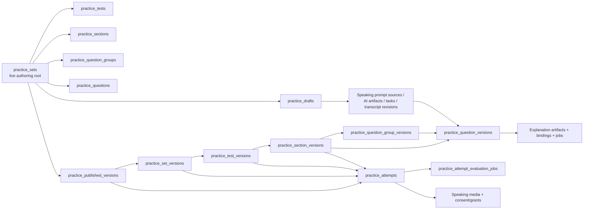

# KSH Practice – Báo cáo bảo vệ schema còn sống

**Ngày kiểm kê:** 09/08/2026
**Phạm vi:** schema được suy ra từ chuỗi Flyway hiện hành đến `V114`; không suy diễn từ những bảng đã bị `DROP` trong migration cũ.
**Kết quả:** Có **37 bảng có tiền tố `practice_` còn sống**. Phần Practice còn phụ thuộc trực tiếp vào **5 bảng không có tiền tố Practice**: `lecturer_assets`, `storage_profiles`, `question_explanation_artifacts`, `question_version_explanation_bindings`, và `question_explanation_generation_tasks`.

> Kết luận để trình bày với hội đồng: Practice không phải là 45 bảng CRUD độc lập. Nó là một tập các **đồ thị dữ liệu theo capability**. Một số bảng là bản ghi nghiệp vụ, một số là snapshot bất biến, và một số là hàng đợi/audit bắt buộc để xử lý AI, media và quyền truy cập an toàn. Xóa một bảng có FK hoặc unique identity trong đồ thị sẽ hoặc bị database chặn, hoặc làm mất tính tái lập, retry an toàn, quyền riêng tư hay lịch sử của cả capability. Vì vậy phương án hợp lý là **retire theo capability graph**, không phải `DROP TABLE` lẻ.

## 1. Cách đọc báo cáo

| Ký hiệu | Nghĩa |
|---|---|
| **PK** | Khóa chính – danh tính duy nhất của bản ghi. |
| **FK vật lý** | `FOREIGN KEY` hiện có trong migration cuối; database tự chặn orphan/inconsistent row. |
| **Liên kết lineage** | ID nguồn chỉ để truy vết và cố ý **không FK** để một author có thể sửa/thay live graph mà không làm hỏng snapshot/attempt đã chốt. Đây không phải FK “thiếu”, mà là quyết định immutability. |
| **Delete boundary** | Capability phải retire cùng bảng đó. Muốn giảm bảng chỉ được xóa trọn boundary sau khi gỡ controller/service/worker/template/test và migration dữ liệu liên quan. |

Các bảng dùng chung `users`, `classes` là **bảng nền tảng toàn hệ thống**, không được tính là Practice-owned; chúng xuất hiện trong cột FK để thể hiện ràng buộc scope/actor.

## 2. Graph tổng quát – lý do không thể “gộp bừa”

Điểm cần nhấn mạnh: bảng version giữ *payload snapshot*; attempt giữ đúng version nó đã làm. Nếu chỉ giữ live tables, một lecturer sửa câu hỏi/hình/audio hôm nay có thể làm bài làm hôm qua đổi nội dung hoặc bị chấm lại theo đề khác.

## 3. Capability A – Live authoring và cấu trúc đề

### A.1 `practice_sets` – aggregate root của một bộ đề

| Thuộc tính | Chi tiết |
|---|---|
| PK | `id` (`BIGINT`). |
| FK đi ra | `class_id → classes.id` (`ON DELETE SET NULL`); `created_by → users.id`. |
| FK đi vào / phụ thuộc | `practice_tests`, `practice_sections`, `practice_question_groups`, `practice_questions`, `practice_edit_logs`; `practice_published_versions`, `practice_set_versions`, `practice_material_references`, `practice_drafts` và `practice_attempts` đều bám trực tiếp hoặc qua version graph. |
| Lý do tồn tại | Lưu lifecycle DRAFT/PUBLISHED/ARCHIVED, scope GLOBAL/CLASS, owner, metadata, cover/audio và là gốc để authoring/publish. `class_id` còn tồn tại như scope cũ nhưng không thay đổi việc `/practice` là boundary riêng. |
| Không thể xóa lẻ vì | Xóa set sẽ phá context của tests/sections/questions và mọi published attempt; FK CASCADE chỉ áp dụng cho live children, không được dùng để xóa lịch sử attempt/version. |
| Delete boundary | **Toàn bộ capability “Practice set authoring & publishing”**. |

### A.2 `practice_tests`

| PK | `id`. |
| FK đi ra | `set_id → practice_sets.id` (`ON DELETE CASCADE`). |
| FK đi vào / lineage | `practice_sections.test_id` (`ON DELETE SET NULL`). `practice_test_versions.test_id` còn source ID để truy vết nhưng FK đã **chủ đích bỏ ở V34**; attempt dùng `test_version_id`. |
| Lý do tồn tại | Gom section thành test, có tiêu đề/thứ tự/thời lượng riêng; một set có thể có nhiều test. |
| Không thể gộp với set | Sẽ mất cardinality “một set – nhiều test”, làm không biểu diễn được test-specific duration/order. |
| Delete boundary | **Multi-test authoring**; phải đổi model authoring và snapshot cùng lúc. |

### A.3 `practice_sections`

| PK | `id`. |
| FK đi ra | `set_id → practice_sets.id` (`CASCADE`); `test_id → practice_tests.id` (`SET NULL`). |
| FK đi vào / lineage | `practice_question_groups.section_id` (`SET NULL`). Snapshot dùng `practice_section_versions.section_id` theo lineage, không FK; attempts neo vào `section_version_id`. |
| Lý do tồn tại | Là đơn vị skill/instruction/thời lượng/điểm trong một test; cho phép cùng set có Reading, Listening, Writing, Speaking. |
| Không thể gộp với test | Mất các trường per-skill và khả năng nhiều section trong một test. |
| Delete boundary | **Sectioned assessment**. |

### A.4 `practice_question_groups`

| PK | `id`. |
| FK đi ra | `set_id → practice_sets.id` (`CASCADE`); `section_id → practice_sections.id` (`SET NULL`). |
| FK đi vào / lineage | `practice_questions.group_id` (`SET NULL`); group version lưu source ID không FK. |
| Lý do tồn tại | Tái sử dụng stimulus chung: reading passage, transcript/listening audio, ảnh, instructions, phạm vi câu hỏi. Không lặp passage/audio vào từng question. |
| Không thể gộp với question | Duplicated text/media tăng dung lượng, sửa một stimulus thành N bản khác nhau, và snapshot không còn mô tả được “một stimulus – nhiều câu”. |
| Delete boundary | **Grouped stimulus (Reading/Listening)**. |

### A.5 `practice_questions`

| PK | `id`. |
| FK đi ra | `set_id → practice_sets.id` (`CASCADE`); `group_id → practice_question_groups.id` (`SET NULL`). |
| FK đi vào / lineage | `practice_speaking_media.question_id`. Published question version giữ `question_id` chỉ làm lineage (không FK sau V34). |
| Lý do tồn tại | Bản **live/editable** của prompt/options/answer/spec/điểm/strategy. Author sửa ở đây để tạo lần publish kế tiếp. |
| Không thể thay bằng question version | Version rows bất biến và có thể nhiều bản cho một câu. Gộp sẽ hoặc sửa dữ liệu attempt cũ, hoặc nhân bản toàn bộ data không có nơi làm việc live. |
| Delete boundary | **Manual question authoring**; đồng nghĩa không còn tạo/sửa đề. |

### A.6 `practice_drafts`

| PK | `id`. |
| FK đi ra | `published_set_id → practice_sets.id` (`ON DELETE SET NULL`). Có unique composite `(id, owner_id)` để kiểm soát ownership trong prompt source. |
| FK đi vào | `practice_material_references.draft_id` (`CASCADE`), `practice_explanation_editorial_revisions.draft_id` (`CASCADE`), `practice_authoring_candidates.target_draft_id` (`RESTRICT`), `practice_speaking_prompt_sources(draft_id, owner_lecturer_id)` (composite FK). |
| Lý do tồn tại | Workspace có version/lock trước publish; lưu bản JSON, owner và workflow import/AI review mà không động trực tiếp vào bản công khai. |
| Không thể gộp với `practice_sets` | DRAFT khác published entity: dữ liệu chuyển tiếp/candidate/media source có thể bị hủy, trong khi set/version đã public không được đổi. |
| Delete boundary | **Draft-first authoring, import, AI authoring**. |

### A.7 `practice_edit_logs`

| PK | `id`. |
| FK đi ra | `set_id → practice_sets.id` (`CASCADE`). `edited_by` là audit identity do service ghi; migration không đặt FK. |
| Lý do tồn tại | Append-only before/after snapshot và summary để giải thích thay đổi authoring/lock; phục vụ review và debug. |
| Có thể retire riêng không? | Có, nhưng chỉ khi retire cả **edit-history/audit capability** và thay bằng audit store khác. Không được drop trong khi UI/service vẫn hiển thị lịch sử. |
| Delete boundary | **Authoring history/audit**. |

### A.8 `practice_material_references`

| PK | `id`. |
| FK đi ra | `asset_id → lecturer_assets.id`; `draft_id → practice_drafts.id` (`CASCADE`); `set_id → practice_sets.id`; `published_version_id → practice_published_versions.id`. |
| Lý do tồn tại | Bridge giữa asset vật lý và đúng scope DRAFT/PUBLISHED_VERSION, kèm placement/key/metadata. Constraint buộc chỉ một shape DRAFT hoặc PUBLISHED_VERSION. |
| Không thể gộp vào asset | Một asset có thể được tham chiếu bởi nhiều draft/version/placement; asset không được biết UI placement của Practice. |
| Delete boundary | **Attach material to authored/published Practice content**. |

### A.9 `practice_asset_lifecycle_tasks`

| PK | `id`. |
| FK đi ra | `asset_id → lecturer_assets.id`; `storage_profile_code → storage_profiles.profile_code`. |
| Lý do tồn tại | Durable worker queue cho DELETE/PROMOTE_CLEANUP/ORPHAN_RECONCILE, retry/claim token/next attempt. Tách I/O object storage khỏi transaction authoring. |
| Không thể gộp vào asset | Asset chỉ biểu diễn trạng thái nghiệp vụ. Queue cần lease/retry/error để process crash không làm rò file hoặc xóa nhầm. |
| Delete boundary | **Asynchronous asset lifecycle**; nếu bỏ phải đổi sang synchronous delete và chấp nhận rủi ro consistency/latency. |

## 4. Capability B – Published snapshot bất biến và learner attempt

### B.1 Nhóm 6 bảng version là một graph, không phải “cache version”

| Bảng | PK | FK vật lý đi ra | Vai trò không thể thay thế | Boundary nếu retire |
|---|---|---|---|---|
| `practice_published_versions` | `id`; unique `(set_id, version_number)` | `set_id → practice_sets.id` | Version header: status, content hash, publisher, thời gian publish. | Published-version history. |
| `practice_set_versions` | `id`; unique `published_version_id` | `published_version_id → practice_published_versions.id`; `set_id → practice_sets.id` | Snapshot metadata của set đúng tại một lần publish. | Published-version history. |
| `practice_test_versions` | `id` | `published_version_id → practice_published_versions.id`; `set_version_id → practice_set_versions.id` | Snapshot test/title/duration/order; `test_id` chỉ lineage, FK live test đã chủ đích bỏ. | Published-version history. |
| `practice_section_versions` | `id` | `published_version_id → practice_published_versions.id`; `test_version_id → practice_test_versions.id` | Snapshot skill/instruction/time/points; `section_id` là lineage không FK. | Published-version history. |
| `practice_question_group_versions` | `id` | `published_version_id → practice_published_versions.id`; `section_version_id → practice_section_versions.id` | Snapshot passage/transcript/audio/image/stimulus provenance; `group_id` là lineage không FK. | Published-version history. |
| `practice_question_versions` | `id` | `published_version_id → practice_published_versions.id`; `section_version_id → practice_section_versions.id`; `group_version_id → practice_question_group_versions.id` | Snapshot prompt/options/answer-spec/strategy/points; `question_id` là lineage không FK. | Published-version history and reproducible grading. |

**Tại sao live foreign key bị bỏ ở V34?** Nếu `question_versions.question_id` vẫn FK vào live question, người soạn xóa/thay live authoring graph sẽ bị chặn hoặc buộc cascade phá snapshot cũ. Thiết kế hiện tại giữ ID nguồn để audit nhưng neo việc làm bài vào version IDs – đây là điều kiện để bản đề công bố không đổi sau khi học viên bắt đầu.

### B.2 `practice_attempts`

| Thuộc tính | Chi tiết |
|---|---|
| PK | `id`. |
| FK đi ra | `user_id → users.id`; `set_id → practice_sets.id`; `published_version_id → practice_published_versions.id`; `set_version_id → practice_set_versions.id`; `test_version_id → practice_test_versions.id`; `section_version_id → practice_section_versions.id`. `test_id` còn source field nhưng FK live test đã bỏ ở V34. |
| FK đi vào | `practice_attempt_evaluation_jobs` (`CASCADE`), `practice_speaking_media`, consent events và reviewer grants. |
| Lý do tồn tại | Bản ghi quyền sở hữu bài làm, answers, deadline/autosave, state, score, evaluation status và **version lock**. |
| Không thể gộp với version | Version dùng chung cho nhiều learner; attempt per learner/per submission, có deadline/retry và dữ liệu trả lời riêng. |
| Delete boundary | **Learner attempt, scoring, result history** – bỏ nó là bỏ chức năng làm Practice. |

### B.3 `practice_attempt_evaluation_jobs`

| PK | `id`; unique `attempt_id` (một job evaluation canonical cho một attempt). |
| FK đi ra | `attempt_id → practice_attempts.id` (`CASCADE`); `requested_by → users.id`. |
| Lý do tồn tại | Đánh giá Writing/Speaking là async, có lease, expiry, bounded retry, manual retry, contract identity và result. Nếu process restart giữa API call, job còn để resume/fail gracefully. |
| Không thể gộp vào attempt | Attempt là aggregate learner; job là state machine worker (`QUEUED/PROCESSING/RETRY_WAIT/...`). Nhét lease/error vào attempt khiến submit và worker cạnh tranh update, không audit retry. |
| Delete boundary | **Async subjective evaluation**. Nếu vẫn dùng AI chấm viết/nói thì phải giữ queue này hoặc triển khai queue bền vững tương đương. |

### B.4 `practice_writing_evaluation_cache`

| PK | `cache_key` (`CHAR(64)`). |
| FK | Không có FK vật lý; key được tạo từ `user_scope_hash`, task/model/prompt/rubric/evaluation-schema và TTL. |
| Lý do tồn tại | Cache kết quả AI Writing theo input/contract để không gửi lại cùng bài, nhầm model/rubric, hoặc tốn phí API lặp lại. Không chứa attempt ownership trực tiếp để tránh cache cross-user. |
| Có thể retire riêng không? | **Có** – đây là ngoại lệ operational. Xóa chỉ khi đồng thời bỏ capability **Writing evaluation response cache** và sửa service; chấm Writing vẫn hoạt động nhưng sẽ tốn request/chi phí hơn và mất deduplication. Không phải bảng “mở rộng” để gộp với attempt vì key/TTL/retention khác lifecycle attempt. |
| Delete boundary | **Writing-evaluation cache**, không phải toàn bộ Writing. |

## 5. Capability C – AI giải thích Reading/Listening có provenance

| Bảng | PK | FK vật lý | Lý do tồn tại | Delete boundary |
|---|---|---|---|---|
| `question_explanation_artifacts` | `id`; unique `fingerprint` | Không FK đi ra. | Immutable-ish artifact theo input contract hash, model, prompt/schema version, language, result/error. Fingerprint dedupe cùng yêu cầu. | AI explanation artifact/provenance. |
| `question_version_explanation_bindings` | `id`; unique active `(question_version_id, active_explanation_language)` | `question_version_id → practice_question_versions.id`; `artifact_id → question_explanation_artifacts.id`. | Chọn artifact nào được hiển thị cho **đúng version** và ngôn ngữ; giữ history SUPERSEDED thay vì overwrite. | AI explanation binding/history. |
| `question_explanation_generation_tasks` | `id`; unique `artifact_id` | `artifact_id → question_explanation_artifacts.id`; `source_question_version_id → practice_question_versions.id`; retry actor → `users.id`. | Durable queue/lease/retry cho provider call; một artifact không bị tạo hai worker song song. | AI explanation generation worker. |
| `practice_explanation_editorial_revisions` | `id`; unique `(draft_id, question_client_id, revision_no)` | `draft_id → practice_drafts.id` (`CASCADE`); `created_by/approved_by → users.id`. | Bản biên tập có state GENERATED_DRAFT/APPROVED/INVALIDATED; đóng dấu strategy/authority, tránh AI output tự động thành “lời giải chính thức”. | Editorial approval of explanations. |

**Vì sao không gộp artifact + binding?** Một artifact được nhận diện bằng content contract/fingerprint; binding trả lời câu hỏi *artifact nào đang là lời giải active cho version này*. Gộp sẽ không hỗ trợ reuse của cùng artifact, supersession, hoặc thay binding mà không phá artifact chứng cứ.
**Có thể giảm nhóm này?** Có, chỉ bằng cách retire trọn **AI Reading/Listening explanation + editorial approval**. Khi đó UI phải rơi về lời giải manual nằm trong question payload; không được drop riêng task/artifact/binding khi worker/UI vẫn sống.

## 6. Capability D – AI/import authoring candidate có review và atomic apply

| Bảng | PK | FK vật lý | Lý do tồn tại | Delete boundary |
|---|---|---|---|---|
| `practice_authoring_candidates` | `id` UUID; unique idempotency composite | `owner_id → users.id`; `target_draft_id → practice_drafts.id`; `warning_acknowledged_by → users.id` (`RESTRICT`). | Lưu candidate từ Excel/PDF-AI qua parse/normalize/validate/review, digest, base draft version và expiry. Importer/provider không được ghi thẳng draft. | Reviewable imported/AI candidate authoring. |
| `practice_authoring_candidate_apply_events` | `id`; unique `(candidate_id, apply_request_id)` | `candidate_id → practice_authoring_candidates.id`; `actor_id → users.id` (`RESTRICT`). | Idempotency ledger cho apply atomic: kết quả DRAFT_APPLIED/CONFLICT/REJECTED, version/digest request. Chống double-click/retry làm ghi hai lần. | Atomic candidate apply audit. |

**Không thể chỉ bỏ apply-events:** candidate có thể được gửi lại do network retry. Không có ledger, hệ thống không phân biệt request cũ đã áp dụng với request mới, dẫn đến double insert hoặc silent overwrite draft.
**Boundary:** Có thể retire cả hai nếu product bỏ *AI/PDF/Excel candidate workflow* và chỉ còn manual editing; không thể xóa một trong hai trong khi workflow import còn được expose.

## 7. Capability E – AI control plane, execution audit và cấu hình provider

| Bảng | PK | FK vật lý | Lý do tồn tại | Delete boundary |
|---|---|---|---|---|
| `practice_ai_provider_profiles` | `id`; unique `profile_code` | `updated_by → users.id`. | Profile endpoint/secret/config/revision/enabled, không hard-code provider credential trong Business flow. | Practice AI provider configuration. |
| `practice_ai_purpose_bindings` | `purpose_code` | `provider_profile_id → practice_ai_provider_profiles.id`; `updated_by → users.id`. | Map rõ từng purpose (PDF authoring, RL explanation, Writing, Speaking/STT/TTS) tới model/dialect/capability/limits/retention; revisioned. | Purpose-to-provider policy. |
| `practice_ai_capability_test_runs` | `id` | `purpose_code → practice_ai_purpose_bindings.purpose_code`; `tested_by → users.id`. | Chứng minh provider/model đã test capability cần thiết và lưu duration/error bounded trước khi bật. | Admin capability-test audit. |
| `practice_ai_execution_audits` | `id` | Không FK vật lý; lưu purpose/profile-code + binding/profile revision snapshot và digests. | Audit chính xác “lần request này dùng config nào” kể cả profile/binding sau đó đã đổi hoặc bị xóa/disable. FK revision không thể biểu đạt được snapshot lịch sử. | AI execution audit/provenance. |

**Lý do không gộp:** profile là reusable endpoint credential, binding là policy theo purpose, capability run là kết quả test, execution audit là event lịch sử. Chúng có cardinality/lifecycle khác nhau. Xóa cả graph chỉ hợp lệ khi **retire toàn bộ AI Practice** hoặc thay bằng một control plane khác đã migration dữ liệu.

## 8. Capability F – Speaking prompt authoring (STT/TTS) và snapshot delivery

| Bảng | PK | FK vật lý chính | Lý do tồn tại | Delete boundary |
|---|---|---|---|---|
| `practice_speaking_prompt_sources` | `id`; unique `(draft_id, question_client_id)` | Composite `(draft_id, owner_lecturer_id) → practice_drafts(id, owner_id)`; owner/creator/updater → users; original/generated/active asset + owner → `lecturer_assets`. | Mutable authoring source: teacher upload audio **hoặc** manual text, current STT/TTS artifact, selected transcript, revision/lock/state. | Speaking prompt authoring. |
| `practice_speaking_prompt_ai_artifacts` | `id`; unique operation fingerprint per owner | owner → users; input/generated asset composites → `lecturer_assets`. | Provider output contract riêng STT/TTS, hash/fingerprint, model/voice/speed/status/error. Reusable nhưng immutable per operation input. | STT/TTS artifact provenance. |
| `practice_speaking_prompt_transcript_revisions` | `id`; unique `(artifact_id, revision_number)` | Composite artifact/owner/operation → AI artifacts; owner/editor → users. | Teacher sửa/xác nhận transcript mà không rewrite provider output; có revision history. | Transcript correction/approval. |
| `practice_speaking_prompt_ai_tasks` | `id`; unique active fingerprint | Composite artifact + owner + operation + fingerprint → artifacts; source + owner → sources; owner/requester → users. | Queue lease/retry cho STT/TTS, ngăn concurrent duplicate provider calls. | Durable STT/TTS work queue. |
| `practice_speaking_prompt_version_contexts` | `question_version_id` (PK) | question version → `practice_question_versions`; owner/creator → users; asset/artifact composites → assets/artifacts. | Snapshot prompt text/audio-origin/STT-TTS contract được phát đúng version cho learner. | Published Speaking delivery. |

**Tại sao cần năm bảng?** `source` mutable; `artifact` là kết quả provider; `transcript revision` là quyết định của teacher; `task` là state machine vận hành; `version context` là snapshot learner-facing. Một bảng chung sẽ trộn mutable authoring, worker lease và immutable delivery – vừa khó FK vừa mất lịch sử/retry.
**Boundary:** Bỏ toàn bộ **Speaking prompt authoring/STT/TTS** thì có thể retire 5 bảng này sau migration. Vẫn giữ Speaking recording/evaluation thì không được drop các bảng của Capability G dưới đây.

## 9. Capability G – Speaking learner media, consent và reviewer authorization

### G.1 Lưu media và xóa vật lý an toàn

| Bảng | PK | FK vật lý | Lý do tồn tại | Delete boundary |
|---|---|---|---|---|
| `practice_speaking_media` | `id`; unique storage identity `(storage_profile_code, storage_key)` | `attempt_id → practice_attempts.id`; `question_id → practice_questions.id`; `storage_profile_code → storage_profiles.profile_code`. | Metadata private recording: content hash, MIME/codec/size/duration, state lifecycle. Không lưu bytes/url trực tiếp trong attempt. | Learner Speaking recording/media. |
| `practice_speaking_media_cleanup_tasks` | `id`; unique storage identity | `media_id → practice_speaking_media.id`; `storage_profile_code → storage_profiles.profile_code`. | Durable delete queue theo temporary expiry/superseded/discard/migration/consent withdrawal; retry và authorization evidence. | Media retention/physical cleanup. |

Xóa `practice_speaking_media_cleanup_tasks` mà vẫn cho upload là tạo orphan object-storage hoặc xóa đồng bộ trong request (dễ timeout và không retry). Xóa `practice_speaking_media` sẽ làm attempt không còn metadata để kiểm tra media nào thuộc question nào.

### G.2 Direct-audio authorization còn giữ lại

| Bảng | PK | FK vật lý | Lý do tồn tại | Delete boundary |
|---|---|---|---|---|
| `practice_speaking_audio_consent_events` | `id`; unique event/evidence/chain-event keys | learner → users; `attempt_id → practice_attempts.id`. | Append-only GRANTED/WITHDRAWN evidence cho direct-audio evaluation; không chứa audio/key/secret. | Learner consent for direct audio. |
| `practice_speaking_audio_reviewer_grants` | `id`; unique grant/evidence keys | attempt → attempts; reviewer/granted/revoked actors → users. | Time-bounded, revocable reviewer right với evidence và lock version. | Reviewer access authorization. |
| `practice_speaking_audio_grant_manager_events` | `id`; unique event/evidence keys | subject/actor → users. | Append-only authority assignment/revoke cho người được quyền cấp reviewer grant; không suy quyền này từ role broad ADMIN/LECTURER. | Grant-manager authority governance. |

`V114` đã retire `practice_speaking_direct_audio_dark_observations` và bảng phụ thuộc `practice_speaking_audio_reviewer_access_events`, đồng thời gỡ reviewer page/API/playback/audit worker. Hai bảng này không mang điểm và không tham gia chuỗi đang chạy `audio → STT → transcript → AI evaluator`. Consent, media, cleanup, purpose/model binding và evaluator vẫn còn. Reviewer grant/manager events hiện là nền tảng governance mặc định tắt cho direct-provider tương lai, không còn được trình bày như một UI reviewer đang hoạt động.

## 10. Capability H – Storage profile và migration không mất dữ liệu

| Bảng | PK | FK vật lý | Lý do tồn tại | Delete boundary |
|---|---|---|---|---|
| `storage_profiles` | `profile_code` | Không FK đi ra trong migration này. | Control plane cho LOCAL/R2 và prefix/revision; được dùng bởi `lecturer_assets`, Practice task/media cleanup/migration. Bảng này **dùng chung**, không chỉ Practice. | Storage abstraction toàn ứng dụng. |
| `lecturer_assets` | `id`; composite unique `(id, owner_lecturer_id)` | `storage_profile_code → storage_profiles.profile_code`; ownership là entity-level/composite relationship. | Asset catalogue được Practice material/prompt STT-TTS tham chiếu; giữ hash, visibility, retention, verification. Cũng là tài sản của lecturer ngoài Practice. | Shared lecturer asset management, không được drop chỉ vì giảm Practice tables. |
| `practice_storage_migration_jobs` | `id`; unique logical target + storage target | `source_profile_code/target_profile_code → storage_profiles.profile_code`. | Copy → verify SHA-256 → update logical reference → delayed delete nguồn. Worker retry/lease/revision giúp đổi LOCAL/R2 không làm mất audio/PDF giữa chừng. | Practice storage migration operation. |

`practice_storage_migration_jobs` không phải “cache”: nó là **sổ trạng thái giao dịch dài** qua hai hệ thống (DB và object store). Nếu gộp vào media/assets, một process chết sau copy trước update sẽ không biết object nào cần retry/xóa; nếu xóa bảng mà vẫn hỗ trợ chuyển profile, sẽ rủi ro duplicate/mất file.

## 11. Capability I – Personalisation của người học

| Bảng | PK | FK vật lý | Lý do tồn tại | Delete boundary |
|---|---|---|---|---|
| `practice_user_preferences` | `user_id` (PK, đúng một preference row mỗi user) | `user_id → users.id` (`ON DELETE CASCADE`). | Lưu Korean font, size, schema version cho renderer Practice. Tách khỏi `users` để preference chỉ tồn tại khi bật Practice, không làm phình profile nền tảng. | **Korean font/size personalisation**. |

Đây là bảng nhỏ và là ứng viên retire độc lập tốt nhất. Tuy vậy không nên `DROP` trực tiếp: phải gỡ preference API/UI/JS và chọn default font cố định trước; sau đó migration bỏ row. Nó không có quan hệ với attempt score hoặc version graph.

## 12. Bảng thực sự có thể retire độc lập hơn

Để báo cáo trung thực: không nên nói mọi bảng đều có cùng mức độ bắt buộc.

| Bảng / nhóm | Có thể retire như capability độc lập? | Điều kiện bắt buộc |
|---|---|---|
| `practice_user_preferences` | Có. | Bỏ **cá nhân hóa font/kích thước chữ tiếng Hàn**; gỡ route/UI/service, không ảnh hưởng attempt. |
| `practice_writing_evaluation_cache` | Có. | Bỏ **response cache/dedup** Writing; chấm AI vẫn còn nhưng tốn tiền/chậm hơn. |
| `practice_edit_logs` | Có, nhưng không nên nếu còn audit. | Bỏ **authoring history/audit** hoặc chuyển sang audit store khác. |
| `practice_authoring_candidates` + apply events | Có theo cặp. | Bỏ import/PDF-AI reviewable candidate flow; chỉ còn manual draft authoring. |
| Explanation artifact/binding/task/editorial group | Có theo group. | Bỏ AI R/L explanation + approval workflow; chuyển UI sang manual explanation. |

Các bảng còn lại nằm trong đường đi chính của authoring → publish snapshot → attempt hoặc nằm trong an toàn media/AI operation. Không nên drop lẻ.

## 13. Checklist khi đề xuất giảm bảng cho hội đồng

1. Xác định **capability** muốn retire, không bắt đầu bằng tên bảng.
2. Liệt kê tất cả FK incoming/outgoing và reference trong service/worker/template/test.
3. Chọn migration dữ liệu: archive, purge có evidence, hoặc migrate vào aggregate thay thế.
4. Gỡ endpoint, background worker, scheduled cleanup, RBAC/menu và test của capability đó trong cùng pull request.
5. Chỉ sau đó thêm Flyway `DROP TABLE` theo thứ tự child → parent; không `DROP` trước code.
6. Với version/attempt/media, phải chứng minh không còn learner attempt, retention hold hoặc reviewer audit cần truy xuất.

## 14. Evidence kỹ thuật

- Core graph và attempts: `V25__practice_hub.sql`, `V33__practice_immutable_versions.sql`, `V34__practice_single_scope_final.sql`, `V62__practice_attempt_integrity_gate.sql`.
- AI explanations: `V37__question_explanation_artifact_lifecycle.sql`, `V69__practice_explanation_binding_supersession.sql`, `V73__practice_objective_explanation_editorial_authority.sql`.
- AI authoring/control plane: `V83__practice_authoring_candidate_foundation.sql`, `V84__practice_ai_control_plane.sql`.
- Speaking: `V30__practice_speaking_media.sql`, `V31__practice_speaking_media_cleanup.sql`, `V55__practice_speaking_prompt_authoring_foundation.sql`, `V103`–`V111`.
- Storage: `V85__practice_storage_profiles.sql`.
- Sự loại bỏ schema legacy/capability được kiểm tra qua `V87`, `V112`, `V113` và `V114`; không đưa các bảng đã drop vào báo cáo này.

> Nếu cần con số exact của **database đang chạy**, chạy truy vấn `information_schema.tables` theo schema local sau khi Flyway hoàn tất. Báo cáo này là inventory theo source-of-truth migration, không giả vờ dữ liệu DB cũ đã được migrate khi chưa chạy ứng dụng.
