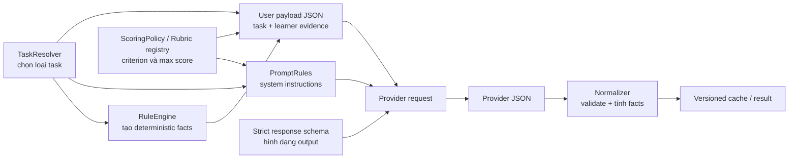

# KSH Language Assessment & Explanation Design

> Trạng thái: **DESIGN PROPOSAL + CURRENT-SOURCE SUPERSESSION NOTE**
>
> Phạm vi: chấm Writing, chấm Speaking, giải thích Reading/Listening và toàn bộ
> các lớp liên quan gồm policy, score, prompt, rule engine, taxonomy, evidence,
> schema, normalizer, versioning, cache, calibration, readiness và result.
>
> Ngày rà soát code: 2026-07-20
>
> Vị trí roadmap hiện tại: bounded `PHASE_13D_UX_CORRECTION` đã được
> commit/push tại `98153ac`; hai authenticated Result Detail route case còn bị
> chặn trước đó đã xanh `2/2` trên disposable fresh V44 schema. `13E-01..05`
> hiện `IMPLEMENTED_PENDING_PHASE_VALIDATION / ACCEPT_STATIC`; complete diff và
> current-source documents đã reconcile, nên Phase 13E là
> `READY_FOR_PHASE_VALIDATION`. Chưa chạy consolidated
> validation/test/build/Git trước readiness declaration. Tài liệu này là design
> authority cho phần runtime/UI được duyệt trong 13E và cho các correctness
> contract được promote vào `PRE_PHASE_14_PRODUCTION_CORRECTNESS_GATE`, nhưng
> chỉ sau khi 13E-13H hoàn tất/validated. Nó không tự mở gate đó và vẫn cấm
> final SME/calibration, direct-audio rollout, destructive migration/reset hay
> retained-data cleanup trước `PRE_PHASE_15_RELEASE_CLOSURE_GATE` sau 14F.
>
> Nguồn chuẩn runtime hiện tại vẫn là code, `CODEX_PRACTICE_WORKFLOW.md` và
> `docs/PRACTICE_PHASE_13_IMPLEMENTATION_AND_GATE.md`.
>
> **Migration audit (`2026-07-24`):**
> `REBASELINE_GO_WITH_GUARDS` là kế hoạch sau consolidated Phase 13E và trước
> 14A, không phải hành động trong 13E. Rebaseline dừng ngay nếu có bất kỳ
> retained/deployed/shared/canonical/upgrade obligation nào.

> **UX-05 current source:** F06 và handoff UX-03..05 trong
> `docs/PRACTICE_PHASE_13D_RESULT_OVERVIEW_UX_CORRECTION_LIVE_CHANGE_LOG.md`
> supersede các mô tả runtime cũ về sáu tiêu chí/holistic Speaking. Runtime hiện
> tại chỉ có hồ sơ chẩn đoán dựa trên transcript: bốn row Content `20`, Grammar
> `20`, Vocabulary `15`, Coherence `15`; Fluency và Pronunciation/Delivery là
> `NOT_SCORABLE` với mọi số null; không cộng `/70`, không aggregate/holistic hay
> attempt score. Direct-audio vẫn `NO-GO`. Crosswalk design/workflow/debt hiện
> hành nằm ở Phase 15 inventory Section 4.1.1.

## 1. Kết luận điều hành

### 1.1 Phán quyết ngắn

Hệ thống hiện tại đã làm tốt phần **an toàn kỹ thuật và khả năng truy vết** hơn
phần **mô hình đo năng lực ngôn ngữ**. Nó đã có prompt dài, strict JSON schema,
rubric ID, version, evidence scope, normalizer, cache identity, immutable
Reading/Listening artifact và fail-closed status. Vì vậy nhận định “chỉ có vài
rule ngắn” không đúng với toàn pipeline.

Tuy nhiên, các rule ngắn trong `WritingRuleEngine` và `SpeakingRuleEngine` đúng
là quá nhỏ và quá thô nếu bị dùng như một bộ mô tả đầy đủ tiếng Hàn. Chúng chỉ
nên là **high-precision deterministic signals**, không phải từ điển toàn bộ lỗi,
không phải rubric, và không được tự quyết định điểm.

Không một blacklist, taxonomy hay prompt hữu hạn nào “bao quát toàn bộ tiếng
Hàn đa dạng và giàu giá trị”. Hệ thống hợp lý phải bao quát **construct cần đo**,
**loại nhiệm vụ**, **mức chất lượng**, **nguồn bằng chứng** và **các trường hợp
rủi ro**. Biến thể ngôn ngữ cụ thể được giữ ở evidence mở, còn độ tin cậy được
chứng minh bằng calibration trên dữ liệu đại diện.

Số dòng code không phải thước đo coverage ngôn ngữ. Repository này không chứa
toàn bộ tri thức tiếng Hàn; nó điều phối một model đã được huấn luyện ngoài repo,
nhưng model lớn đến đâu cũng không chứng minh đã biết mọi cách dùng đúng. Code,
model, corpus và calibration đều hữu hạn; tiếng Hàn là một hệ mở, thay đổi theo
thời gian, cộng đồng, tình huống và mục đích. Vì vậy claim đúng luôn là
**coverage trong một miền đã định nghĩa**, không phải “coverage toàn bộ tiếng Hàn”.

### 1.2 GO/NO-GO theo năng lực hiện tại

| Capability | Đánh giá hiện tại | Quyết định |
| --- | --- | --- |
| Writing feedback nội bộ | Nền tảng tốt, nhưng descriptor và policy điểm còn thiếu; trọng số Q53/Q54 không khớp bảng TOPIK công khai | **LIMITED GO** sau khi gọi đúng là điểm luyện tập KSH; sửa policy trước khi quảng bá là mô phỏng TOPIK sát chuẩn |
| Speaking từ transcript | Có thể phản hồi Content/Grammar/Vocabulary/Coherence có điều kiện | **SHADOW/LIMITED GO** sau calibration; không chấm các thuộc tính cần audio |
| Speaking Fluency/Pronunciation/Delivery | Phase 13D UX-03..05 đã truyền authoritative transcript confidence và khóa hai tiêu chí acoustic ở `NOT_SCORABLE`, nhưng evaluator vẫn không nhận audio | **NO-GO** cho điểm audio-grounded; transcript-only guard đã qua Phase 13D focused gate và fresh V44 route gate `2/2` |
| Reading/Listening deterministic score | Key-based, tách khỏi AI | **GO** nếu answer spec đúng |
| Reading/Listening AI explanation | Evidence gate và immutable lifecycle tốt; output chưa thật sự type-aware | **LIMITED GO** cho `SINGLE_CHOICE`; cần redesign cho `FILL_BLANK` và `TRUE_FALSE_NOT_GIVEN` |

### 1.3 Vì sao vài nghìn hay vài chục nghìn dòng không thể chứa toàn bộ tiếng Hàn

Tiếng Hàn cần xét không chỉ một danh sách ngữ pháp hiện đại mà còn:

- biến đổi lịch sử của ngôn ngữ và chữ viết;
- chính tả/cách dùng cổ, cận đại và hiện đại;
- tiếng Hàn chuẩn, phương ngữ vùng miền và biến thể cộng đồng;
- khác biệt Bắc/Nam và diaspora;
- speech level, honorific, quan hệ xã hội và mức độ gián tiếp;
- khẩu ngữ, văn viết, học thuật, hành chính, báo chí, văn chương, quảng cáo,
  mạng xã hội và hội thoại nghề nghiệp;
- thành ngữ, collocation, hàm ý, mỉa mai, chơi chữ và liên văn bản;
- từ mới, từ vay mượn, code-switching, tên riêng và cách dùng đang tiếp tục đổi;
- khác biệt cá nhân nhưng vẫn chấp nhận được của người bản ngữ và người học.

Muốn encode mọi câu đúng/sai bằng `if`, regex hoặc enum sẽ gặp ba thất bại:

1. **Không thể liệt kê hết**: cùng một biểu thức có thể đúng/sai tùy context,
   speaker, audience, genre và thời điểm lịch sử.
2. **False positive tăng theo rule**: càng thêm blacklist thô, càng phạt nhầm
   cách dùng hợp lệ; `랑` nằm trong `사랑` là ví dụ nhỏ ngay trong code hiện tại.
3. **Hệ thống lập tức lỗi thời**: ngôn ngữ mới và cách dùng mới xuất hiện nhanh
   hơn vòng release code.

Model cũng không giải quyết triệt để ba vấn đề này. Model cho khả năng khái quát
open-world tốt hơn rule engine nhưng vẫn có blind spot, hallucination, bias và
drift. Human expert cũng có disagreement. Do đó kiến trúc đúng phải có ba vòng:

```text
closed-world code contract
  -> định nghĩa task/policy/score/evidence/invariants

open-world linguistic judgment
  -> model hoặc human diễn giải ngôn ngữ cụ thể trong context

empirical validity boundary
  -> calibration đo hệ thống đúng đến đâu trên miền dữ liệu đã tuyên bố
```

Mục tiêu KSH nên được viết hữu hạn và kiểm chứng được, ví dụ:

> “Đánh giá tiếng Hàn hiện đại dùng trong các task luyện TOPIK/KSH đã hỗ trợ,
> ưu tiên chuẩn viết hiện đại và khả năng hiểu được trong nói; chấp nhận biến thể
> hợp lý khi không phá mục đích giao tiếp; không tuyên bố thẩm định đầy đủ tiếng
> Hàn lịch sử, văn chương, phương ngữ hoặc mọi cộng đồng sử dụng.”

Đây không phải hạ tiêu chuẩn. Đây là cách duy nhất để một assessment có validity:
nói rõ population, domain, task và interpretation mà score được phép đại diện.

## 2. Phạm vi và thuật ngữ

Trong tài liệu này:

- **Policy**: tuyên bố hệ thống đo cái gì, không đo cái gì, dùng thang nào và khi
  nào kết quả không khả dụng.
- **Task spec**: đặc tả nhiệm vụ cụ thể, mục đích giao tiếp, đối tượng, thể loại,
  yêu cầu, thời lượng/dung lượng và evidence có thẩm quyền.
- **Scoring criterion**: trục có điểm và trọng số.
- **Performance descriptor**: mô tả chất lượng ở từng mức điểm của một criterion.
- **Diagnostic taxonomy**: mã phân loại điểm mạnh/lỗi để giải thích và luyện tập;
  không đồng nghĩa với scoring criterion.
- **Rule engine**: tín hiệu xác định bằng code với precision cao; không phải bộ
  phân tích tiếng Hàn hoàn chỉnh.
- **Evidence**: đoạn text, toàn bài, metadata nhiệm vụ, transcript span, timestamp,
  image region hoặc acoustic measurement có provenance.
- **Normalizer**: lớp giữ contract, tính tổng điểm, loại evidence sai và trả trạng
  thái; không tự “chữa” kết quả thiếu thành một điểm giả.
- **Explanation**: giải thích đáp án Reading/Listening; không phải chấm năng lực
  người học và không được chứa learner answer trong shared artifact.

`CanonicalQuestionType` hiện tại là taxonomy **delivery/interaction** gồm
`SINGLE_CHOICE`, `TRUE_FALSE_NOT_GIVEN`, `FILL_BLANK`, `ESSAY`, `SPEAKING`.
Nó không và không cần đóng vai taxonomy ngôn ngữ. Các construct như main idea,
inference, register hay pragmatic appropriateness phải nằm ở task spec hoặc
diagnostic taxonomy, không cần tạo thêm question type runtime.

## 3. Mục tiêu sản phẩm và giới hạn claim

### 3.1 Mục tiêu

KSH cung cấp:

1. điểm luyện tập theo task và policy KSH;
2. feedback tiếng Việt, evidence tiếng Hàn và gợi ý sửa tiếng Hàn;
3. score có thể giải thích từ rubric;
4. trạng thái rõ khi evidence không đủ;
5. khả năng so sánh có giới hạn giữa các lần chấm dùng cùng policy bundle;
6. công cụ luyện tập, không phải chứng chỉ năng lực chính thức.

### 3.2 Không tuyên bố

- Không gọi điểm KSH là điểm TOPIK chính thức hoặc quy đổi chứng chỉ.
- Không gọi learner “native-like/non-native-like”.
- Không chẩn đoán y khoa, trị liệu giọng nói hoặc phoneme như sự thật khi thiếu
  alignment/audio evidence.
- Không suy ra năng lực tổng thể của tiếng Hàn từ một task ngắn.
- Không coi một danh sách từ nối, blacklist khẩu ngữ hay số lỗi là toàn bộ chất
  lượng ngôn ngữ.

NIIED hiện công bố TOPIK II PBT có bốn câu Writing và TOPIK Speaking có sáu câu,
nhưng đó không làm cho một rubric nội bộ tự động trở thành rubric chính thức.
Nguồn: [NIIED — TOPIK](https://niied.go.kr/web/niied/contents/niied_topik).

## 4. Kiến trúc hiện tại (as-is)

### 4.1 Writing

```text
immutable question + WritingTaskType + learner answer + optional image
  -> WritingTaskResolver
  -> WritingRuleEngine (char count + spoken-style signals)
  -> WritingPromptRules + allowed scoring/finding rubrics
  -> provider strict JSON
  -> WritingEvaluationNormalizer
       - validate criterion IDs/max/score
       - validate finding evidence span/scope
       - compute raw score + percentage
       - create annotations
  -> versioned cache/result
```

### 4.2 Speaking

```text
private learner audio
  -> transcription provider
  -> transcript + authoritative optional ASR confidence
  -> SpeakingRuleEngine signals
  -> SpeakingPromptRules + four transcript-grounded score rows
  -> evaluator receives transcript, metadata, optional question image (not audio)
  -> SpeakingEvaluationNormalizer
       - validate four language rows against their native maxima
       - discard unsupported acoustic claims/evidence
       - append Fluency and Pronunciation/Delivery as null NOT_SCORABLE rows
  -> persisted typed capability/evidence/trust contract
  -> transcript-language profile presenter with no subtotal/holistic/attempt score
```

Đây là current-source pipeline sau bounded Phase 13D UX-03..05, đang chờ một
gate validation tổng hợp. `AUDIO_DIRECT_FULL_RESERVED` chỉ là seam bị khóa;
không phải bằng chứng rằng hệ thống hiện đã chấm được âm thanh.

### 4.3 Reading/Listening

```text
published immutable question + answer spec + approved passage/transcript/images
  -> ExplanationInputFactory
  -> fingerprint + durable preparation task
  -> ReadingListeningExplanationClient
  -> strict JSON + quote/option-ID validation
  -> immutable shared artifact + question-version binding
  -> read-only result GET
  + separate deterministic LearnerAnswerOverlay
```

### 4.4 Cách đọc cú pháp `""" + helper() + """` trong `WritingPromptRules`

Đây là cú pháp Java để **ghép các chuỗi**, không phải cú pháp riêng của AI và
không phải “cộng điểm”. Java text block bắt đầu/kết thúc bằng `"""`. Khi cần
chèn một đoạn được quyết định lúc runtime, code đóng text block, gọi hàm trả về
`String`, dùng toán tử `+`, rồi mở text block tiếp theo.

Ví dụ thật ở `WritingPromptRules.java:54`:

```java
return """
       Chấm bài viết theo đúng """ + rubricInstruction(taskType) + """
       [QUY TẮC CHẤM]
       ...
       """;
```

Về ý nghĩa, nó tương đương dạng dễ đọc hơn sau:

```java
String before = "Chấm bài viết theo đúng ";
String selectedRubricInstruction = rubricInstruction(taskType);
String after = "\n[QUY TẮC CHẤM]\n...";
return before + selectedRubricInstruction + after;
```

Khi chạy, model chỉ nhận **một chuỗi system prompt cuối cùng**. Model không nhìn
thấy tên hàm `rubricInstruction`, không gọi được hàm đó và cũng không biết prompt
đã được ghép từ bao nhiêu phần.

Năm chỗ ghép trong Writing có năm mục đích khác nhau:

| Chỗ ghép | Input quyết định | Đoạn được chọn | Lý do tồn tại |
| --- | --- | --- | --- |
| `rubricInstruction(taskType)` | Q51/Q52 hay essay | mô tả rubric cloze hoặc essay | Không áp tiêu chí bố cục bài luận cho câu điền blank |
| `taskSpecificRules(taskType)` | Q51, Q52, Q53, Q54, GENERAL | yêu cầu riêng của loại task | Một khung chung nhưng construct/task constraint khác nhau |
| `taskDetailRules(taskType)` | task type | ưu tiên finding/evidence riêng | Giữ phần diagnosis bám đúng evidence của từng task |
| `taskUpgradeRules(taskType)` | task type | quy tắc tạo bài nâng cấp | Q53 cần report khách quan, Q54 cần nghị luận, Q51/52 cần câu ngắn |
| `auditRules(isReEvaluation)` | chấm mới hay kiểm định lại | chuỗi rỗng hoặc audit section | Re-evaluation dùng cùng schema nhưng thêm thái độ chấm độc lập |

Điểm quan trọng là **không phải cứ “thỉnh thoảng thích thì cộng hàm”**. Mỗi điểm
ghép đáng lẽ phải là một variation point có tên: task, evidence mode, score mode
hoặc audit mode. Nếu một helper không đại diện variation point rõ ràng thì nó chỉ
làm prompt khó đọc hơn và không nên được tách/chèn tùy tiện.

#### Tại sao không viết bốn prompt Q51-Q54 hoàn toàn riêng?

Việc giữ một skeleton chung tránh nhân bản các policy phải giống nhau ở mọi task:

- claim “điểm luyện tập KSH, không phải điểm chính thức”;
- language policy Việt/Hàn;
- không tự đổi criterion/max score;
- evidence scope và exact substring;
- spam/off-topic guardrail;
- output JSON contract;
- không bịa dữ kiện và không đổi ý người học khi rewrite.

Nếu copy toàn bộ prompt thành bốn bản, một guardrail được sửa ở Q53 có thể bị
quên ở Q51/Q52/Q54. Helper theo task giải quyết duplication đó. Trade-off là
prompt cuối khó nhìn trực tiếp trong source và có thể phát sinh rule mâu thuẫn
giữa skeleton chung với module riêng.

#### Vì sao exact placement của các hàm lại nằm ở những dòng đó?

Có hai loại lý do:

- **Có lý do kiến trúc**: rubric instruction phải xuất hiện trước khi model chấm;
  task detail phải đứng gần phần findings; upgrade rule phải đứng gần phần
  rewrite; audit rule chỉ bật ở re-evaluation.
- **Lý do lịch sử/biên tập**: việc dùng inline `+` thay vì `String.join`, và chính
  xác module nằm trước hay sau một checklist cùng loại, không phải invariant
  runtime. Git history cho thấy prompt được tích lũy theo nhiều đợt: khung ban
  đầu, unified score/findings/rewrite, evidence contract, max-score discipline và
  image evidence. Vì vậy một phần hình dạng hiện tại là kết quả phát triển dần,
  không phải toàn bộ đã được thiết kế upfront.

Không nên bịa một lý do học thuật cho mọi vị trí dòng. Lý do nào không có task
contract, test hoặc history support phải được ghi là **implementation choice**,
không gọi là assessment principle.

### 4.5 Mục đích của “single unified prompt” trong Writing

Comment tại `WritingPromptRules.java:40-43` và flow tại
`WritingEvaluationClient.java:204-215` cho thấy chủ đích hiện tại là một provider
call trả đồng thời:

1. rubric scores;
2. strengths/needs;
3. upgraded answer;
4. sentence rewrites.

Lợi ích:

- score và feedback cùng nhìn một prompt, learner answer và task context;
- giảm latency/cost so với ba hoặc bốn provider calls;
- tránh một call cho điểm cao nhưng call khác lại mô tả bài rất yếu;
- cache/persist được một evaluation envelope có chung provenance.

Đánh đổi:

- system prompt và response schema lớn;
- một phần malformed có thể làm hỏng cả response;
- model phải đồng thời chấm, chẩn đoán và coaching nên dễ tự mâu thuẫn;
- thay đổi một module có thể làm output khác ở những phần tưởng như không liên quan;
- test hiện chủ yếu chứng minh “đoạn text có mặt”, chưa chứng minh thứ tự/module
  làm chất lượng chấm tốt hơn.

Do đó “one call” là quyết định vận hành hợp lý cho MVP, không phải bằng chứng rằng
rubric có validity. Thiết kế đích vẫn phải tách **score judgment**, **diagnosis**
và **coaching** thành ba cấu trúc logic, dù có thể render chúng trong một request.

### 4.6 Một request AI hiện tại thực ra có năm contract khác nhau



| Contract | Câu hỏi nó trả lời | Writing hiện nằm ở đâu |
| --- | --- | --- |
| Instruction contract | Model phải hành xử/chấm theo nguyên tắc nào? | `WritingPromptRules.buildUnifiedPrompt()` |
| Input/evidence contract | Task, learner answer, rule facts và ảnh nào được gửi? | `WritingEvaluationClient.userPayload()` + `multimodalContent()` |
| Scoring contract | Criterion nào active, max bao nhiêu? | `WritingScoringPolicy` được serialize vào `allowed_rubric.scoring_criteria` |
| Output shape contract | Provider được phép trả field/type nào? | `WritingEvaluationClient.unifiedSchema()` và `response_format` |
| Trust/normalization contract | Field nào được tin, tổng nào backend tính, evidence nào bị loại? | `WritingEvaluationNormalizer` |

Đây là khung kiến trúc quan trọng hơn bản thân chuỗi prompt. Prompt chỉ là một
lớp trong năm lớp. Nếu model làm trái prompt nhưng schema/normalizer không chặn,
hệ thống vẫn có lỗi. Nếu prompt viết đúng nhưng input thiếu evidence, model cũng
không thể chấm đúng.

#### Vì sao learner answer không được nối bằng `+` vào system prompt?

Current Writing path đưa `prompt`, `learner_answer`, `rule_violations` và
`allowed_rubric` vào một `Map`, rồi dùng `ObjectMapper` serialize thành user
payload (`WritingEvaluationClient.java:426-459`). Đây là boundary đúng vì:

- phân biệt instruction do hệ thống sở hữu với data do user/author cung cấp;
- giữ escaping JSON đúng;
- giảm nguy cơ learner text được hiểu như một system rule;
- cho phép log/redaction/test theo field;
- cùng payload có thể đi kèm image item mà không nhét base64 vào prompt prose.

Tách role không loại bỏ hoàn toàn prompt injection, nhưng tốt hơn nhiều so với
`systemPrompt + learnerAnswer`.

### 4.7 Giải phẫu trách nhiệm các file Writing hiện tại

| File | Trách nhiệm thực tế | Vì sao cần riêng | Debt hiện tại |
| --- | --- | --- | --- |
| `WritingTaskResolver` | chọn Q51/Q52/Q53/Q54/GENERAL | Task type phải được backend quyết định trước model | heuristic fallback vẫn có thể đoán sai nếu metadata vắng |
| `WritingRuleEngine` | char count và register signals deterministic | Facts có thể tái lập, test được, không phụ thuộc provider | substring/`String.length()` quá thô |
| `WritingScoringPolicy` | active scoring criteria và max score | Backend phải sở hữu arithmetic/weights | Q53/Q54 weights cần chốt profile/claim |
| `WritingRubricCriterion` | finding IDs, polarity, category, evidence scopes | khóa taxonomy mà provider được dùng | chưa typed mapping đầy đủ tới scoring criterion/impact |
| `WritingPromptRules` | prose policy + task modules + một số rubric accessors | centralize system instructions | đang kiêm cả prompt và rubric labels/accessors |
| `WritingEvaluationClient` | orchestration cục bộ, cache lookup, payload, schema, transport/retry | tạo request hoàn chỉnh và gọi provider | class 661 dòng, đang gộp quá nhiều responsibility |
| `WritingEvaluationNormalizer` | validate rubric/evidence, tính score, compatibility, annotations | backend là authority cuối | class 792 dòng, có cả legacy/read-model logic |
| `WritingEvaluationCacheService` | identity/reuse theo input/model/version | không gọi lại cùng evaluation contract | prompt/rubric/schema change phải invalidate đúng |
| `WritingFeedbackViewMapper`/presenter | chuyển result canonical thành UI view | UI không tự hiểu provider JSON | phụ thuộc chất lượng canonical output phía trước |

Một coupling cần nói rõ với mentor: `WritingPromptRules` không chỉ chứa prompt.
`rubricNamesForTask()` và `scoringCriteriaForTask()` còn được normalizer, mock và
tests gọi. Nghĩa là normalizer đang phụ thuộc ngược vào một class tên “PromptRules”.
Chạy được nhưng boundary chưa sạch. Target hợp lý là:

```text
WritingRubricRegistry / WritingScoringPolicy
  -> được PromptRenderer đọc để sinh instruction
  -> được PayloadBuilder đọc để sinh allowed_rubric
  -> được SchemaBuilder/Normalizer đọc để validate

Normalizer không phụ thuộc PromptRenderer.
```

### 4.8 Các file khác đang giải cùng bài toán composition như thế nào

#### A. Speaking: `String.join` thay cho đóng/mở text block

`SpeakingPromptRules.buildSystemPrompt()` dùng:

```java
return String.join("\n\n",
        policyRules(),
        languagePolicyRules(),
        allowedRubricScoringRules(),
        evidenceSourceRules(),
        ...,
        textFallbackRule(textFallback),
        outputJsonSection());
```

Ý đồ giống Writing: ghép các module code-owned thành một system prompt. Cách này
cho thấy rõ manifest và thứ tự module hơn inline `""" + ... + """`.

Hai module Speaking dùng `.formatted(...)`:

- `allowedRubricScoringRules()` chèn `rubricSummary()` sinh từ
  `SpeakingRubricCriterion.values()`;
- `evidenceSourceRules()` chèn danh sách từ `SpeakingEvidenceSource.values()`.

Lợi ích là prompt không phải copy tay criterion IDs/max score và evidence-source
enum. Nhưng `textFallbackRule(false)` vẫn trả một section thay vì vắng hẳn, còn
`textFallbackRule(true)` đổi instruction. Đây là conditional module tương đương
`auditRules()` của Writing.

`SpeakingEvaluationPromptBuilder` lại có trách nhiệm khác:

- build user payload có task, audio metadata, transcript, versions, rubric và
  rule signals;
- build strict JSON schema bằng các helper `objectSchema`, `props`, `typed`,
  `arrayOf`, `enumSchema`;
- không gọi network.

`OpenAiCompatibleSpeakingEvaluationClient` chỉ lắp system prompt + user payload +
optional image vào provider envelope và lo transport/parse. Đây là decomposition
rõ hơn Writing client, dù schema/prompt hiện vẫn còn duplication và mismatch.

#### B. Reading/Listening: một slot động bằng `switch + formatted`

`ReadingListeningExplanationClient.systemPrompt()` trước tiên chọn `typeRule`:

```java
String typeRule = switch (questionType) {
    case SINGLE_CHOICE -> "...";
    case TRUE_FALSE_NOT_GIVEN -> "...";
    case FILL_BLANK -> "...";
    case ESSAY, SPEAKING -> throw new IllegalArgumentException(...);
};
return """
       ...
       Quy tắc theo loại câu hỏi: %s
       """.formatted(typeRule);
```

Ở đây chỉ có một variation point nên `.formatted` dễ đọc hơn. Tuy vậy class này
đang đồng thời build request, prompt, payload, schema, gọi provider và clean/
validate response. Nó cần được tách tương tự Speaking khi làm schema v3 type-aware.

#### C. JSON schema helpers: nhìn giống “cộng hàm” nhưng không phải ghép prompt

Trong Writing client và Speaking prompt builder, code như:

```java
"rubric_scores", arrayOf(objectSchema(
        list("criterionId", "score", "maxScore"),
        prop("criterionId", typed("string"),
             "score", typed("number"),
             "maxScore", typed("number"))))
```

là một mini-DSL tạo `Map<String,Object>` biểu diễn JSON Schema. Mỗi helper tạo
một node cấu trúc rồi được lồng vào node cha. Mục đích là giảm hàng trăm dòng
`new LinkedHashMap(); put(...)`, không phải đưa thêm tri thức tiếng Hàn cho model.

Debt của cách này là varargs `Object...` không type-safe: số cặp lẻ hoặc key sai
type chỉ lộ ở runtime. Target dài hạn nên dùng typed schema DTO/builder hoặc schema
được generate từ canonical response model.

#### D. Multimodal builder: ghép danh sách content, không ghép một String

Writing, Speaking và R/L đều tạo content list theo thứ tự:

```text
text payload
optional governed question image(s)
```

Mỗi ảnh là item `image_url` riêng; metadata/digest nằm trong JSON text payload.
Helper tồn tại vì số image thay đổi theo request. Nó cũng giữ transport concern
ra khỏi prompt prose.

#### E. `StringBuilder` có thể mang mục đích hoàn toàn khác

- `PracticePdfAiOrchestrator.multimodalMessage()` append annotation JSON, raw
  text và từng image-region label vì số vùng PDF biến đổi. System policy nằm riêng
  trong `PracticePdfAiPromptRules`.
- `ExplanationFingerprintBuilder.framed()` append `byteLength:value` trước khi
  hash. Length-prefix tránh ambiguity như hai field `ab|c` và `a|bc`; đây là
  identity/caching logic, không phải prompt.
- `extractOutputText()` trong provider clients append các text fragments vì một
  số provider trả output thành nhiều content items; đây là response parsing.

Vì vậy khi thấy `+`, `.append`, `.formatted` hoặc `String.join`, trước tiên phải
hỏi nó đang compose **instruction**, **input data**, **schema**, **transport
content**, **identity material** hay **provider output**. Cùng cú pháp String
không có nghĩa là cùng architectural responsibility.

### 4.9 Những lý do nào của kiến trúc hiện tại có bằng chứng, lý do nào chỉ là suy luận

| Nhận định | Mức chắc chắn | Bằng chứng |
| --- | --- | --- |
| Writing chủ ý dùng một unified provider call | Chắc chắn | comment `WritingPromptRules:40-43`, client comment `Single unified provider call`, tests kiểm tra đủ sections |
| Task-specific helpers nhằm tránh dùng cùng rule cho Q51-Q54 | Chắc chắn | `switch(taskType)` và tests riêng Q51/Q53/Q54 |
| Audit helper chỉ phục vụ re-evaluation | Chắc chắn | boolean `isReEvaluation`, normal/audit prompt test và cache lookup bị skip khi re-evaluate |
| System instruction và learner data được tách role | Chắc chắn | request có system message và user multimodal payload riêng |
| Inline `+` được chọn vì tốt hơn `String.join` | Không có bằng chứng | Speaking dùng `String.join`; đây chủ yếu là style/evolution |
| Thứ tự tuyệt đối của mọi checklist đã được calibration | Không có bằng chứng | tests chỉ assert text/section tồn tại, không có ablation/order study |
| Prompt càng dài thì càng bao phủ tiếng Hàn | Sai | length chỉ tăng instruction surface, không chứng minh construct coverage/validity |

### 4.10 Cách giải thích ngắn với mentor

> “Dấu `+` ở đây là Java đóng text block để chèn một module String rồi mở text
> block tiếp. Mỗi module đại diện một variation point đã biết trước như task type
> hoặc audit mode; model cuối cùng chỉ nhận một prompt hoàn chỉnh. Kiến trúc không
> chỉ có prompt: backend resolve task, tạo deterministic facts, truyền learner
> evidence trong JSON, khóa output bằng schema, rồi normalizer kiểm tra và tự tính
> score. Writing đang dùng inline concatenation; Speaking dùng module manifest
> với `String.join`; Reading/Listening dùng `switch + formatted`. Ý đồ module hóa
> là hợp lý, nhưng style chưa thống nhất và một số class đang gộp quá nhiều trách
> nhiệm, nên design đích đưa rubric/task/evidence về registry canonical và để
> prompt chỉ render từ registry đó.”

Khi được hỏi “tại sao thêm một helper vào prompt?”, câu trả lời phải đủ bốn ý:

1. variation point cụ thể là gì;
2. module áp dụng cho task/evidence mode nào;
3. nó thay đổi judgment/output nào;
4. test, version bump và calibration nào chứng minh thay đổi an toàn.

Nếu không trả lời được bốn ý này thì chưa có lý do đủ mạnh để thêm module.

### 4.11 Quy tắc version khi sửa các module nói trên

| Thay đổi | Identity phải đổi |
| --- | --- |
| Sửa prose có thể làm judgment khác | `promptVersion` |
| Thêm/bỏ criterion, đổi max/descriptor | `rubricVersion` và thường cả prompt version |
| Thêm/bỏ/đổi type field output | `schemaVersion`/contract version |
| Đổi evidence authority hoặc task spec | evidence/task-spec version và bundle identity |
| Đổi phép tính/cap/validation backend | `normalizerVersion`/policy bundle; invalidate reuse nếu result semantics đổi |
| Đổi model/provider có thể ảnh hưởng output | model identity trong cache/fingerprint |

Current Writing cache đã chứa prompt/rubric/schema identity, còn target bundle ở
phần 8 cần bổ sung task spec, descriptor, evidence policy và normalizer identity.
Version không phải nhãn trang trí: nếu thêm `+ helper()` làm semantic prompt đổi
mà không bump version, cache có thể trả kết quả được tạo dưới rule cũ.

### 4.12 Storage boundary và final-state Practice baseline

Không dùng tên migration lịch sử để suy ra ownership:

- `question_explanation_artifacts`,
  `question_version_explanation_bindings` và
  `question_explanation_generation_tasks` chỉ phục vụ explanation R/L;
- Writing dùng `practice_writing_evaluation_cache`, và cache identity đích phải
  chứa đầy đủ task spec, score profile, construct/diagnostic registry,
  descriptor, evidence policy/validator, prompt/schema, model/provider,
  normalizer và bounded-rule version trong `AssessmentPolicyBundle`;
- V26 và V39 là semantic duplicate của exam rich-text widening; V27 bị đặt tên
  sai nhưng tạo Writing cache; V34 là stale squashed residue; V37 không phải
  legacy-upgrade an toàn vì bỏ qua `question_version_id` của V34, giả định
  ID/fingerprint/language rồi drop cache; V44 chỉ là local seed repair.

Nếu no-obligation guard xanh, baseline mới là schema-only final state, không
phải rename-only hay repair: immutable version graph, attempt/media lifecycle,
Writing cache với bundle identity, R/L artifact/task và binding history
append-only active/superseded. Không legacy backfill, transient create/drop,
content seed, legacy cache ID/table hoặc local V44 repair. Giữ nguyên
byte/checksum non-Practice V38-V43 và chọn next free version sau khi pull tại
thời điểm thực thi; `V44__practice_baseline.sql` chỉ là đề xuất nếu còn trống.

DB cũ chỉ read-only evidence; không Flyway repair/reuse. Fresh disposable DB
phải giữ validate-on-migrate, clean disabled mặc định/allowlist riêng, qua
Flyway + Hibernate validation và minimal technical R/L/W/S smoke trước 14A.
Canonical Vietnamese/Korean SME-reviewed UAT seed chỉ load sau 14F. Stable
Report-an-Error identity phải trỏ tới immutable question version, attempt,
artifact/binding hoặc Writing bundle/result và media reference tương ứng.

## 5. Những điểm đang làm tốt

### 5.1 Toàn hệ thống

- Đã tách deterministic score của Reading/Listening khỏi AI explanation.
- Đã tách shared explanation khỏi learner answer và correctness overlay.
- Attempt/result đọc immutable published version thay vì live mutable graph.
- Provider failure của Writing/Speaking không được biến thành điểm giả trong
  production path.
- Model, prompt, rubric và schema version tham gia cache/reuse identity.
- Strict JSON schema và normalizer giảm lỗi field tự do.
- User content đi trong data payload, không nối trực tiếp thành system rule.
- Evidence scope đã có khái niệm `TEXT_SPAN`, `WHOLE_ANSWER`, `TASK_METADATA`.
- UI/result contract đã thừa nhận null/unavailable khác điểm 0.

### 5.2 Writing

- Phân biệt scoring rubric (macro score) và finding taxonomy (feedback chi tiết).
- Q51/Q52 không bị ép vào bố cục essay; hai blank được biểu diễn riêng.
- Q53/Q54/GENERAL có content, organization và language là ba construct hợp lý.
- Exact substring evidence được backend xác minh trước khi tạo highlight.
- Strength không có correction; lỗi text-span phải có correction tiếng Hàn.
- Task type explicit từ immutable question được ưu tiên hơn heuristic detection.
- Tổng điểm được backend tính, provider không được tự trả total tùy ý.

### 5.3 Speaking

- Tách `actually_heard_transcript` khỏi `interpreted_intent` ở contract là hướng
  đúng, tránh dùng “ý đoán được” để sửa ngữ pháp/phát âm.
- Bốn trục transcript-grounded hiện tại chạm được task, grammar, vocabulary và
  discourse/coherence mà không giả rằng chúng tạo thành điểm Nói tổng hợp.
- Hai trục Fluency và Pronunciation/Delivery vẫn tồn tại như construct cần audio,
  nhưng được biểu diễn null/`NOT_SCORABLE` thay vì số điểm suy từ transcript.
- Có guardrail chống official score, native-like và chẩn đoán phoneme.
- Text fallback được đánh dấu riêng; media identity và reuse policy có version.
- Backend từ chối duplicate/missing language row, lọc claim acoustic và giữ
  capability/evidence/trust trong persisted contract; không recompute overall.

### 5.4 Reading/Listening

- Không có evidence text/image thì không gọi provider thành công.
- Listening transcript chỉ usable khi approved.
- Correct option ID không thể bị AI thay đổi; eliminated option lạ/correct bị bỏ.
- Text quote phải nằm trong approved evidence; learner answer không đi vào payload.
- Explanation được sinh theo published content, cache bằng content fingerprint và
  GET result không gọi AI.

## 6. Thiếu sót và rủi ro hiện tại

### 6.1 Cross-cutting

#### A. Contract kỹ thuật tốt nhưng construct chưa được đặc tả đủ

Code nói nhiều về field, ID và max score, nhưng chưa có descriptor rõ cho từng
mức chất lượng. Hai giám khảo có thể cùng hiểu “Grammar 14/20” rất khác nhau.
Không có descriptor thì strict JSON chỉ bảo đảm **đúng hình**, chưa bảo đảm
**đúng nghĩa**.

#### B. Chưa có mapping bắt buộc giữa score và diagnostic findings

Finding taxonomy phong phú nhưng chưa ánh xạ typed tới scoring criterion. Một
response có thể cho Language rất cao trong `rubric_scores` nhưng liệt kê nhiều
lỗi nghiêm trọng mà normalizer vẫn chấp nhận.

#### C. Calibration hiện là smoke framework, chưa phải validity evidence

`AiCalibrationReadinessPolicy` chỉ cần 5 fixture cho Writing và 5 cho Speaking,
và chỉ kiểm tra expected score range. Con số đó đủ test plumbing, không đủ kiểm
tra độ đồng thuận giám khảo, bias theo task/level hay stability giữa nhiều lần gọi.

#### D. Nhiều “source of truth” cho version/policy

Speaking có version constants ở prompt rules, normalizer và application config;
fallback constants không hoàn toàn trùng. Một evaluation bundle phải có đúng một
identity canonical.

#### E. Output quá rộng dễ tự mâu thuẫn

Speaking đồng thời yêu cầu `rubric_scores`, `criterion_feedback`, `strengths`,
`needs_improvement`, `findings`, `evidence`, `recommendations`, annotations và
action plan. Nhiều trường đang diễn đạt cùng một sự thật theo các dạng khác nhau.
Nên có một canonical structure và các view khác được backend derive.

### 6.2 Writing

#### A. Trọng số Q53/Q54 không khớp bảng TOPIK công khai

Current `WritingScoringPolicy` dùng:

| Task | Content | Organization | Language | Total |
| --- | ---: | ---: | ---: | ---: |
| Q53 hiện tại | 12 | 9 | 9 | 30 |
| Q54 hiện tại | 20 | 15 | 15 | 50 |

Tài liệu hướng dẫn công khai của TOPIK dùng:

| Task | Content/task | Organization | Language | Total |
| --- | ---: | ---: | ---: | ---: |
| Q53 công khai | 7 | 7 | 16 | 30 |
| Q54 công khai | 12 | 12 | 26 | 50 |

Nguồn: [TOPIK II 문항 유형 — official exam.topik.go.kr PDF](https://exam.topik.go.kr/nasdata/webnas/raonkeditordata/uploadId/2024/02/20240227_175504804_07236.pdf).

Hai lựa chọn đều có thể hợp lệ, nhưng phải chọn rõ:

- nếu là **KSH balanced rubric**, giữ 12/9/9 và 20/15/15 nhưng không gọi là
  official/task-native TOPIK score;
- nếu là **TOPIK-aligned practice**, đổi thành 7/7/16 và 12/12/26 rồi calibrate.

Khuyến nghị: chọn TOPIK-aligned cho Q53/Q54 vì sản phẩm đang gắn trực tiếp Q51-54;
giữ disclaimer “điểm luyện tập KSH”.

#### B. Q51/Q52 có phân rã hữu ích nhưng cần claim đúng

Sáu row `2/2/1` cho mỗi blank là rubric phân tích KSH hợp lý. Tài liệu TOPIK công
khai mô tả mỗi blank đạt tối đa 5 điểm khi nội dung, từ vựng và ngữ pháp phù hợp,
không công bố chính rubric 2/2/1 đang dùng. Vì vậy sáu row này nên được ghi rõ là
**KSH diagnostic allocation**, không giả làm bảng chấm chính thức.

#### C. Length policy vừa mơ hồ vừa không deterministic

- Rule engine đếm Java `String.length()` sau khi bỏ newline; đây không phải bộ
  đếm ô 원고지 đầy đủ cho chữ số, dấu câu và grapheme.
- Warning ghi “tối đa -10/-15 điểm”, nhưng backend không có penalty table; model
  tự diễn giải warning trong rubric score.
- Việc quá dài ở PBT còn phụ thuộc phần ngoài vùng trả lời có được chấm hay không,
  không đơn giản là một mức phạt tuyến tính.

Policy mới phải chọn một trong hai: length là descriptor của Task Fulfillment,
hoặc deterministic cap/penalty có bảng công khai. Không được ghi một số phạt
trong message rồi giao model tự quyết.

#### D. Blacklist substring tạo false positive tiếng Hàn

`WritingRuleEngine` tìm chuỗi con, không phân tích token/morpheme/ending. Ví dụ
`랑` có thể bị bắt bên trong `사랑`, `하고` có thể là cấu trúc hợp lệ, `그리고`
không phải lỗi mặc định. Đây là bằng chứng trực tiếp rằng rule ngắn không thể
đại diện toàn bộ register tiếng Hàn.

Rule deterministic chỉ nên phát hard finding khi có pattern đủ ngữ cảnh, ví dụ
sentence-final ending hoặc morpheme boundary; nếu không thì chỉ gửi advisory
signal và model/teacher phải xác nhận.

#### E. Task metadata evidence chưa đi hết pipeline

Taxonomy có `TASK_METADATA`, nhưng normalizer Writing hiện loại mọi finding có
scope này. Vì vậy hệ thống đúng khi tránh bịa dữ liệu Q53, nhưng cũng chưa thể
xác nhận “số liệu bài làm sai biểu đồ” dù ảnh thật đã được gửi.

#### F. Một số prompt rule có thể overfit format

- Q54 vừa nói chỉ kiểm tra yêu cầu hiển thị, vừa khẳng định “đầy đủ 3 câu hỏi gợi
  ý”; task authoring khác ba bullet có thể bị chấm sai.
- Mở/thân/kết nên là một biểu hiện tổ chức phù hợp, không phải công thức bắt buộc
  cho mọi response có mạch lạc tốt.
- Nêu sẵn một số collocation/từ nối dễ khiến model thưởng pattern matching thay
  vì đánh giá chức năng diễn ngôn.

#### G. Chưa có descriptor và impact model

Taxonomy biết loại lỗi nhưng chưa biết:

- lỗi local hay global;
- có cản trở nghĩa không;
- lặp bao nhiêu lần;
- mức confidence;
- lỗi có phù hợp trình độ/task không;
- lỗi thuộc criterion score nào.

Đếm lỗi không được thay scoring, nhưng impact/frequency cần để score và feedback
không tự mâu thuẫn.

### 6.3 Speaking

> Các mục A-D dưới đây ghi finding tại lần audit `2026-07-20`. UX-03..05 đã sửa
> transcript confidence, capability contract và semantics `NOT_SCORABLE`; phần
> guard này đã qua Phase 13D focused gate và fresh V44 route gate `2/2`. Chúng
> không còn là mô tả current source; các mục E-H và direct-audio/calibration/
> privacy vẫn là future debt theo P15-PRE-01/04/07/08/09.

#### A. Không có audio evidence trong evaluator

`OpenAiCompatibleSpeakingEvaluationClient` chỉ gửi text payload và optional
question image. Nó không gửi learner audio. Duration, byte size và ASR transcript
không đủ để chấm pronunciation, rhythm, intonation, pacing hay actual pauses.

Do đó `S_FLUENCY` và `S_PRONUNCIATION_DELIVERY` không được tạo score như thể đã
đo audio. Cảnh báo “advisory” không chữa được vấn đề nếu các điểm này vẫn tham gia
overall denominator.

#### B. Text fallback cap 50% là điểm giả

Normalizer hiện cap Pronunciation/Delivery ở nửa max khi text fallback. Không có
audio không có nghĩa là năng lực ở mức 50%; đúng semantics là `NOT_SCORABLE` và
criterion đó bị loại khỏi denominator hoặc toàn score được đánh dấu partial.

#### C. ASR confidence bị rơi trước bước scoring

`SpeakingEvaluationOrchestrator.request()` hiện truyền `null` vào
`transcriptConfidence`; confidence chỉ được gắn lại vào result sau khi scoring.
Vì vậy normalizer không thể tin cậy áp low-confidence caps dựa trên giá trị từ
transcriber, còn provider có thể tự sinh một confidence không có thẩm quyền.

#### D. `actually heard` và `interpreted intent` mới đúng ở schema, chưa đúng ở data

Orchestrator gán normalized transcript làm `actually_heard_transcript` và luôn
để `interpreted_intent=null`. Chưa có bước nào tạo/kiểm duyệt intent riêng. Không
nên mô tả capability này là đã hoạt động đầy đủ.

#### E. Fixed rubric cho mọi speaking task

Tất cả câu nói dùng cùng sáu criterion và trọng số `20/20/15/15/15/15`. Một câu
đọc thành tiếng, role-play, trả lời ngắn, mô tả hình và lập luận dài không cung
cấp cùng loại evidence. Chấm Coherence 15 điểm cho câu trả lời một câu hoặc
Content 20 điểm cho read-aloud đều làm yếu construct validity.

#### F. Pragmatic/sociolinguistic competence đang bị nhét vào Grammar/Vocabulary

Với tiếng Hàn, lựa chọn 높임말, speech level, sentence ending, xưng hô và mức độ
gián tiếp phụ thuộc quan hệ người nói-người nghe và mục đích giao tiếp. Đưa toàn
bộ vào grammar hoặc vocabulary làm mất phần “dùng đúng trong tình huống”.

#### G. Flat subcriterion whitelist không khóa parent-child

Schema cho phép bất kỳ `S_*` subcriterion đi với bất kỳ primary criterion; normalizer
không kiểm tra mapping, không xác minh exact transcript evidence, correction,
scope hoặc offset. Writing làm evidence validation chặt hơn Speaking.

#### H. Rule engine substring không đủ an toàn

- `음`, `어`, `그` được đếm bằng substring nên có thể nằm trong từ bình thường.
- Có `요` ở bất kỳ đâu được coi là polite evidence.
- Không có timestamp nên không biết filler, hesitation hay self-repair thật.
- “không có marker trong whitelist” không chứng minh discourse thiếu mạch lạc.

Các tín hiệu này chỉ nên là hint, không đi trực tiếp vào điểm.

### 6.4 Reading/Listening explanation

#### A. Schema vẫn mang hình MCQ cho mọi type

Mọi output đều có một `evidenceQuote`, một `correctReasonVi` và
`eliminatedOptions`. Với fill blank, code chỉ xóa option eliminations bịa nhưng
không tạo explanation riêng cho từng blank/accepted value. Với TFNG, schema không
biểu diễn ba quan hệ entailed/contradicted/not-stated.

Điều này đã được blueprint cũ nhận ra: “MCQ-style `eliminatedOptions` không đủ
cho fill blank”. Thiết kế mới phải hoàn tất việc đó.

#### B. Một quote đúng không bảo đảm toàn explanation đúng

Cleaner chỉ chứng minh có một quote nằm trong evidence và một reason không rỗng.
Nó không chứng minh reason thực sự được quote hỗ trợ, không yêu cầu đủ rationales
cho mọi distractor và không kiểm tra bản dịch.

#### C. Image evidence chưa có region binding

Chỉ cần có image và provider bắt đầu quote bằng `[IMAGE]` là visual evidence
được chấp nhận. Không có image index, region/bounding box, OCR span hoặc field
reference nên backend không thể xác minh claim cụ thể.

#### D. Teacher explanation có authority chưa rõ

Payload có `teacherExplanation`, nhưng system prompt lại nói chỉ dùng evidenceText
và ảnh. Cần xác định teacher explanation là:

- `AUTHOR_GUIDANCE`: gợi ý để diễn đạt, không phải factual evidence; hoặc
- `APPROVED_EVIDENCE`: chỉ khi được review và snapshot rõ.

Không để model tự chọn authority.

#### E. Construct của Reading và Listening chưa được ghi nhận

Question type chỉ nói cách trả lời. Explanation chưa biết câu đang đo main idea,
detail, inference, reference, vocabulary-in-context, discourse relation, speaker
intent, relationship hay next action. Vì thế feedback dễ thành “đáp án đúng vì
đoạn này nói vậy” thay vì giải thích chiến lược hiểu ngôn ngữ.

## 7. Nguyên tắc thiết kế đích

### 7.1 Không cố liệt kê toàn bộ tiếng Hàn

Coverage được tạo bởi năm thứ:

1. construct rõ;
2. task spec rõ;
3. descriptor theo mức;
4. evidence mở nhưng có provenance;
5. calibration matrix đại diện.

Diagnostic taxonomy chỉ cần **MECE đủ dùng cho hành động học tập**, không cần mọi
hiện tượng ngôn ngữ có một enum riêng. Trường mở như `linguisticFeatureKo` và
`explanationVi` giữ sắc thái, còn code ổn định dùng category/subcategory.

Thiết kế dùng ranh giới closed-world/open-world:

- **Closed-world trong code**: task types, active criteria, max scores,
  descriptor levels, allowed evidence, arithmetic, availability và safety.
- **Open-world trong judgment**: câu có tự nhiên không, hàm ý gì, register có hợp
  tình huống không, cách diễn đạt hiếm nhưng hợp lệ hay sai thật.
- **Out-of-domain**: archaic/historical Korean, dialect nặng, literary wordplay,
  domain chuyên môn sâu hoặc evidence quá kém phải được đánh dấu
  `REVIEW_REQUIRED/NOT_SCORABLE`, không ép thành điểm chắc chắn.

CEFR cũng tách communicative activities khỏi linguistic, sociolinguistic và
pragmatic competence, đồng thời khuyến nghị dùng profile thay vì ép mọi năng lực
vào một nhãn duy nhất. Nguồn: [Council of Europe — CEFR Companion Volume](https://rm.coe.int/common-european-framework-of-reference-for-languages-learning-teaching/16809ea0d4).

ACTFL 2024 mô tả năng lực theo nhiều tham số như function, context/content, text
type, language control, vocabulary, communication strategies và cultural
awareness. Đây là lý do task/context phải nằm trong design, không chỉ grammar
rule. Nguồn: [ACTFL Proficiency Guidelines 2024](https://www.actfl.org/uploads/files/general/Resources-Publications/ACTFL_Proficiency_Guidelines_2024.pdf).

### 7.2 Score, diagnosis và coaching là ba output khác nhau

- **Score** trả lời: mức thực hiện task theo criterion descriptor là bao nhiêu?
- **Diagnosis** trả lời: evidence nào tạo ra điểm mạnh/yếu và tác động gì?
- **Coaching** trả lời: bước luyện tiếp theo và câu sửa nào hữu ích?

Coaching không được retroactively thay đổi score. Sample/upgraded answer không
được dùng làm hidden reference để phạt người học.

### 7.3 Không có evidence thì `NOT_SCORABLE`, không phải điểm thấp

Mọi criterion có `availability`:

- `SCORED`: đủ evidence và score tham gia denominator;
- `ADVISORY_ONLY`: có hint nhưng không đủ để chấm;
- `NOT_SCORABLE`: nguồn evidence bắt buộc vắng;
- `INVALID`: evidence/contract mâu thuẫn;
- `PENDING`: chưa xử lý xong.

Overall luôn mang `earned`, `possible`, `coverage` và status. Không tự quy đổi
`NOT_SCORABLE` thành 0 hoặc 50%.

### 7.4 Backend sở hữu facts, provider sở hữu judgments

Backend phải tự gắn model/version/media ID/transcript/confidence, tự tính total,
tự validate evidence và authority. Provider chỉ trả criterion judgments,
descriptor level, explanation và proposed feedback.

## 8. Assessment Policy Bundle

Mỗi evaluation phải khóa một bundle bất biến:

```json
{
  "policyBundleId": "ksh-writing-topik-pbt-v1",
  "skill": "WRITING",
  "taskSpecVersion": "writing-q53-v1",
  "rubricVersion": "writing-q53-topik-aligned-v1",
  "descriptorVersion": "writing-descriptors-v1",
  "diagnosticTaxonomyVersion": "korean-diagnostic-v1",
  "evidencePolicyVersion": "writing-evidence-v1",
  "promptVersion": "writing-eval-v6",
  "schemaVersion": "writing-eval-v5",
  "normalizerVersion": "writing-normalizer-v2",
  "model": "provider/model-id",
  "calibrationSetVersion": "ksh-calibration-2026-01"
}
```

Khuyến nghị MVP: bundle do code sở hữu, review qua pull request và immutable theo
release. Không cần tái tạo ngay các bảng assessment profile đã bị loại khỏi scope.
Chỉ đưa policy vào database khi thật sự cần nhiều profile được duyệt đồng thời.

## 9. Writing target design

### 9.1 Task specifications

| Task | Construct chính | Evidence tối thiểu | Không chấm |
| --- | --- | --- | --- |
| Q51 | Hoàn thành discourse thực dụng ở đúng hai blank; semantic/pragmatic fit; grammar/register match | Toàn passage + vị trí hai blank + câu người học | Bố cục essay, từ nối nghị luận dài |
| Q52 | Hoàn thành discourse giải thích/học thuật; quan hệ logic và connective/ending phù hợp | Toàn passage + hai blank + câu người học | Mở-thân-kết, ý kiến cá nhân nếu đề không yêu cầu |
| Q53 | Chọn, mô tả, so sánh và tổ chức dữ liệu đã cho; objective report style | Prompt/ảnh có authority + structured chart facts nếu có + response | Claim dữ liệu đúng/sai khi chỉ có ảnh mơ hồ |
| Q54 | Bao phủ yêu cầu; lập luận/phát triển; tổ chức; language use phù hợp essay | Prompt bullets có cấu trúc + response | Ép đúng ba bullet hoặc ba đoạn nếu task spec không nói vậy |
| GENERAL | Hoàn thành mục đích/thể loại do author khai báo | Purpose, audience, genre, expected length và response | Tự suy ra Q53/Q54 |

### 9.2 Scoring criteria và lý do

#### Q53/Q54/GENERAL

| Criterion | Vì sao cần | Bao gồm | Không bao gồm | Evidence |
| --- | --- | --- | --- | --- |
| `W_CONTENT_TASK_ACHIEVEMENT` | Ngôn ngữ đúng nhưng không trả lời đề vẫn không hoàn thành giao tiếp | coverage, relevance, accuracy với dữ liệu có thẩm quyền, development phù hợp task | grammar/spelling thuần túy | prompt requirement IDs, response spans, whole answer, chart fact refs |
| `W_ORGANIZATION_COHERENCE` | Các câu đúng riêng lẻ chưa tạo thành discourse dễ theo dõi | ordering, paragraphing khi phù hợp, cohesion, logical relation, reference chains | thưởng chỉ vì có từ nối mẫu | whole-answer map + transition/reference spans |
| `W_LANGUAGE_EXPRESSION` | Đo resource và control của tiếng Hàn viết | grammar, particles, endings, vocabulary, collocation, register, spelling/spacing, range phù hợp | nội dung đúng đề hoặc bố cục | exact spans + grouped error/strength evidence |

Khuyến nghị Q53/Q54: dùng max `7/7/16` và `12/12/26` nếu chọn profile
TOPIK-aligned. GENERAL dùng max 100 nội bộ nhưng không quy đổi TOPIK.

#### Q51/Q52

Giữ sáu analytic drill-down cells hiện tại nếu sản phẩm cần feedback từng
blank; đây không phải sáu top-level scoring criteria:

```text
Blank 1: context 2 + grammar 2 + expression/register 1
Blank 2: context 2 + grammar 2 + expression/register 1
```

Nhưng label contract là `KSH_CLOZE_ANALYTIC_V1`. Có thể thêm một view chính thức
hơn ở mức mỗi blank `0..5`, còn ba subscore là drill-down, không cộng hai lần.

### 9.3 Performance descriptors

Mỗi criterion cần 5 mức anchored; số nguyên/half-point chỉ được chọn sau mức:

| Level | Mô tả chung |
| --- | --- |
| `L4_STRONG` | Thực hiện đầy đủ và ổn định; hạn chế nhỏ không ảnh hưởng mục đích |
| `L3_EFFECTIVE` | Thực hiện phần lớn; còn một số thiếu sót nhưng thông điệp rõ |
| `L2_PARTIAL` | Thực hiện một phần; hạn chế lặp lại hoặc ảnh hưởng độ rõ |
| `L1_LIMITED` | Evidence rất ít; lỗi/thiếu sót làm task khó được hoàn thành |
| `L0_NO_RATABLE_PERFORMANCE` | Trống, không liên quan, không đủ tiếng Hàn hoặc không có evidence để chấm |

Descriptor phải task-specific. Ví dụ Content `L4` của Q53 là bao phủ đúng các
facts/relations chính, trong khi Q54 là trả lời requirements và phát triển luận
điểm. Không dùng một câu descriptor chung cho cả hai.

### 9.4 Diagnostic taxonomy Writing v1

Ba scoring criteria ổn định của Writing vẫn là
`W_CONTENT_TASK_ACHIEVEMENT`, `W_ORGANIZATION_COHERENCE` và
`W_LANGUAGE_EXPRESSION`; taxonomy dưới đây là lớp diagnostic/subcriterion riêng,
không biến mỗi đặc trưng tiếng Hàn thành một hàng điểm. Với Q51/Q52, drill-down
theo blank vẫn thuộc task-native analytic allocation hiện có, không tạo thêm
criterion cạnh tranh với score policy.

Registry diagnostic phải có version, ba tầng, task-bounded cho
`Q51/Q52/Q53/Q54/GENERAL` và không tạo enum cho từng biểu hiện nhỏ:

| Category | Subcategories đề xuất |
| --- | --- |
| `TASK_CONTENT` | requirement coverage, relevance, data accuracy, thesis/main idea, development, support |
| `DISCOURSE` | global organization, paragraphing, logical relation, connectives, cohesion, ellipsis/reference, transition use, redundancy |
| `MORPHOSYNTAX` | morphology/particles, endings/conjugation, speech-level forms, tense/aspect/modality/negation, predicate-valency/호응, word order, adnominal/relative/embedded clauses, quotation/nominalization, passive/causative, sentence completeness |
| `LEXICO_SEMANTIC` | vocabulary sense-in-context, word choice, collocation, idiomaticity, domain/Sino-Korean vocabulary, precision, naturalness, repetition, range |
| `SOCIOLINGUISTIC_PRAGMATIC` | register, honorific/speech level, stance, genre convention, politeness/indirectness |
| `ORTHOGRAPHY` | spelling/jamo, spacing, punctuation, numeral/unit rendering |
| `LENGTH_FORMAT` | task length, paragraph/answer-sheet constraints; chỉ khi đo được đúng delivery mode |

Mỗi finding có thêm:

```json
{
  "diagnosticCode": "W.MORPHOSYNTAX.PARTICLE",
  "subtype": "CASE_PARTICLE_SELECTION",
  "scoringCriterionId": "W_LANGUAGE_EXPRESSION",
  "countedSeparately": false,
  "polarity": "NEEDS_IMPROVEMENT",
  "evidenceRef": "response-span-3",
  "evidenceAuthority": "LEARNER_RESPONSE",
  "impact": "MINOR|MODERATE|MAJOR|BLOCKING",
  "frequency": 2,
  "confidence": 0.91,
  "observability": "DIRECT|INFERRED_BOUNDED|NOT_OBSERVABLE",
  "taskApplicability": ["Q51", "Q52", "Q53", "Q54", "GENERAL"],
  "explanationVi": "...",
  "correctionKo": "..."
}
```

Không tính điểm bằng số lượng findings. Score dựa descriptor judgment; findings
chỉ phải nhất quán với level/impact và map về đúng một trong ba parent scoring
criteria khi score-bearing relevance tồn tại.

Current strict Writing provider schema còn thiếu ít nhất `subtype`, `impact`,
`frequency` và `confidence` dù normalizer đã đọc/diễn giải một phần các field
liên quan. Đây là runtime contract debt bắt buộc của pre-14, không phải chỉ nợ
UI. `13E-03` chỉ dựng typed UI/contract seam, giữ ba scoring criteria và copy
no-exhaustive-coverage trung thực. `PRE_PHASE_14_PRODUCTION_CORRECTNESS_GATE`
phải hoàn thiện registry, provider schema/prompt, normalizer, bounded rule
engine và cache/`AssessmentPolicyBundle` identity cho Writing lẫn Speaking.
Final SME/calibration vẫn đóng sau 14F ở release-closure gate.

### 9.5 Length policy

- `deliveryMode=PBT_WONGOJI`: dùng cell-counting algorithm và official sheet
  constraints đã test bằng fixture.
- `deliveryMode=IBT_TEXTAREA`: dùng Unicode code points/grapheme policy công bố.
- `deliveryMode=KSH_GENERAL`: author khai min/max hoặc không có length score.
- Length result là typed fact (`UNDER_MIN`, `WITHIN_RANGE`, `OVER_MAX`), không là
  câu warning tự do.
- Descriptor/cap cụ thể nằm trong task policy, không nằm trong prompt prose.

## 10. Speaking target design

### 10.1 Task spec bắt buộc

Mỗi Speaking question phải có:

```json
{
  "responseMode": "SHORT_RESPONSE|ROLE_PLAY|DESCRIPTION|SUSTAINED_MONOLOGUE|READ_ALOUD",
  "communicativeFunction": ["DESCRIBE", "REQUEST", "EXPLAIN", "ARGUE"],
  "situation": "...",
  "interlocutorRole": "...",
  "audience": "...",
  "requiredContentUnits": ["req-1", "req-2"],
  "targetRegister": "POLITE_FORMAL",
  "preparationSeconds": 30,
  "responseSeconds": 60,
  "evidenceRequirements": ["TRANSCRIPT", "AUDIO"]
}
```

`SpeakingDelivery` hiện tại giữ timing/media; task spec bổ sung construct, không
nhân đôi storage/delivery fields.

### 10.2 Criteria và quyết định giữ/chỉnh

| Current criterion | Quyết định | Lý do/điều chỉnh |
| --- | --- | --- |
| Content / Task Fulfillment | Giữ | Ánh xạ requirement IDs, relevance, development theo response mode |
| Grammar / Sentence Control | Giữ | Đánh giá control và communicative impact, không chỉ đếm lỗi |
| Vocabulary / Expressions | Giữ | Range, precision, collocation, strategies; level/task appropriate |
| Coherence / Organization | Giữ có điều kiện | Chỉ scored khi task đủ dài để tạo discourse; short response có thể N/A hoặc gộp task |
| Fluency | Giữ nhưng yêu cầu audio/timestamps | Continuity, pace, pausing, repair, filler impact; transcript plain text không đủ |
| Pronunciation / Delivery | Đổi tên thành Intelligibility & Prosodic Delivery | Đo listener effort/intelligibility, không đo “giọng bản xứ”; bắt buộc audio-grounded |
| Pragmatic Appropriateness | Thêm làm scored criterion hoặc task subscore | Tách situation/register/honorific/indirectness khỏi grammar; trọng số tùy role-play/dialogue task |

Không có một weight set cho mọi task. Policy resolver trả active criteria,
max score và evidence requirements theo `responseMode`.

### 10.3 Evidence matrix

| Criterion | Transcript | Aligned timestamps | Raw/derived audio | Prompt/task metadata |
| --- | --- | --- | --- | --- |
| Content | Required | Optional | Không cần | Required |
| Grammar | Required, confidence đủ | Optional | Không cần | Required |
| Vocabulary | Required, confidence đủ | Optional | Không cần | Required |
| Coherence | Required | Hữu ích | Không cần | Required |
| Pragmatic appropriateness | Required | Optional | Hữu ích cho delivery | Situation/audience bắt buộc |
| Fluency | Không đủ một mình | Required hoặc acoustic segmentation | Required | Response-time context |
| Intelligibility/prosody | ASR chỉ là secondary signal | Strongly preferred | Required | Target wording nếu read-aloud |

ASR confidence đo độ chắc của transcriber, không đồng nghĩa pronunciation score.

### 10.4 Audio-unavailable semantics

Nếu evaluator không nhận audio/derived measurements:

```text
Fluency.availability = NOT_SCORABLE
Intelligibility.availability = NOT_SCORABLE
criterion_profile = four transcript-grounded native rows
aggregate/subtotal/holistic/attempt score = UNAVAILABLE
profile.status = READY | PARTIAL | PENDING | FAILED | UNAVAILABLE
```

Không cap hai criterion về 50%. UI ghi “Chưa chấm từ audio”, không ghi “7.5/15”.
Một future partial aggregate chỉ có thể được xem xét sau một quyết định
`AssessmentPolicyBundle` riêng ở P15-PRE-09; nó không phải contract Phase 13.

### 10.5 Speaking diagnostic taxonomy v1

| Category | Subcategories đề xuất |
| --- | --- |
| `TASK` | relevance, requirement coverage, specificity, completion |
| `PRAGMATICS` | speech level, honorifics, address terms, politeness, indirectness, situation fit, turn appropriateness |
| `GRAMMAR` | particle, tense/aspect, ending, connector, sentence structure, modifier, agreement/호응 |
| `VOCABULARY` | word choice, collocation, range, precision, repetition, circumlocution |
| `DISCOURSE` | sequencing, cohesion, topic maintenance, opening/closing, repair strategy |
| `FLUENCY` | silent pause, filled pause, repetition, false start, self-repair, rate, continuity |
| `INTELLIGIBILITY` | listener effort, unclear word/span, segmental suspicion, rhythm/intonation advisory |

Subcriterion registry phải typed theo parent:

```text
S_GRAMMAR_PARTICLES -> S_GRAMMAR_SENTENCE_CONTROL
S_FLUENCY_FILLERS -> S_FLUENCY
S_PRAGMATICS_HONORIFIC_REGISTER -> S_PRAGMATIC_APPROPRIATENESS
```

Normalizer từ chối cặp sai thay vì chỉ kiểm tra hai ID có trong hai whitelist.

## 11. Reading/Listening explanation target design

### 11.1 Common explanation envelope

```json
{
  "schemaVersion": "rl-explanation-v3",
  "questionType": "SINGLE_CHOICE",
  "constructTags": ["MAIN_IDEA"],
  "meaningSummaryVi": "...",
  "evidenceRefs": [],
  "correctAnswerExplanation": {},
  "learningPoints": [],
  "limitations": [],
  "confidence": "HIGH|MEDIUM|LOW"
}
```

### 11.2 Type-specific payloads

#### Single choice

```json
{
  "correctOptionIds": ["option_2"],
  "optionRationales": [
    {
      "optionId": "option_1",
      "verdict": "INCORRECT",
      "reasonVi": "...",
      "evidenceRefIds": ["ev-1"],
      "distractorType": "DETAIL_MISMATCH"
    }
  ]
}
```

Yêu cầu rationale cho mọi text option có thể chấm. Correct ID do backend điền;
provider không được thay.

#### True / False / Not Given

```json
{
  "claim": "...",
  "verdict": "ENTAILED|CONTRADICTED|NOT_STATED",
  "reasonVi": "...",
  "evidenceRefIds": ["ev-1"],
  "missingInformationVi": "bắt buộc khi NOT_STATED"
}
```

- TRUE: passage/transcript entail claim.
- FALSE: evidence contradicts claim; chỉ “không thấy” chưa đủ.
- NOT_GIVEN: chỉ ra thông tin cần thiết nhưng nguồn không cung cấp; không bịa quote.

#### Fill blank

```json
{
  "blankExplanations": [
    {
      "blankId": "blank_1",
      "acceptedValues": ["..."],
      "semanticConstraintVi": "...",
      "grammarConstraintVi": "...",
      "registerConstraintVi": "...",
      "reconstructedContextKo": "...",
      "evidenceRefIds": ["ev-1"]
    }
  ]
}
```

Provider không tự thêm accepted value. Nếu thấy một đáp án khác hợp lý, output
`authorReviewSuggestion`, không mutate answer spec và không hiển thị là official.

### 11.3 Construct tags cho giải thích

Không thay canonical question types. Thêm tags metadata để chọn explanation lens:

#### Reading

- `MAIN_IDEA`, `PURPOSE`, `DETAIL`, `INFERENCE`, `REFERENCE`,
  `VOCABULARY_IN_CONTEXT`, `GRAMMAR_RELATION`, `DISCOURSE_ORDER`,
  `ATTITUDE_TONE`, `TEXT_STRUCTURE`.

#### Listening

- `SITUATION`, `SPEAKER_RELATION`, `PURPOSE`, `INTENT`, `DETAIL`,
  `INFERENCE`, `NEXT_ACTION`, `ATTITUDE_TONE`, `DISCOURSE_FLOW`.

Construct tags là authoring metadata có thể đa trị, không phải đáp án và không
tham gia deterministic score.

### 11.4 Evidence references

```json
{
  "id": "ev-1",
  "kind": "TEXT_SPAN|TRANSCRIPT_SPAN|IMAGE_REGION|AUDIO_SEGMENT",
  "sourceRole": "group.transcript",
  "quote": "...",
  "start": 42,
  "end": 58,
  "startMs": null,
  "endMs": null,
  "imageAssetSha256": null,
  "region": null
}
```

- Text/transcript span được backend substring validate trên normalized source.
- Image claim cần asset digest + image index + region hoặc structured fact ref.
- Audio segment chỉ dùng khi có approved timestamps; không dùng raw URL mutable.
- Một explanation có thể cần nhiều evidence refs, không ép về một quote.

### 11.5 Authority order

1. immutable answer spec;
2. approved passage/transcript/structured visual facts;
3. approved image/audio evidence;
4. task prompt/instruction;
5. teacher explanation ở vai trò `AUTHOR_GUIDANCE`;
6. model inference, luôn phải được evidence hỗ trợ.

Khi teacher explanation xung đột answer spec/stimulus, artifact fail review thay vì
âm thầm chọn một phía.

## 12. Rule engine design

### 12.1 Vai trò đúng

Rule engine chỉ làm những việc có thể kiểm tra ổn định:

- blank/no-Hangul/invalid media;
- exact task metadata, response duration/length;
- exact answer-spec consistency;
- exact evidence substring/offset;
- high-precision ending/morpheme patterns đã có boundary;
- audio facts từ công cụ chuyên dụng: duration, timestamp, pause segmentation;
- schema/ID/score arithmetic.

Không dùng rule engine để kết luận trực tiếp:

- câu có tự nhiên không;
- lập luận có sâu không;
- phát âm một phoneme đúng không;
- answer coherent chỉ vì có/không có từ nối whitelist;
- register sai chỉ vì một substring xuất hiện.

### 12.2 Signal contract

```json
{
  "code": "W.REGISTER.SENTENCE_FINAL_HAEYO",
  "category": "SOCIOLINGUISTIC_PRAGMATIC",
  "evidenceRef": "response-span-8",
  "precisionClass": "HARD|ADVISORY",
  "taskApplicability": ["Q53", "Q54"],
  "detectedFact": "sentence-final 해요체 detected",
  "scoringInstruction": "DO_NOT_SCORE_DIRECTLY"
}
```

Mọi hard rule phải có positive/negative fixture, gồm các từ chứa cùng substring
nhưng không phải lỗi.

## 13. Prompt và response contract

### 13.1 Prompt tách thành module

```text
global safety/language policy
+ task spec
+ active rubric and descriptors
+ evidence policy
+ diagnostic registry for task
+ output schema summary
```

Không lặp cùng rule trong prose, enum và output section nếu có thể generate từ
registry. Prompt được build từ canonical bundle để tránh drift.

Target không nên chỉ đổi inline `+` thành một kiểu nối String khác. Cần biến
variation point thành dữ liệu có identity:

```java
record PromptModule(
        String moduleId,
        String moduleVersion,
        int order,
        Set<String> applicableTaskProfiles,
        Set<String> requiredEvidenceModes,
        String codeOwnedInstruction
) {}

record EvaluationPromptBundle(
        String bundleId,
        List<PromptModule> activeModules,
        String renderedSystemPrompt,
        Object userPayload,
        Object responseSchema,
        String renderedPromptSha256
) {}
```

Renderer đích phải:

1. resolve task/evidence/score profile trước;
2. chọn module theo applicability, không theo `if` rải rác;
3. sort bằng order ổn định và reject duplicate module ID;
4. render system instruction chỉ từ code-owned text;
5. serialize learner/task evidence riêng bằng typed payload;
6. generate response schema từ canonical response model/registry;
7. lưu module manifest + digest trong provenance để debug chính xác prompt nào
   đã tạo score;
8. snapshot-test prompt cuối cho từng task profile, không chỉ assert vài substring.

Tách class đích:

```text
AssessmentPolicyRegistry
  -> task spec + rubric + descriptors + evidence policy

EvaluationPromptRenderer
  -> chỉ chọn/render PromptModule

EvaluationPayloadBuilder
  -> chỉ serialize task/learner/evidence facts

EvaluationSchemaFactory
  -> chỉ build strict output contract

ProviderClient
  -> chỉ transport/retry/parse provider envelope

EvaluationNormalizer
  -> chỉ validate authority/invariants và derive backend facts
```

Như vậy câu trả lời cho “tại sao thêm module này?” nằm trong `moduleId`,
applicability, required evidence và version; không còn phụ thuộc việc người đọc
tự suy ra ý nghĩa từ một dấu `+` nằm giữa text block.

### 13.2 Canonical provider output

Provider chỉ trả:

```json
{
  "status": "EVALUATED",
  "criterionJudgments": [],
  "diagnosticFindings": [],
  "overallSummaryVi": "...",
  "upgradedAnswerKo": "...",
  "coachingActions": []
}
```

Backend derive:

- rubric score view;
- criterion feedback view;
- strengths/needs lists;
- annotations/offsets;
- action-plan presentation;
- total/percentage chỉ khi scoring policy của task và evidence contract hiện hành
  cho phép một aggregate; nếu không thì chỉ derive điểm/max theo từng criterion,
  coverage và trạng thái `NOT_SCORABLE`;
- metadata/model/version/media identity.

Không yêu cầu provider echo transcript, model, versions, media IDs hoặc total.

### 13.3 Criterion judgment

```json
{
  "criterionId": "W_LANGUAGE_EXPRESSION",
  "availability": "SCORED",
  "descriptorLevel": "L3_EFFECTIVE",
  "score": 21,
  "maxScore": 26,
  "summaryVi": "...",
  "evidenceRefIds": ["ev-2", "ev-3"],
  "confidence": 0.84
}
```

Score phải nằm trong range được descriptor level cho phép. Normalizer kiểm tra
criterion coverage, evidence requirement và cross-field consistency.

## 14. Normalizer invariants

### 14.1 Chung

- Đúng bundle identity; provider không override metadata.
- Đúng active criterion set theo task.
- Unique criterion/subcriterion IDs và đúng parent-child.
- Score/max/descriptor level hợp lệ.
- Chỉ derive overall/denominator khi bundle của task tuyên bố aggregate đó là
  hợp lệ. Current transcript-only Speaking không có subtotal, denominator tổng,
  holistic hay attempt score; bốn row ngôn ngữ giữ max riêng và hai row âm học
  là null `NOT_SCORABLE`.
- Missing required evidence -> `NOT_SCORABLE`, không fallback score.
- Learner-facing text đúng language policy.
- Output không có secret, storage path hay mutable URL.

### 14.2 Writing

- Exact response span hoặc validated task fact reference.
- Finding polarity/category/task applicability đúng.
- `TASK_METADATA` chỉ được nhận khi reference tới structured fact/image evidence
  thực sự tồn tại.
- Major/Blocking findings phải tương thích với criterion level; nếu không,
  contract status là `JUDGMENT_INCONSISTENT` để review/retry.
- Q51/Q52 đủ hai blank; Q53/Q54 đúng native max của selected policy.
- Length fact do backend, provider chỉ diễn giải effect theo descriptor.

### 14.3 Speaking

- Transcript findings phải exact substring và offsets do backend tính.
- Audio-only finding bắt buộc audio/timestamp/acoustic evidence source.
- ASR confidence lấy từ transcriber, provider không tự đặt.
- Low ASR confidence làm language criterion advisory/not-scorable theo policy,
  không chỉ thêm warning sau khi đã tính score.
- Text fallback không có Fluency/Intelligibility score.

### 14.4 Reading/Listening

- Correct answer IDs/accepted values lấy từ answer spec, không lấy từ model.
- Type-specific minimum completeness.
- Mọi rationale factual phải có evidence refs.
- TFNG relation validation theo verdict.
- Fill blank coverage đúng từng blank ID.
- Image fact không có region/structured ref thì `VISUAL_EVIDENCE_UNVERIFIED`.

## 15. Calibration và validity plan

### 15.1 Không dùng “5 fixture” làm release evidence

Phân cấp:

1. **Contract smoke**: tối thiểu 5 fixture/skill để test plumbing — current
   framework phù hợp tầng này.
2. **Academic calibration**: sample theo từng task × quality level × evidence mode,
   có ít nhất hai giáo viên/giám khảo độc lập trên một subset và adjudication.
3. **Shadow production**: model chấm nhưng không ảnh hưởng người học; so với human.
4. **Limited rollout**: feature flag, report bad feedback, monitoring drift.
5. **General availability**: chỉ sau khi các slice chính đạt gate.

Không chốt một sample size giả tạo cho mọi task. Calibration owner phải tính theo
số cell cần đại diện và confidence mong muốn. Một target khởi đầu thực dụng là:

- mỗi Writing task có đủ mẫu ở mọi descriptor level, gồm boundary pairs;
- mỗi Speaking response mode có audio tốt/xấu, nhiều giọng, tốc độ, thiết bị và
  mức ASR confidence;
- mỗi R/L canonical type × construct tag có correct, distractor khó và evidence
  thiếu/mâu thuẫn;
- Vietnamese L1 transfer cases, code-switching hợp lệ và topic/register đa dạng.

### 15.2 Metrics

#### Score quality

- human-human agreement trước khi đánh giá AI;
- weighted kappa hoặc ICC tùy score type;
- exact/adjacent descriptor agreement;
- MAE/bias cho overall và từng criterion;
- boundary reversal rate trên paired responses;
- repeated-run variance với cùng input/model version.

#### Feedback quality

- evidence validity rate;
- false-error rate;
- missed-major-error rate;
- score/finding consistency;
- correction preserves intended meaning;
- Vietnamese explanation clarity và Korean correction naturalness;
- unsupported audio/visual claim rate.

#### Fairness/robustness

- accent/dialect intelligibility không bị đánh đồng với native accent;
- microphone/noise/device slices;
- short/long response, simple but correct vs ornate but inaccurate;
- names, loanwords, numbers, Latin script/code-switching hợp lệ;
- prompt injection, profanity, repeated prompt, memorized template;
- model/provider version drift.

### 15.3 Provisional release gates

Các số dưới đây là **ngưỡng sản phẩm đề xuất để SMEs phê duyệt**, không phải chuẩn
quốc tế mặc định:

- 100% score arithmetic/ID/answer-spec invariants;
- 0 critical unsupported audio/visual claims trong release set;
- >= 99% exact evidence reference validity;
- weighted agreement với adjudicated human >= 0.70 ở từng scored task profile;
- >= 85% adjacent descriptor agreement;
- score bias theo major slice không vượt ngưỡng SMEs đặt trước;
- R/L correct answer preservation 100%; type-specific explanation completeness
  >= 98%;
- mọi regression critical làm bundle `NO-GO`, không chỉ giảm average metric.

## 16. Test matrix bắt buộc

### 16.1 Writing

- Q51/Q52: hai blank, partial blank, nhiều đáp án tự nhiên, register khác nhau.
- Q53: chart/text/image, missing data, fabricated data, correct simple language,
  ornate but inaccurate language.
- Q54: đủ/thiếu requirement, thesis implicit/explicit, coherent không dùng marker
  whitelist, simple correct vs complex erroneous.
- Boundary substring negatives: `사랑` không kích hoạt particle `랑`.
- Spacing, punctuation, digits, loanwords, mixed Hangul/Latin hợp lệ.
- Same score with different finding count when descriptor quality unchanged.

### 16.2 Speaking

- Mỗi response mode và active criterion set.
- Text fallback -> audio criteria N/A.
- ASR low confidence đi vào request và ảnh hưởng availability trước scoring.
- Filler token thật vs syllable nằm trong từ.
- Polite/casual ending theo sentence boundary, role và audience.
- Audio with pauses, repairs, noise, varying devices and accents.
- Subcriterion wrong parent bị reject.
- Transcript span/offset fake bị reject.

### 16.3 Reading/Listening

- Mỗi canonical type và construct tag.
- TFNG contradiction vs absence.
- Mỗi blank ID và accepted value.
- All distractors covered, correct option never eliminated.
- Multiple text spans; image region required; transcript approval required.
- Teacher guidance conflict với answer spec.
- Shared artifact không chứa learner answer/identity.

## 17. Lộ trình triển khai và ranh giới Phase 13E / hai gate

Các lát cắt dưới đây mô tả thứ tự phụ thuộc kỹ thuật. Explicit Phase 13E GO đã
được ghi nhận; `13E-01..05` là
`IMPLEMENTED_PENDING_PHASE_VALIDATION / ACCEPT_STATIC`, complete diff đã
reconcile và Phase 13E là `READY_FOR_PHASE_VALIDATION`. Một validation unit
duy nhất được khóa tại live log Section 12. Phase 13E sở hữu typed runtime/UI,
learner-facing Việt/Hàn, ba màn Detail và explanation theo question type. Sau
khi 13E-13H hoàn tất/validated,
`PRE_PHASE_14_PRODUCTION_CORRECTNESS_GATE` khóa score/explanation/construct/
evidence/UI identity cần cho report target; phần đã được prior slice giải quyết
đúng chỉ được verify bằng evidence, không triển khai trùng. Sau 14F,
`PRE_PHASE_15_RELEASE_CLOSURE_GATE` mới sở hữu final SME sign-off, calibration,
direct-audio Speaking rollout, destructive/environment cleanup, retained-data
removal, migration/reset rehearsal, premium seed và Manual UAT. Phase 13E không
được mở quyền cho bất kỳ gate nào trong hai gate này.

### P0 — Correctness/claim blockers

1. Chọn và document Q53/Q54 score profile; khuyến nghị sửa thành `7/7/16` và
   `12/12/26` cho TOPIK-aligned practice.
2. `[IMPLEMENTED_AND_PHASE_13D_FOCUSED_GATE_GREEN]` Truyền authoritative
   `transcriptConfidence` qua Speaking request.
3. `[IMPLEMENTED_AND_PHASE_13D_FOCUSED_GATE_GREEN]` Speaking không audio: Fluency và
   Pronunciation/Delivery là null/`NOT_SCORABLE`; không half-cap, subtotal hoặc
   holistic/attempt score.
4. Giữ live audio-grounded Speaking `NO-GO` tới khi evaluator có evidence thật.
5. Thay substring hard findings thành advisory hoặc boundary-aware patterns.
6. Gộp version constants về một bundle identity.
7. Sửa wording “official criteria/task-native” ở nơi policy nội bộ chưa align.

### P1 — Construct và schema

1. Thêm task spec cho Writing/ Speaking.
2. Viết descriptor tables có teacher sign-off.
3. Typed parent-child registry cho diagnostics.
4. Chuẩn hóa canonical provider output, derive UI views ở backend.
5. R/L explanation v3 type-aware; migration/read compatibility cho v2.
6. EvidenceRef có offset/region/provenance.
7. Score/finding consistency validation.

Allocation hiện hành:

- Phase 13E: bounded parent-child display mapping, backend-derived UI views,
  type-native R/L explanation runtime/renderer, exact evidence/display
  invariants và một explicit v2 **read-compatibility** decision;
- pre-Phase-14: versioned expanded construct/subcriterion contract cho cả
  Writing và Speaking, typed R/L explanation contract, score/profile/rule/data
  decision, append-only active/superseded artifact binding, Writing cache/global
  `AssessmentPolicyBundle` identity, config safety và guarded final-state
  Practice rebaseline/fresh Flyway-Hibernate smoke proof;
- post-14/pre-Phase-15: final SME/calibration/corpus acceptance, direct-audio
  decision, retained-data/UAT reset closure và canonical SME-reviewed seed.

### P2 — Calibration

1. Xây teacher-reviewed corpus và annotation guide.
2. Chấm double-blind subset, adjudicate disagreement.
3. Shadow runs nhiều lần/provider version.
4. Dashboard metrics theo task/criterion/evidence mode.
5. Quy trình approve/rollback bundle.

### P3 — Audio-grounded Speaking

1. Chọn provider/derived-feature pipeline được phép nhận audio.
2. Word timestamps, pauses, repairs, rate và alignment provenance.
3. Intelligibility/prosody rubric được calibrate trên Korean learner audio.
4. Privacy, consent, retention/deletion và reviewer authorization.
5. Chỉ bật criterion nào qua gate; criterion còn lại vẫn N/A.

## 18. File-level change map đề xuất

| Khu vực hiện tại | Hướng thay đổi |
| --- | --- |
| `WritingScoringPolicy` | Chọn profile rõ, sửa weights/claims, thêm descriptor mapping |
| `WritingPromptRules` | Generate từ task spec/rubric registry; bỏ hard-coded assumption xung đột |
| `WritingRubricCriterion` | Chuyển thành diagnostic registry có parent score criterion/impact schema |
| `WritingRuleEngine` | Typed length facts; token/boundary aware; advisory by default |
| `WritingEvaluationNormalizer` | Task metadata refs, descriptor-score validation, score/finding consistency |
| `SpeakingRubricCriterion` | Active criteria/weights theo response mode; thêm pragmatic criterion khi phù hợp |
| `SpeakingEvaluationPromptBuilder` | Task spec + typed subcriterion registry; không yêu cầu provider echo metadata |
| `SpeakingEvaluationOrchestrator` | Truyền ASR confidence thật; không giả interpreted intent |
| `SpeakingEvaluationNormalizer` | N/A denominator, evidence validation, parent-child mapping, backend metadata authority |
| `SpeakingRuleEngine` | Không đếm filler/register bằng substring thô |
| `ReadingListeningExplanationClient` | Schema v3 type-aware và multi-evidence refs |
| `ExplanationInputFactory` | Construct tags, explicit teacher authority, structured visual facts khi có |
| `AiCalibrationReadinessPolicy` | Phân biệt smoke vs academic calibration/release gate |

## 19. Acceptance criteria của design này

Design được coi là triển khai đúng khi:

1. Mỗi score trả lời được “task nào, policy nào, evidence nào, descriptor nào”.
2. Không criterion nào có score nếu thiếu nguồn evidence bắt buộc.
3. Không có “official TOPIK” claim nếu chưa align và validate.
4. Writing Q51/Q52/Q53/Q54 dùng đúng task-specific construct.
5. Speaking task ngắn/dài/role-play không bị ép cùng active rubric.
6. Pragmatic Korean features có chỗ đúng, không bị nhét hết vào grammar.
7. R/L explanation thực sự khác schema theo question type.
8. Score, diagnosis và coaching không tự mâu thuẫn.
9. Deterministic rules không tự nhận là bao quát tiếng Hàn.
10. Bundle/version change làm invalid reuse/cache đúng cách.
11. Calibration chứng minh reliability/factuality theo slice, không chỉ có vài
    happy-path fixtures.
12. Learner luôn thấy score availability, denominator, evidence limitation và
    nguồn feedback một cách trung thực.

## 20. Quyết định cần chốt trước khi sửa code

1. Q53/Q54 sẽ là `TOPIK_ALIGNED_PRACTICE` hay `KSH_BALANCED`?
2. Q51/Q52 `2/2/1` là score thật hay diagnostic drill-down dưới mỗi blank 5 điểm?
3. Speaking text-only có cho overall partial score hay chỉ feedback không điểm?
4. Những Speaking response modes nào thực sự có trong KSH authoring?
5. Có thêm scored Pragmatic criterion hay gắn nó vào Task Fulfillment theo task?
6. R/L construct tags do lecturer chọn, import AI đề xuất hay kết hợp hai bước?
7. Teacher explanation là guidance hay approved evidence?
8. Ai là academic owner phê duyệt descriptors và adjudicate calibration?

Khuyến nghị mặc định:

- TOPIK-aligned Q53/Q54 nhưng luôn gọi là KSH practice score;
- Q51/Q52 mỗi blank 5 điểm, `2/2/1` là analytic allocation KSH;
- Speaking text-only hiện chỉ cho hồ sơ chẩn đoán bốn criterion
  transcript-grounded với score/max riêng từng row; không subtotal/aggregate/
  holistic/attempt score; audio criteria `NOT_SCORABLE`;
- pragmatic appropriateness là active criterion cho role-play/dialogue, là
  subdimension của Task Fulfillment cho monologue;
- lecturer chọn construct tag từ controlled list, import AI chỉ đề xuất;
- teacher explanation là `AUTHOR_GUIDANCE`, chỉ promoted thành evidence qua review;
- một Korean assessment SME sở hữu rubric/descriptor, engineering sở hữu contract.

## 21. PREP screen research và KSH result-detail design

### 21.1 Nguồn nghiên cứu và ranh giới sử dụng

Đã đọc toàn bộ ảnh cục bộ trong bốn thư mục do người dùng cung cấp:

- `/Users/toanlamsaoduocc/Downloads/prep/5.1.result detail của listening/`;
- `/Users/toanlamsaoduocc/Downloads/prep/5.2.result detail của reading/`;
- `/Users/toanlamsaoduocc/Downloads/prep/5.3 result detail của writing/`;
- `/Users/toanlamsaoduocc/Downloads/prep/5.4 result detail của speaking/`.

Những ảnh này chỉ là bằng chứng nghiên cứu về cách tổ chức thông tin và tương
tác. Không sao chép nhận diện, nội dung, câu trả lời, IELTS band, tên tiêu chí,
ảnh minh họa hay claim của PREP. KSH giữ ba ranh giới:

1. scoring/rubric là tiếng Hàn, task-native và thuộc policy KSH;
2. explanation renderer nhận typed JSON đã kiểm tra, không nhận HTML tự do từ AI;
3. lecturer reference, learner upgrade và provider evaluation là ba nguồn khác
   nhau, không được đổi nhãn cho nhau.

Chip của PREP chỉ được học như một primitive điều hướng/trình bày: giúp người
học nhìn nhanh nhóm thông tin, số finding đã được xác nhận hoặc chuyển giữa các
phần giải thích. Chip không phải taxonomy. KSH không lấy tên chip, số lượng,
thứ tự, màu, band hoặc criterion của PREP/IELTS làm nguồn sự thật. Mọi chip KSH
phải do typed DTO/backend cung cấp từ policy tiếng Hàn theo task và chỉ đếm
evidence đã qua validator. Với Speaking transcript-only, browser không được tự
tạo chip Fluency/Pronunciation từ STT.

Phần guard hiện tại của Phase 13D mới là tập con fail-closed: exact transcript
span, backend-derived offsets, empty `WHOLE_ANSWER`, reject metadata không có
thẩm quyền/wrong parent, low-confidence không có profile và exact current
six-row envelope (bốn language `SCORED`, hai acoustic null `NOT_SCORABLE`).
Ngay cả 16 transcript-language subcriteria/examples hiện được registry hóa cũng
chỉ là bounded current subset, không exhaustive. Tập con này ngăn claim sai
ngay bây giờ nhưng không thay cho versioned expanded Writing/Speaking construct
contract ở pre-14, càng không thay cho final calibration và SME sign-off ở
pre-15.

### 21.2 Những mẫu tương tác đáng học và điều không nên sao chép

| Màn hình quan sát | Ý tưởng dùng được cho KSH | Điều phải thay |
| --- | --- | --- |
| Listening | Audio ở source pane; transcript theo speaker/timestamp; question card và explanation mở rộng; evidence/translation đặt cạnh nhau; navigator theo Part/câu | Timestamp chỉ hiển thị nếu pipeline có dữ liệu có thẩm quyền. Transcript không thay audio evidence. Không copy IELTS task/option text. |
| Reading | Passage dài cuộn độc lập; có thể giữ source bên trái; bảng đối chiếu statement với vùng thông tin; giải thích FALSE/NOT GIVEN và fill-blank theo ngữ pháp/ngữ nghĩa | Chỉ hỗ trợ ba canonical type hiện có, không đưa matching hoặc type PREP khác vào KSH. Dịch vùng liên quan mặc định, không bắt AI dịch toàn bài vô điều kiện. |
| Writing | Question và learner answer luôn nhìn thấy; finding bên phải liên kết tới span bên trái; overview/rubric, strength categories, needs/correction, upgraded answer và sample tách khu vực | PREP có năm tab và dùng IELTS criteria. KSH dùng đúng bốn feedback tab, tiêu chí Q51-Q54/KSH, không đếm diagnostic lens thành điểm mới. Sample giáo viên nằm ngoài feedback tabs. |
| Speaking | Phát lại audio thật; transcript có index; có so sánh âm thanh người học/mẫu, phoneme và word stress; finding ngôn ngữ tách strength/need; question drawer | Chỉ tái tạo phoneme/stress/acoustic panel khi evaluator thực sự nhận audio, có alignment/provenance và calibration tiếng Hàn. Hiện tại KSH transcript-only phải để các tiêu chí này `NOT_SCORABLE`. |

Ảnh Speaking của PREP đặc biệt chứng minh kiến trúc đúng của acoustic feedback:
người học có thể nghe bản ghi của chính mình và mẫu, còn bảng phoneme/stress có
nguồn audio. KSH hiện mới đưa audio qua STT rồi gửi text cho evaluator, nên
không được mô phỏng giao diện đó bằng dữ liệu suy ra từ transcript.

### 21.3 Ba màn Detail riêng, chỉ chia sẻ primitive thị giác

Phase 13D focused gate và fresh-route gate đã xanh, explicit Phase 13E GO đã có.
Trong `13E-01..05`, KSH phải thay hai legacy detail parser bằng đúng **ba
màn/contract**:

1. `OBJECTIVE_DETAIL` dùng chung cho Reading/Listening, rồi phân nhánh tiếp theo
   canonical question type;
2. `WRITING_DETAIL` riêng cho Q51-Q54/GENERAL;
3. `SPEAKING_DETAIL` riêng cho transcript, recording và capability/evidence state.

Một canonical read-only route/assembler có thể dispatch tới đúng một màn, và
ba màn có thể dùng chung header, navigation, split-pane, state/accessibility
components. Nhưng không được giữ một generic browser-side JSON parser hoặc một
template có hàng loạt nhánh Writing/Speaking/R/L. DTO, presenter, template và
test contract của ba màn phải tách rõ để một thay đổi của Speaking không làm
sai denominator/label/tab của Writing hay R/L.

```text
immutable attempt/version identity
  -> canonical detail assembler (read-only)
  -> exactly one detail presenter/screen
       OBJECTIVE_DETAIL  -> Reading/Listening question-type explanation view
       WRITING_DETAIL    -> four-tab evaluation view
       SPEAKING_DETAIL   -> four-tab evaluation view + governed audio evidence
  -> server-validated DTO
  -> screen-specific Thymeleaf template + bounded navigation/playback JavaScript
```

Shell desktop gồm hai pane cuộn độc lập:

- trái: nguồn có thẩm quyền hoặc learner submission;
- phải: answer review/explanation hoặc feedback tabs;
- trên/dưới: group/question navigation, state và previous/next;
- mobile: xếp dọc, source trước review, vẫn có anchor quay về evidence.

Shared primitive không có nghĩa là ép mọi type vào cùng trường. Một `kind` hoặc
sealed DTO quyết định màn nào được render. Nếu skill/question type không khớp
payload kind, backend từ chối thay vì cho UI đoán.

### 21.4 Reading/Listening: typed table theo type

#### A. Single choice và loại trừ đáp án

```json
{
  "kind": "SINGLE_CHOICE",
  "correctOptionIds": ["option_2"],
  "learnerOptionIds": ["option_1"],
  "optionRationales": [
    {
      "optionId": "option_1",
      "verdict": "INCORRECT",
      "reasonVi": "Chi tiết này trái với nguồn.",
      "distractorType": "DETAIL_MISMATCH",
      "evidenceRefIds": ["ev-1"]
    }
  ],
  "relevantTranslationVi": "..."
}
```

Backend sở hữu correct option IDs. Provider phải giải thích mọi option text
hiển thị được: vì sao đúng, vì sao sai và evidence nào hỗ trợ. UI có thể vẽ bảng
`Lựa chọn | Kết luận | Lý do | Bằng chứng`, nhưng AI không trả chuỗi `<table>`.

#### B. Fill blank

```json
{
  "kind": "FILL_BLANK",
  "blanks": [
    {
      "blankId": "blank_1",
      "learnerValue": "...",
      "acceptedValues": ["..."],
      "semanticConstraintVi": "...",
      "grammarConstraintVi": "Sau tiểu từ này cần một cụm danh từ.",
      "reconstructedContextKo": "...",
      "translationVi": "...",
      "evidenceRefIds": ["ev-2"]
    }
  ]
}
```

Mỗi blank là một row ổn định. Accepted values đến từ immutable answer spec;
provider chỉ giải thích. Đáp án khác có vẻ hợp lý đi vào author-review
suggestion, không tự thành đáp án đúng cho learner hiện tại.

#### C. True/False/Not Given

```json
{
  "kind": "TRUE_FALSE_NOT_GIVEN",
  "claim": "...",
  "verdict": "CONTRADICTED",
  "reasonVi": "Nguồn nói ngược lại mệnh đề.",
  "whyNotOtherLabels": {
    "TRUE": "Không được nguồn khẳng định; nguồn phủ định trực tiếp.",
    "NOT_GIVEN": "Thông tin có xuất hiện nên không phải thiếu dữ kiện."
  },
  "evidenceRefIds": ["ev-3"],
  "relevantTranslationVi": "..."
}
```

`FALSE` cần contradiction; `NOT_GIVEN` cần mô tả fact còn thiếu. Việc “không
tìm thấy quote” không tự động là NOT GIVEN và càng không được bịa quote.

### 21.5 Chiến lược dịch cho passage dài

KSH không nên biến mọi explanation thành bản dịch toàn passage:

1. luôn giữ nguyên Korean source có thẩm quyền;
2. mặc định dịch evidence span và context window đủ hiểu;
3. full translation chỉ là lecturer-provided artifact hoặc một capability riêng
   được version/cache/review, không phải side effect bắt buộc của mỗi câu;
4. mỗi translation ghi source span/asset và version;
5. UI nêu rõ “dịch đoạn liên quan” hay “bản dịch toàn bài”.

Cách này vừa phục vụ người học Việt Nam vừa tránh chi phí/nhiễu/hallucination
khi bài đọc dài. Với Listening, dịch đoạn transcript liên quan và giữ speaker,
timestamp nếu có.

### 21.6 Writing/Speaking: bốn feedback tab KSH

| Tab | Contract chung | Writing specialization | Speaking specialization |
| --- | --- | --- | --- |
| `OVERVIEW` | Score profile, evidence mode, coverage, selected score rows, summary | Q51-Q54/GENERAL task label, max score, requirement/data checklist | Chỉ active/evaluable criteria; transcript-only hiện bốn điểm/max riêng, hai acoustic `NOT_SCORABLE` và không có subtotal/holistic/attempt denominator |
| `STRENGTHS` | Typed diagnostic groups, evidence refs, criterion parent, `countedSeparately` | Task coverage, organization, grammar, vocabulary/register, spelling/spacing theo task | Content/language/coherence và audio-backed strengths nếu có audio evidence |
| `NEEDS_IMPROVEMENT` | Evidence, explanationVi, correction/suggestionKo, impact/severity | Exact learner span hoặc whole-answer/task metadata có thẩm quyền | Transcript span hoặc timestamp/audio segment; không tạo acoustic finding từ text |
| `UPGRADED_ANSWER` | Bản nâng cấp bám learner intent/data, annotated diff, rewrite reasons | Không bịa luận cứ/số liệu; giữ đúng Q51-Q54 | Không giả là transcript thực tế; optional synthesized audio phải ghi nguồn |

Các diagnostic chip học từ PREP chỉ ở **mẫu tương tác**: một hàng category nhỏ,
dễ quét, có thể dùng để lọc/đi tới evidence. KSH không sao chép tên chip, IELTS
criterion, band hay taxonomy của PREP. Label, thứ tự, applicability và parent
của chip phải đến từ named versioned Korean task/construct registry của KSH;
mọi score-bearing label/denominator/descriptor cũng phải đến từ named versioned
KSH policy. Số trên chip là số finding đã được backend validator chấp nhận và
normalize có evidence, không phải điểm, band hoặc số lỗi do browser tự đếm.
Mỗi chip map tới một parent score criterion, có `countedSeparately=false` nếu
chỉ là diagnostic, và biến mất hoặc hiện `Không đủ bằng chứng` thay vì số 0 giả
khi không có dữ liệu.

Score-bearing `Hoàn thành nhiệm vụ/Nội dung` chỉ nằm trong `OVERVIEW`.
`STRENGTHS` và `NEEDS_IMPROVEMENT` chỉ chứa diagnostic findings có parent
criterion; không render lại raw score criterion thành chip `Content`.
Filter chip phải là descriptor tiếng Việt/tiếng Hàn do backend cấp, chẳng hạn
`Bám sát yêu cầu`, không phải score card thứ hai. Speaking chip cũng chỉ xuất
hiện khi có validator-accepted evidence; transcript-only không được tạo chip
fluency, pause, pronunciation, intonation hoặc prosody từ STT.

Ví dụ construct gần tiếng Hàn có thể tạo chip khi task/evidence cho phép gồm:
task coverage; organization/cohesion; tiểu từ và quan hệ vị ngữ-tham tố; tense,
aspect, modality và negation; đuôi câu/speech level/honorific; định ngữ, mệnh đề
nhúng, trích dẫn và nominalization; vocabulary/collocation/register; chính tả
và cách chữ. Đây là registry mở có version và SME review, không phải danh sách
khẳng định bao quát toàn bộ tiếng Hàn. Với Speaking transcript-only, tuyệt đối
không tạo chip phát âm, ngữ điệu, nhịp, pause hay fluency từ text/STT; các chip
âm học chỉ xuất hiện sau direct-audio evidence và calibration được phê duyệt.

### 21.7 Lecturer reference không phải tab AI thứ năm

Trong KSH:

```text
lecturer creates reference in draft
  -> draft contract validates text/audio/language/provenance
  -> publisher persists it with PracticeQuestion
  -> immutable PracticeQuestionVersion snapshots it
  -> result detail displays read-only "Giảng viên cung cấp"
```

Nó không đi qua `WritingEvaluationResult` hoặc `SpeakingEvaluationResult`,
không tham gia score, không bị evaluator sửa và không thay đổi ở attempt cũ sau
khi lecturer sửa draft mới.

Code hiện tại chưa đạt contract này:

- `manage/editor.html` giữ `essaySample` và `speakingSample` trong draft;
- `PracticePublisherService.determineEditType` nhận biết thay đổi sample;
- nhưng phần tạo `PracticeQuestion` chỉ persist prompt, explanation, content,
  answer spec và task type, nên sample không đến published/version result;
- `result-detail.html` lại đọc `sample_answer` từ AI feedback.

Do đó phải thiết kế một field/record lecturer reference chính thức và migration
hoặc versioned JSON strategy; không vá bằng cách đổi nhãn `sample_answer`.

Trong Phase 13E chỉ render lecturer reference khi đã có canonical versioned
source; nếu chưa có thì hiển thị trạng thái chưa có dữ liệu trung thực và không
dùng AI `sample_answer` làm fallback. Trước 14A, pre-14 gate phải chứng minh
round-trip immutable draft -> publish -> question version -> old-attempt result;
nếu chưa chứng minh được thì panel/target này phải hidden và unreportable, kèm
debt rõ ràng. Nếu cần đổi schema, chỉ thêm forward migration; destructive
backfill/reset hoặc retained-data cleanup vẫn thuộc pre-15 release closure.

### 21.8 Highlight, table và an toàn render

- Provider trả IDs, spans, offsets, timestamps, regions và text fields.
- Normalizer kiểm tra substring/offset, parent-child, option/blank ID và source.
- Presenter biến provider contract thành display DTO.
- Template tạo `<table>`, `<tr>`, `<td>` và escaped text.
- JavaScript chỉ đồng bộ tab, navigation, playback, scroll/highlight.
- Không dùng `th:utext` hoặc `innerHTML` với chuỗi provider chưa sanitize.
- Màu luôn đi cùng icon/label; keyboard và screen reader đọc được tab/table.

### 21.9 Current file ownership

Danh sách file cụ thể và quyết định database/compatibility nằm tại
`docs/PRACTICE_PHASE_15_COMPATIBILITY_CLEANUP_AND_SEED_UAT_INVENTORY.md`,
Sections 4.3-4.6. Tài liệu này định nghĩa lý do và contract; inventory định nghĩa
file nào hiện đang sở hữu trách nhiệm và proof thuộc gate nào.

Đến `PRE_PHASE_14_PRODUCTION_CORRECTNESS_GATE`, cần re-scan vì Phase 13E-13H
có thể đã thay thế `result-detail.html`, `rl-result-detail.html`, DTO hoặc
service hiện tại. Re-scan không được dùng để bỏ trách nhiệm; nó chỉ ánh xạ
trách nhiệm sang file kế nhiệm. Sau 14F, release-closure gate re-scan riêng cho
destructive cleanup/data/environment/UAT.

## 22. Field-language contract và Korean construct coverage matrix

### 22.1 Không dịch machine contract, không để English rò ra learner surface

Hiện `SpeakingPromptRules` và một số label/descriptor code-owned còn dùng nhiều
tiếng Anh. Việc cần làm không phải dịch mù toàn file:

- stable JSON key, enum, `criterionId`, `W_*`, `S_*`, schema/status giữ ASCII để
  không phá contract/cache/history;
- human-readable system instruction do KSH sở hữu dùng tiếng Việt để reviewer
  Việt Nam audit được, kèm tiếng Hàn cho example/evidence/correction;
- learner-facing label/explanation dùng tiếng Việt hoặc tiếng Hàn theo field;
- provider-owned display label không được đi thẳng ra UI; backend map label có
  thẩm quyền và reject/repair output sai language contract;
- prompt, taxonomy, descriptor, field-language matrix và calibration-set digest
  cùng tham gia `AssessmentPolicyBundle` identity.

### 22.2 Coverage đo construct trong miền, không tuyên bố biết toàn bộ tiếng Hàn

Mỗi task được support cần một matrix có version:

```text
skill/task
  x scored construct
  x diagnostic construct
  x evidence source/availability
  x descriptor/impact rule
  x diagnostic code + parent
  x golden/counterexample/calibration fixture
```

Pre-14 contract expansion applies equally to Writing and Speaking, plus typed
R/L explanation; it is not merely an expansion of the current Speaking
registry. Current Writing finding categories/IDs are useful implementation
seeds but are not exhaustive Korean coverage. For every Writing diagnostic, the
versioned contract must audit explicit applicability to
Q51/Q52/Q53/Q54/GENERAL, evidence authority, descriptor/impact semantics and
parent score-criterion
mapping. The current bounded 16 Speaking transcript subcriteria/examples require
the same versioned applicability/evidence/parent audit. Adding more enum values
or examples is not evidence of Korean-SME review, calibration or academic
validity.

Các chiều audit gồm, khi task và evidence quan sát được: 조사/topic/case,
predicate-argument/valency, 시제·상, negation, modality, 종결어미/speech level,
높임법, 관형절 và embedded clause, quotation/nominalization, 피동·사동,
호응, meaning/collocation/idiomaticity, reference/ellipsis, discourse/cohesion,
register/pragmatics, cùng 맞춤법/띄어쓰기 cho Writing. Đây là coverage checklist,
không phải danh sách lỗi tự động và không phải tuyên bố bao phủ tiếng Hàn lịch
sử, phương ngữ hay mọi genre.

Speaking transcript không thể chứng minh spelling/spacing hoặc acoustic
properties. R/L chỉ thêm learning point khi construct thực sự giúp giải thích
câu hỏi; không biến mọi bài đọc/nghe thành bài giảng ngữ pháp. Dimension không
quan sát được phải absent/`NOT_SCORABLE`, không bị model đoán.

Phase 13E thực thi tập con learner-surface/runtime của section này: backend-owned
label Việt/Hàn, typed parent/diagnostic/chip mapping, task applicability,
evidence-honest `NOT_SCORABLE` và out-of-domain/no-claim copy.
`PRE_PHASE_14_PRODUCTION_CORRECTNESS_GATE` khóa versioned expanded W/S matrix,
typed R/L contract, descriptor/evidence/parent mapping và
`AssessmentPolicyBundle` identity đủ ổn định để Phase 14 report đúng target.
`PRE_PHASE_15_RELEASE_CLOSURE_GATE` mới đóng final Korean-SME sign-off,
golden/adversarial corpus, calibration, fairness và repeatability. Không gate
nào được tuyên bố bao phủ toàn bộ tiếng Hàn, và Phase 13E không được tự nhận đã
đóng một trong hai gate.
