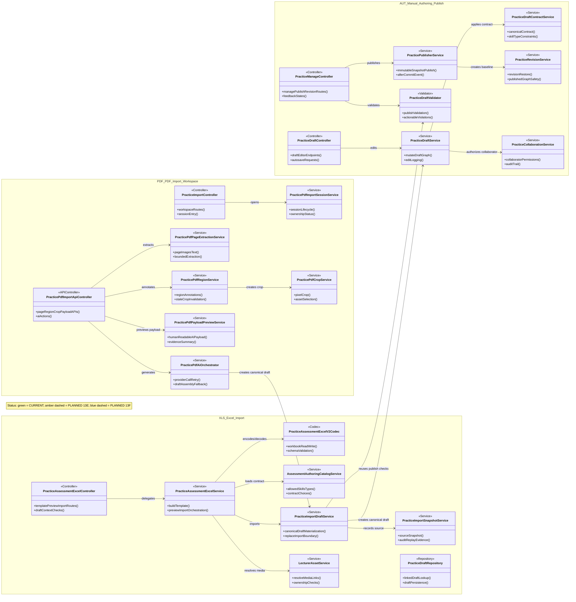
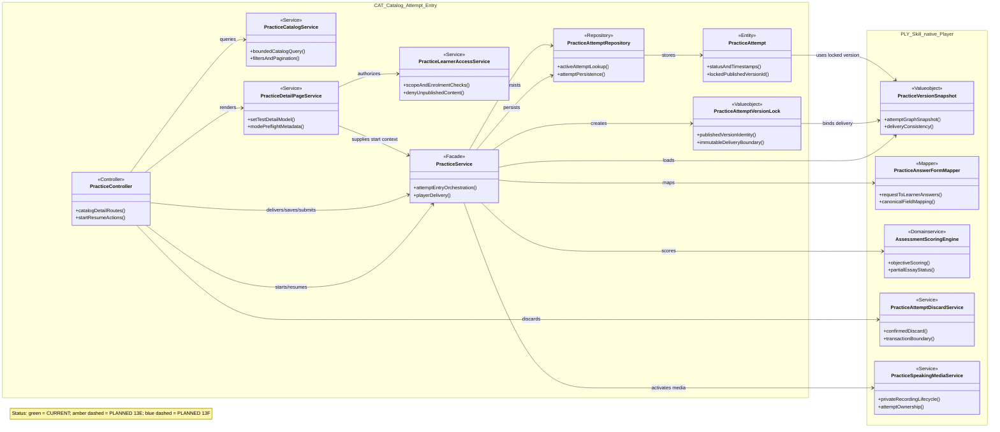
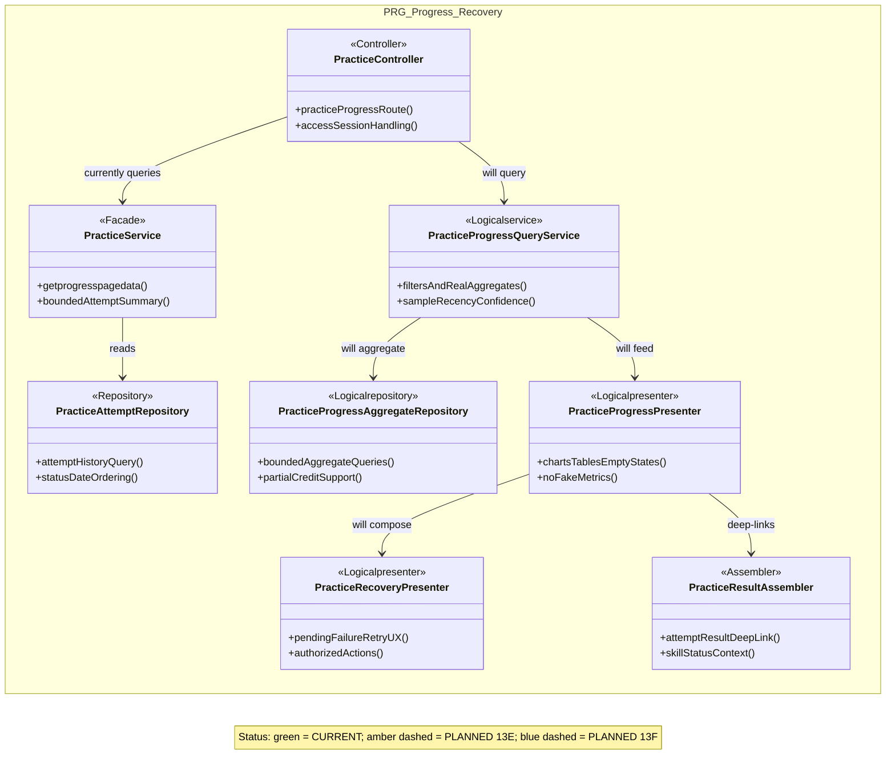

# KSH Practice Mermaid Class Diagrams

Status: `PRE_13E_ARCHITECTURE_BASELINE`

Each fenced block is a standalone Mermaid diagram. Copy only the code inside one block into Mermaid Live Editor.
The four reader-facing areas preserve the ten internal module codes used by code, Draw.io and Jira.

## 1. Practice Test Management

Modules: `AUT, XLS, PDF`

## 2. Skill-based Attempt Lifecycle

Modules: `CAT, PLY`

## 3. Versioned Results and Evidence

Modules: `RLE, WRT, SPK, RES`

```mermaid
classDiagram
    direction TB
    note "Status: green = CURRENT; amber dashed = PLANNED 13E; blue dashed = PLANNED 13F"
    namespace RLE_R_L_Explanation_Lifecycle {
        class PublishedVersionExplanationListener {
            <<Listener>>
            +afterCommitIntake()
            +preparePublishedVersion()
        }
        class QuestionExplanationPreparationService {
            <<Service>>
            +eligibleQuestionScan()
            +bindingTaskPreparation()
        }
        class ExplanationInputFactory {
            <<Factory>>
            +immutablePromptEvidence()
            +languageSafeInput()
        }
        class ExplanationFingerprintBuilder {
            <<Service>>
            +idIndependentFingerprint()
            +contentIdentity()
        }
        class QuestionExplanationGenerationWorker {
            <<Worker>>
            +claimDurableTasks()
            +boundedProcessing()
        }
        class QuestionExplanationRetryService {
            <<Service>>
            +explicitRetry()
            +statusPolicy()
        }
        class QuestionExplanationReadService {
            <<Service>>
            +bindingSafeRead()
            +noProviderCalls()
        }
        class ObjectiveEvidencePresenter {
            <<Logicalpresenter>>
            +officialLearnerTeacherAILayers()
            +evidenceAnchors()
        }
    }
    namespace WRT_Writing_AI_Evaluation {
        class WritingEvaluationCacheService {
            <<Service>>
            +identityReuse()
            +persistEvaluationStatus()
        }
        class WritingEvaluationClient {
            <<Providerport>>
            +providerRequest()
            +typedFailure()
        }
        class WritingEvaluationNormalizer {
            <<Normalizer>>
            +schemaScoreNormalization()
            +rejectMalformedFeedback()
        }
        class WritingPromptRules {
            <<Rules>>
            +koreanTaskPrompt()
            +safeEvidenceBoundaries()
        }
        class WritingRuleEngine {
            <<Domainservice>>
            +rubricInvariants()
            +criterionChecks()
        }
        class WritingScoringPolicy {
            <<Domainservice>>
            +topikWeights()
            +scoreAggregation()
        }
        class WritingResultPresenter {
            <<Presenter>>
            +skillNativeOverview()
            +fourAnalysisLenses()
        }
        class WritingEvidencePresenter {
            <<Logicalpresenter>>
            +submittedCorrectionRewriteSample()
            +rubricEvidenceDetail()
        }
    }
    namespace SPK_Speaking_Evaluation {
        class PracticeSpeakingMediaController {
            <<Controller>>
            +uploadActivateDelete()
            +ownerScopedEndpoints()
        }
        class PracticeSpeakingMediaService {
            <<Service>>
            +mediaLifecycle()
            +attemptOwnership()
        }
        class SpeakingAudioPreparationService {
            <<Service>>
            +validateInspectAudio()
            +preparePrivateObject()
        }
        class SpeakingTranscriptionMediaResolver {
            <<Service>>
            +resolveAuthorizedRecording()
            +transcriptionInput()
        }
        class SpeakingEvaluationOrchestrator {
            <<Service>>
            +transcribeEvaluateSequence()
            +failurePolicy()
        }
        class SpeakingRuleEngine {
            <<Domainservice>>
            +fourTranscriptCriteria()
            +twoAcousticCriteriaNotScorable()
            +evidenceChecks()
        }
        class SpeakingResultPresenter {
            <<Presenter>>
            +transcriptLanguageProfile()
            +noHolisticScoreWithoutDirectAudio()
            +noPerQuestionOverview()
        }
        class SpeakingEvidencePresenter {
            <<Logicalpresenter>>
            +perQuestionRecordingTranscript()
            +structuredEvidence()
        }
    }
    namespace RES_Result_Overview_Detail {
        class PracticeResultAssembler {
            <<Assembler>>
            +canonicalResultEnvelope()
            +selectSkillPresenter()
        }
        class ObjectiveResultPresenter {
            <<Presenter>>
            +readingListeningOverview()
            +questionTypeAccuracy()
        }
        class PracticeResultContext {
            <<Context>>
            +attemptVersionEvaluationData()
            +authorizationSafeInput()
        }
        class PracticeResultDetailAssembler {
            <<Logicalassembler>>
            +evidenceLayers()
            +availabilityStates()
        }
        class Writing_SpeakingEvidencePresenter["Writing/SpeakingEvidencePresenter"] {
            <<Logicalpresenters>>
            +skillNativeDetail()
            +noSecondAIPipeline()
        }
    }
    PublishedVersionExplanationListener --> QuestionExplanationPreparationService : prepares
    QuestionExplanationPreparationService --> ExplanationInputFactory : builds input
    QuestionExplanationPreparationService --> ExplanationFingerprintBuilder : identifies
    QuestionExplanationGenerationWorker --> QuestionExplanationRetryService : shares task policy
    QuestionExplanationGenerationWorker --> QuestionExplanationReadService : produces readable artifact
    QuestionExplanationReadService --> ObjectiveEvidencePresenter : will feed
    WritingEvaluationCacheService --> WritingEvaluationClient : calls when not reusable
    WritingEvaluationClient --> WritingEvaluationNormalizer : returns provider data
    WritingEvaluationNormalizer --> WritingRuleEngine : validates
    WritingRuleEngine --> WritingScoringPolicy : scores
    WritingEvaluationCacheService --> WritingResultPresenter : feeds
    WritingResultPresenter --> WritingEvidencePresenter : will share context
    PracticeSpeakingMediaController --> PracticeSpeakingMediaService : manages
    PracticeSpeakingMediaService --> SpeakingAudioPreparationService : validates/stores
    SpeakingEvaluationOrchestrator --> SpeakingTranscriptionMediaResolver : loads audio
    SpeakingEvaluationOrchestrator --> SpeakingRuleEngine : validates feedback
    SpeakingEvaluationOrchestrator --> SpeakingResultPresenter : feeds
    SpeakingResultPresenter --> SpeakingEvidencePresenter : will share context
    PracticeResultAssembler --> PracticeResultContext : consumes
    PracticeResultAssembler --> ObjectiveResultPresenter : delegates
    PracticeResultAssembler --> WritingResultPresenter : delegates
    PracticeResultAssembler --> SpeakingResultPresenter : delegates
    PracticeResultContext --> PracticeResultDetailAssembler : will feed
    PracticeResultDetailAssembler --> ObjectiveEvidencePresenter : will delegate
    PracticeResultDetailAssembler --> Writing_SpeakingEvidencePresenter : will delegate
    QuestionExplanationReadService --> PracticeResultDetailAssembler : supplies objective evidence
    WritingEvaluationCacheService --> PracticeResultAssembler : supplies writing state
    SpeakingEvaluationOrchestrator --> PracticeResultAssembler : supplies speaking state
    classDef current fill:#E8F5E9,stroke:#2E7D32,color:#0B2545,stroke-width:1.5px;
    classDef planned13e fill:#FFF8E1,stroke:#F9A825,color:#0B2545,stroke-width:1.5px,stroke-dasharray:5 3;
    classDef planned13f fill:#E3F2FD,stroke:#1976D2,color:#0B2545,stroke-width:1.5px,stroke-dasharray:5 3;
    classDef deferred fill:#F5F5F5,stroke:#616161,color:#263238,stroke-dasharray:3 3;
    cssClass "PublishedVersionExplanationListener,QuestionExplanationPreparationService,ExplanationInputFactory,ExplanationFingerprintBuilder,QuestionExplanationGenerationWorker,QuestionExplanationRetryService,QuestionExplanationReadService,WritingEvaluationCacheService,WritingEvaluationClient,WritingEvaluationNormalizer,WritingPromptRules,WritingRuleEngine,WritingScoringPolicy,WritingResultPresenter,PracticeSpeakingMediaController,PracticeSpeakingMediaService,SpeakingAudioPreparationService,SpeakingTranscriptionMediaResolver,SpeakingEvaluationOrchestrator,SpeakingRuleEngine,SpeakingResultPresenter,PracticeResultAssembler,ObjectiveResultPresenter,PracticeResultContext" current
    cssClass "ObjectiveEvidencePresenter,WritingEvidencePresenter,SpeakingEvidencePresenter,PracticeResultDetailAssembler,Writing_SpeakingEvidencePresenter" planned13e
```

## 4. Practice Progress Management

Modules: `PRG`

