# KSH Practice Mermaid Sequence Diagrams

Status: `PRE_13E_ARCHITECTURE_BASELINE`

This document contains exactly 30 standalone Mermaid sequence diagrams, one for each formal Practice Use Case.
Copy only the code inside one fenced block into Mermaid Live Editor.

## 1. Practice Test Management

### Module AUT - Manual Authoring & Publish

#### UC-AUT-01 - Create, edit and autosave a Practice draft

Status: `CURRENT`

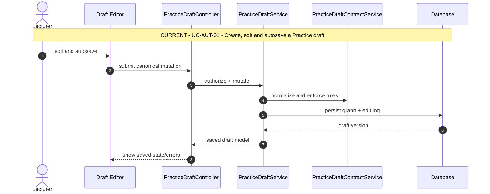

#### UC-AUT-02 - Validate and publish an immutable version

Status: `CURRENT`

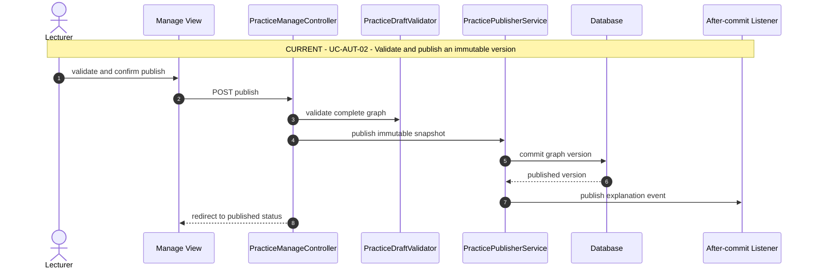

#### UC-AUT-03 - Create a revision and manage collaborators

Status: `CURRENT`

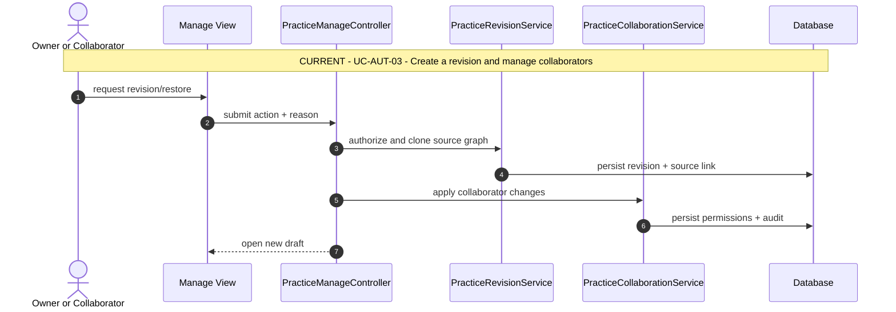

### Module XLS - Excel Import

#### UC-XLS-01 - Download a rules-aware Excel template

Status: `CURRENT`

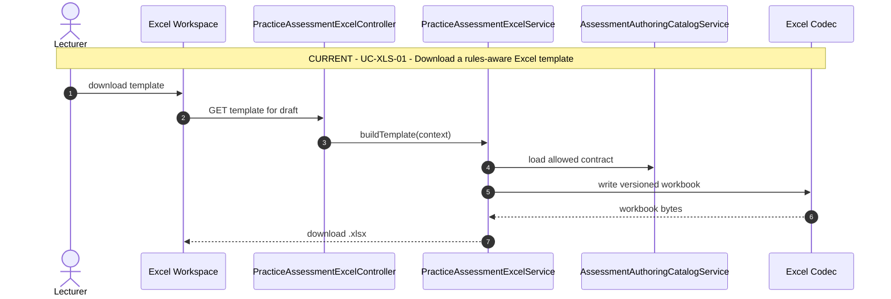

#### UC-XLS-02 - Preview a workbook and resolve validation issues

Status: `CURRENT`

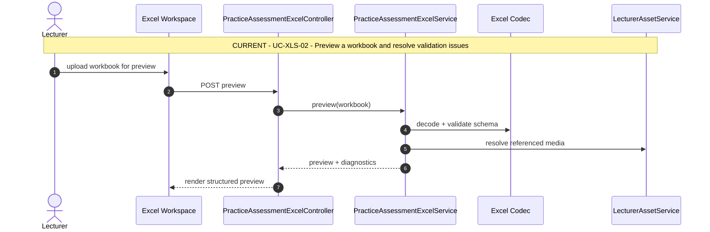

#### UC-XLS-03 - Import a workbook as a standard editable draft

Status: `CURRENT`

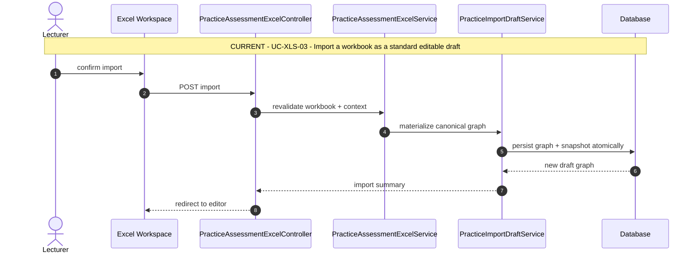

### Module PDF - PDF Import Workspace

#### UC-PDF-01 - Upload a PDF and create an import session

Status: `CURRENT`

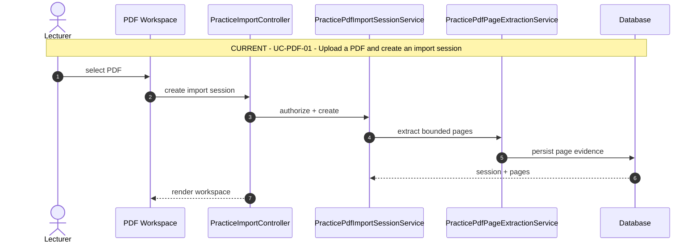

#### UC-PDF-02 - Select, crop and preview PDF regions

Status: `CURRENT`

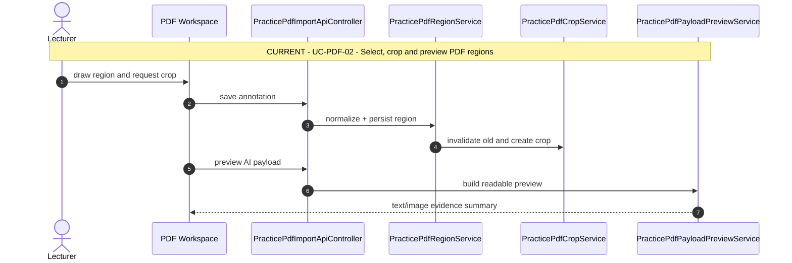

#### UC-PDF-03 - Generate questions with AI and import a validated draft

Status: `CURRENT`

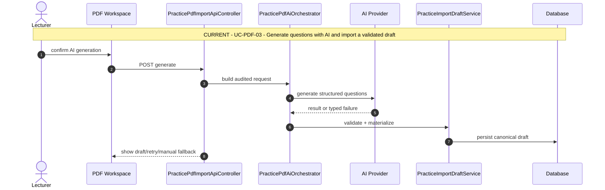

## 2. Skill-based Attempt Lifecycle

### Module CAT - Catalog & Attempt Entry

#### UC-CAT-01 - Browse and filter the Practice catalog

Status: `CURRENT`

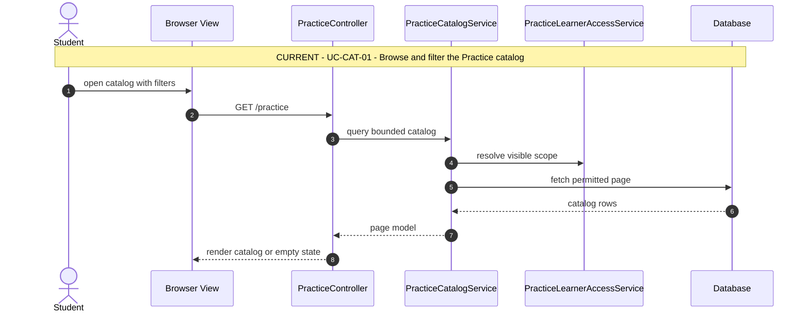

#### UC-CAT-02 - View Practice set and test details

Status: `CURRENT`

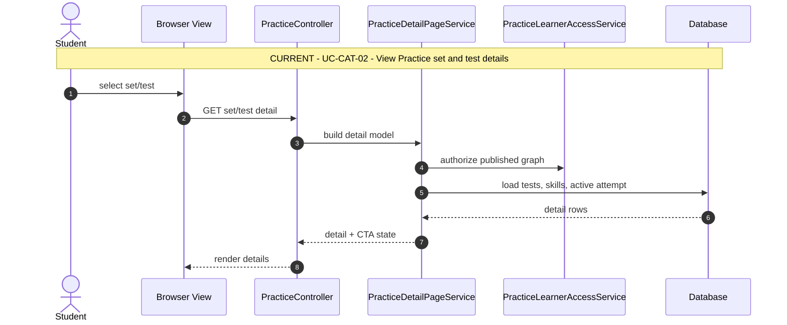

#### UC-CAT-03 - Start, resume or discard an attempt

Status: `CURRENT`

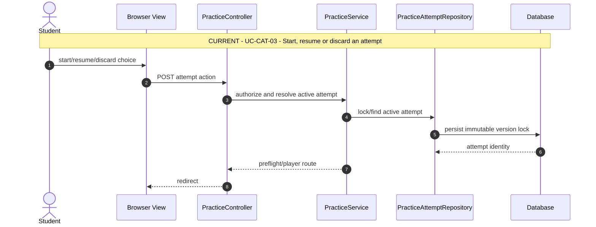

### Module PLY - Skill-native Player

#### UC-PLY-01 - Complete device checks and enter the correct player

Status: `CURRENT`

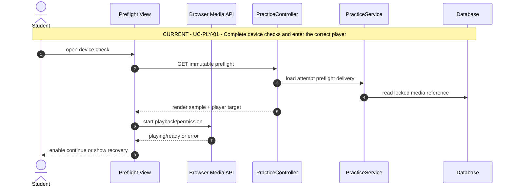

#### UC-PLY-02 - Answer, autosave, navigate and resume

Status: `CURRENT`

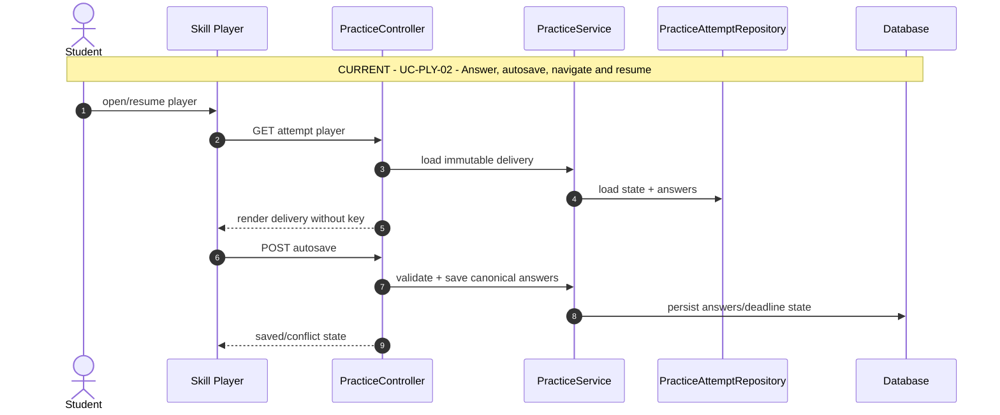

#### UC-PLY-03 - Submit or finalize an attempt safely

Status: `CURRENT`

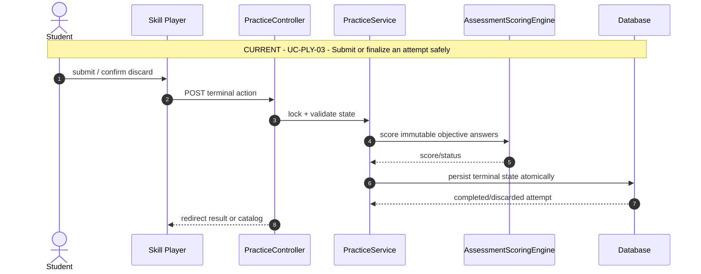

## 3. Versioned Results and Evidence

### Module RLE - R/L Explanation Lifecycle

#### UC-RLE-01 - Queue explanation preparation after publishing

Status: `CURRENT`

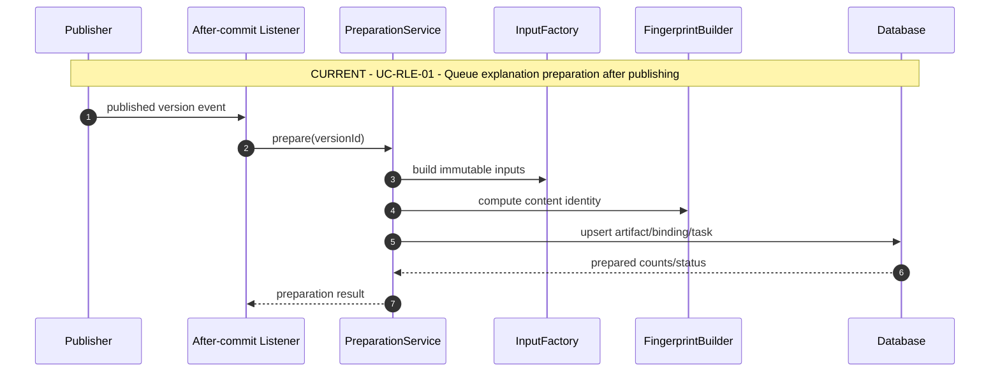

#### UC-RLE-02 - Generate, reuse and retry explanation artifacts

Status: `CURRENT`

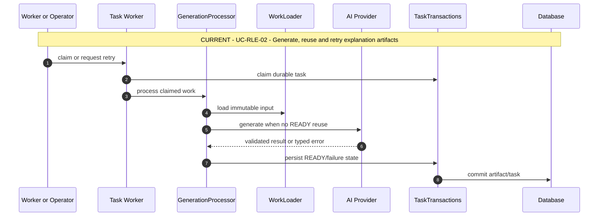

#### UC-RLE-03 - Read an explanation with a student-specific answer overlay

Status: `CURRENT`

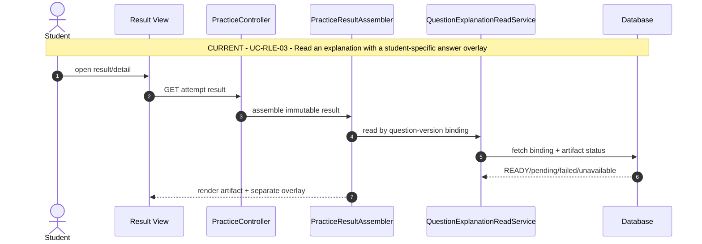

### Module WRT - Writing AI Evaluation

#### UC-WRT-01 - Evaluate a submitted Korean writing response

Status: `CURRENT`

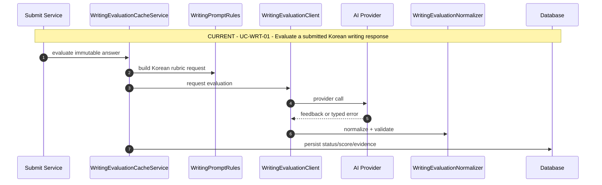

#### UC-WRT-02 - Reuse or re-evaluate stored Writing feedback

Status: `CURRENT`

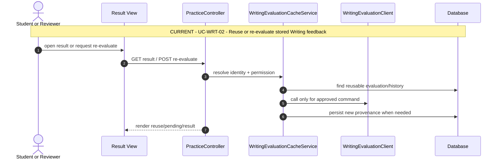

#### UC-WRT-03 - Review Korean Writing criteria through four student-friendly views

Status: `PLANNED 13E`

```mermaid
sequenceDiagram
    autonumber
    actor P01 as Student
    participant P02 as Writing Detail View
    participant P03 as PracticeController
    participant P04 as PracticeResultDetailAssembler (13E)
    participant P05 as WritingEvidencePresenter (13E)
    participant P06 as Database
    Note over P01,P06: PLANNED 13E - UC-WRT-03 - Review Korean Writing criteria through four student-friendly views
    P01->>P02: open Writing detail
    P02->>P03: GET result/detail
    P03->>P04: assemble immutable evidence
    P04->>P06: read answer + evaluation provenance
    P04->>P05: map four Korean lenses
    P05-->>P02: render evidence and availability states
```

### Module SPK - Speaking Evaluation

#### UC-SPK-01 - Manage private attempt recordings

Status: `CURRENT`

```mermaid
sequenceDiagram
    autonumber
    actor P01 as Student
    participant P02 as Speaking Player
    participant P03 as PracticeSpeakingMediaController
    participant P04 as PracticeSpeakingMediaService
    participant P05 as SpeakingAudioPreparationService
    participant P06 as Private Storage
    Note over P01,P06: CURRENT - UC-SPK-01 - Manage private attempt recordings
    P01->>P02: record and upload
    P02->>P03: POST private recording
    P03->>P04: authorize media action
    P04->>P05: inspect and prepare audio
    P05->>P06: store private object
    P06-->>P04: opaque storage key
    P04-->>P02: active recording identity
```

#### UC-SPK-02 - Transcribe and evaluate a Speaking attempt

Status: `CURRENT`

```mermaid
sequenceDiagram
    autonumber
    participant P01 as Submit Service
    participant P02 as SpeakingEvaluationOrchestrator
    participant P03 as Media Resolver
    participant P04 as Transcription Provider
    participant P05 as Evaluation Provider
    participant P06 as SpeakingRuleEngine
    participant P07 as Database
    Note over P01,P07: CURRENT - UC-SPK-02 - Transcribe and evaluate a Speaking attempt
    P01->>P02: evaluate submitted attempt
    P02->>P03: resolve authorized recording
    P03->>P04: transcribe private audio
    P04-->>P02: transcript + provenance
    P02->>P05: evaluate Korean rubric
    P05-->>P06: feedback/score candidate
    P06->>P07: persist validated status/evidence
```

#### UC-SPK-03 - Review a transcript-grounded Speaking profile and per-question evidence

Status: `PLANNED 13E`

```mermaid
sequenceDiagram
    autonumber
    actor P01 as Student
    participant P02 as Speaking Detail View
    participant P03 as PracticeController
    participant P04 as PracticeResultDetailAssembler (13E)
    participant P05 as SpeakingEvidencePresenter (13E)
    participant P06 as Private Media Endpoint
    Note over P01,P06: PLANNED 13E - UC-SPK-03 - Review a transcript-grounded profile and per-question evidence
    P01->>P02: open Speaking detail
    P02->>P03: GET result/detail
    P03->>P04: load typed profile + question evidence
    P04->>P05: map transcript/media/evidence
    P05->>P06: create authorized playback references
    P05-->>P02: render evidence-honest profile and per-question evidence
```

### Module RES - Result Overview & Detail

#### UC-RES-01 - View a skill-specific Result Overview

Status: `CURRENT`

```mermaid
sequenceDiagram
    autonumber
    actor P01 as Student
    participant P02 as Result View
    participant P03 as PracticeController
    participant P04 as PracticeResultAssembler
    participant P05 as Skill Result Presenter
    participant P06 as Database
    Note over P01,P06: CURRENT - UC-RES-01 - View a skill-specific Result Overview
    P01->>P02: open overview
    P02->>P03: GET /result
    P03->>P04: assemble canonical context
    P04->>P06: read attempt/version/evaluation
    P04->>P05: present by skill family
    P05-->>P02: render overview/status
```

#### UC-RES-02 - View Result Detail with clearly separated evidence

Status: `PLANNED 13E`

```mermaid
sequenceDiagram
    autonumber
    actor P01 as Student
    participant P02 as Result Detail View
    participant P03 as PracticeController
    participant P04 as PracticeResultDetailAssembler (13E)
    participant P05 as Skill Evidence Presenter (13E)
    participant P06 as Read Services
    participant P07 as Database
    Note over P01,P07: PLANNED 13E - UC-RES-02 - View Result Detail with clearly separated evidence
    P01->>P02: open evidence detail
    P02->>P03: GET /result/detail
    P03->>P04: load immutable result context
    P04->>P06: read explanation/evaluation/media metadata
    P06->>P07: fetch version-bound evidence
    P04->>P05: map separated layers
    P05-->>P02: render evidence/status
```

#### UC-RES-03 - Handle pending, failed and unavailable result states

Status: `CURRENT`

```mermaid
sequenceDiagram
    autonumber
    actor P01 as Student or Reviewer
    participant P02 as Result View
    participant P03 as PracticeController
    participant P04 as PracticeResultAssembler
    participant P05 as Retry or Re-evaluate Service
    participant P06 as Database
    Note over P01,P06: CURRENT - UC-RES-03 - Handle pending, failed and unavailable result states
    P01->>P02: view state / choose recovery
    P02->>P03: GET status or POST command
    P03->>P04: map learner-safe status
    P03->>P05: authorize recovery command
    P05->>P06: transition durable status
    P03-->>P02: render updated state
```

## 4. Practice Progress Management

### Module PRG - Progress & Recovery

#### UC-PRG-01 - View real Practice history and summaries

Status: `CURRENT`

```mermaid
sequenceDiagram
    autonumber
    actor P01 as Student
    participant P02 as Progress View
    participant P03 as PracticeController
    participant P04 as PracticeService
    participant P05 as PracticeAttemptRepository
    participant P06 as Database
    Note over P01,P06: CURRENT - UC-PRG-01 - View real Practice history and summaries
    P01->>P02: open progress
    P02->>P03: GET /practice/progress
    P03->>P04: getProgressPageData(owner)
    P04->>P05: query bounded history
    P05->>P06: fetch attempt rows
    P06-->>P04: history + scores/status
    P03-->>P02: render aggregates/empty/recovery
```

#### UC-PRG-02 - Filter and drill down into progress

Status: `PLANNED 13F`

```mermaid
sequenceDiagram
    autonumber
    actor P01 as Student
    participant P02 as Progress View
    participant P03 as PracticeController
    participant P04 as PracticeProgressQueryService (13F)
    participant P05 as Aggregate Repository (13F)
    participant P06 as Result Routes
    Note over P01,P06: PLANNED 13F - UC-PRG-02 - Filter and drill down into progress
    P01->>P02: apply filters
    P02->>P03: GET progress?filters
    P03->>P04: normalize + query
    P04->>P05: aggregate + history
    P05-->>P04: rows + sample metadata
    P04-->>P02: render metrics/confidence
    P02->>P06: open selected attempt
```

#### UC-PRG-03 - Open authorized recovery actions for incomplete evaluations

Status: `PLANNED 13F`

```mermaid
sequenceDiagram
    autonumber
    actor P01 as Student or Operator
    participant P02 as Progress View
    participant P03 as PracticeController
    participant P04 as PracticeRecoveryPresenter (13F)
    participant P05 as Existing Retry Services
    participant P06 as Database
    Note over P01,P06: PLANNED 13F - UC-PRG-03 - Open authorized recovery actions for incomplete evaluations
    P01->>P02: view state / choose recovery
    P02->>P03: GET progress or POST recovery
    P03->>P04: map safe operational state
    P03->>P05: authorize explicit command
    P05->>P06: persist durable transition
    P03-->>P02: render refreshed state
```
